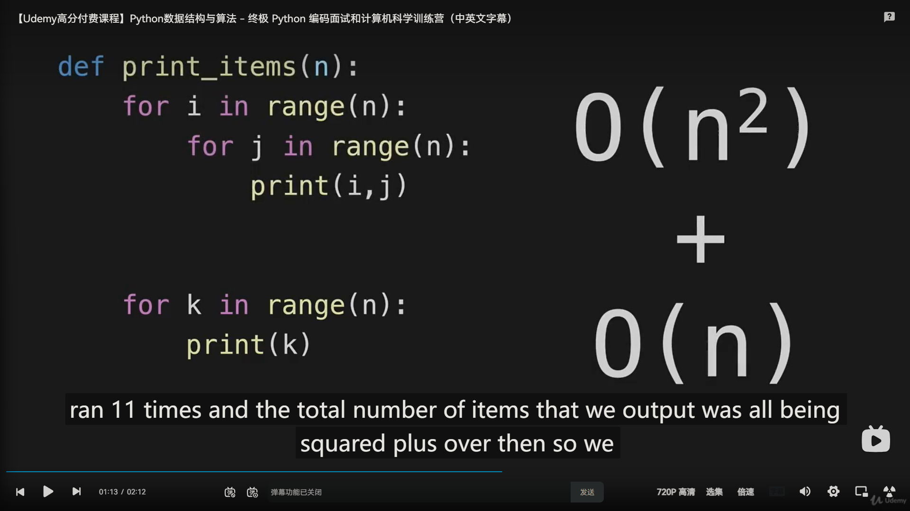

```python
def print_items(n):
    for i in range(n):
        for j in range(n):
            print(i,j)

    for k in range(n):
        print(k)

print_items(10) 
```




> dominant: 占主导地位、主宰、支配或显著的
>
> 在算法分析中，"non-dominant" 指的是在时间复杂度分析中被认为不主导的部分。通常，当分析算法的时间复杂度时，我们关注那些在输入规模 n 增长时对总运行时间最显著的部分，这些部分通常被称为 "dominant" 部分。"Non-dominant" 部分指的是那些在大 O 表示法中被忽略的较小阶数或较低次要的项。这些部分虽然在理论上会增加运行时间，但它们的增长速度相对较慢，因此在实际分析中通常可以忽略不计。