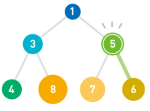
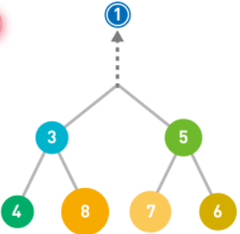
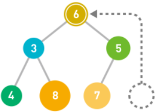
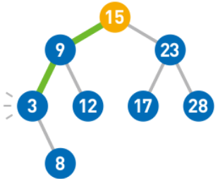
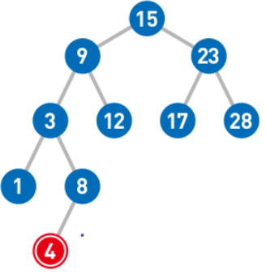
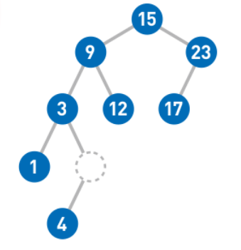
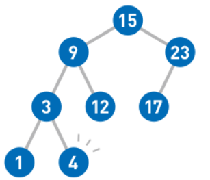
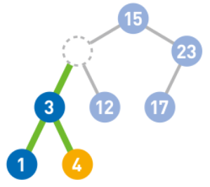

> @jayce 数据结构本身是用于数据的存储，其核心在于保存数据。 
> 掌握一个数据解构，应该重点把握两个方面：
>
> 1. 该数据结构的特点有哪些？
> 2. 该数据结构的增删查是如何进行的？有哪些点值得注意？
> 3. 该数据结构有哪些扩展形式，其特点和增删查又是如何进行的？

# 总结

## 1. 链表

### 1.1 特点

- 数据线性排列
- 增删很方便，查询耗时
- 每个数据项有一个指针指向下一个数据内存地址，在内存中，无需连续内存空间，可以分散存储
- 也正是因为分散存储，所以查询时需要顺着指针逐个遍历
- 时间复杂度： 查询为 O(n)， 增加和删除与n无关，所以为 O(1)

### 1.2 增删查

#### 1.2.1 查

查询，从首个元素开始，依据其指针指向的下一个元素，去遍历。

#### 1.2.2 增

只需要改变插入位置前后的指针指向即可：

```bash
"blue" --> "Yellow" --> "Red"
# 在第二个位置插入 “Green”
"blue" --> "Green"
"Green" --> "Yellow"
# ==>
"blue" --> "Green" --> "Yellow" --> "Red"
```

#### 1.2.3 删

将待删除项的前一个元素指针指向待删除项的后一个元素即可：

```bash
"blue" --> "Green" --> "Yellow" --> "Red"
# 删除 Yellow, 直接将  "Green" 指向 "Red" 即可， "Yellow" 无需处理，如果需要再次用到其地址，直接覆盖
"Green" --> "Red"
# ==>
"blue" --> "Green" --> "Red"
```

### 1.3 链表的扩展

处理基本链表， 还有两种较为常见的扩展链表，分别是 环形链表/循环链表 和 双向链表


循环链表，适合保存数量固定的最新数据

双向链表的则可以前后双向遍历， （双向链表存在两个缺点：1. 指针数的增加会导致存储空间需求增加；2.添加和删除数据时需要改变更多指针指向。 ）

## 2. 数组

### 2.1 特点

- 数据呈线性排列，内存空间也是顺序的
- 数据的访问十分简单，数据的添加和删除比较耗时
- 时间复杂度：数据访问为 O(1), 增删为 O(n)
- 数组相比较链表：数据访问比链表快，但是数据的增删都比链表慢

### 2.2 增删查

#### 2.2.1 查

数据的访问，直接按照索引访问

#### 2.2.2 增

```bash
["a","b","c"]
```

要想在 `"a"` 和 `“b”` 之间插入一个数据，

1. 在数组末尾增加需要的存储空间： `["a","b","c", - ]`
2. 然后自后往前向后移动，直到指定插入位置：`["a","b", - ,"c"] --> ["a", - ,"b","c"]`
3. 最后在指定位置插入目标数据：`["a","x","b","c"]`

#### 2.2.3 删

1. 首先删除掉目标数据项：`["a", - ,"b","c"]`
2. 从删除位置开始，将后面的数据逐个像前移动：`["a","b", - ,"c"] --> ["a","b","c", - ]`
3. 最后，删除掉多余的空间：`["a","b","c"]`


## 3. 栈（桶）

### 3.1 特点

- 数据呈线性排列
- 后进先出
- 栈中的数据增删只能在一端进行， 增加叫做 入栈操作， 删除叫做 出栈操作

#### 3.2 增删查

#### 3.2.1 查

栈很少讨论如何查询

#### 3.2.2 增

在最后一个元素后追加元素

#### 3.2.3 删

删除最后一个元素


## 4. 队列

### 4.1 特点

- 队列的数据也是呈线性排列的
- 队列和数据有些相似，但是队列是一个双开口的管子, 数据的增加叫做入队，数据的删除叫做出队
- 先进先出

### 4.2 增删查

#### 4.2.1 查

队列也基本不讨论如何查询

#### 4.2.2 增

队列的数据增加，从队列的头部操作 （入队）

#### 4.2.3 删

队列的数据删除， 从队列的尾部操作（出队）


## 5. 哈希表

### 5.1 特点

- 哈希表以数组 + 链表为存储容器

- 数据的访问和存储都需要通过 **哈希函数（Hash）** 进行计算，算出 **数组的键** ，然后进行 **mod运算**

  > ```bash
  > #运算规则：
  > "Joe" --hash--> 4928 --> mod 5 --> 3
  > # Joe 数据将被存储到索引值为 3 的数组位上。
  > ```
  >
  > 更多的
  >
  > ```bash
  > #item	Hash	mod 5
  > "Joe"	4828	3
  > "Sue"	7291	1
  > "Dan"	1539	4
  > "Nell"	6276	1
  > "Ally"	9143	3
  > "Bob"	5278	3
  > ```
  >
  > 相同的键位 我们称之为 **“冲突”**， 这时候我们通过链表，将这些位置相同的数据项放在一起。 
  >
  > ```bash
  > [
  > 	,
  > 	"Sue" --> "Nell",
  > 	,
  > 	"Joe" --> "Ally" --> "Bob",
  > 	"Dan"
  > ]
  > ```

### 5.2 增删查

#### 5.2.1 查

计算 Hash 值，然后进行 Mod 运算，然后对数据对应的索引位上的链表进行线性查找。

例如要查询 “Ally” , "Allay"  ==> Hash函数 ==> `9143`== mod 5 ==> `3`, 然后对数组[3]，进行链表的线性查找。找到 “Allay” 数据项。 

#### 5.2.2 增删

哈希表结构的数据， 增删都符合，先通过 Hash 函数计算出 Hash 值，然后进行 Mod 运算找到数组的索引位。 从而找到了数组中对应位的链表 。 接着，增删操作均符合 链表的增删操作特性。 

> 关于哈希表的补充:
>
> 在 **哈希表** 中，我们可以利用 **哈希函数** 快速访问到数组中的目标数据。 如果发生 **哈希冲突** ， 就使用 **链表** 进行存储。如果使用数组的空间太小，使用哈希表的时候就容易发生冲突，线性查找的使用频率也会更加高； 反过来，如果数组的空间太大， 就会出现很多空箱子，造成内存的浪费。 因此给数组设定合适的空间非常重要。 
>
> 在存储数据的过程中，如果发生冲突，通常有两种方式去解决：
>
> 1. 链地址法（同一位置的冲突对象组织在一起）：可以利用链表在已有数据的后面插入新的数据来解决冲突。 这种方法被称为 “链地址法”。也就是上面 「特点」 中那样
>
> 2. 开放定址法（换个位置）：一旦产生了冲突（该地址已经有其他的元素），就按某种规则去寻找另一空地址。
>
>    - 若发生了第 $i$ 次冲突，试探的下一个地址将会增加 $d_i$, 基本公式是$(1\leq i \leq TableSize)$：
>      $$
>      h_i(key) = (h(key)+ d_i) \pmod {TableSize}
>      $$
>      $d_i$ 决定了不同的解决冲突方案：
>
>      - 线性探测：$d_i = i$
>      - 平方探测：$ d_i = \pm i^2$
>      - 双散列：$d_i = i\times h_2(key)$

## 6. 堆

### 6.1 特点

- 堆是一种图的树形结构，被用于实现 “优先队列(priority queues)”

  > 优先队列是一种数据结构，可以自由地添加数据，但是取出数据时要从最小值开始按照顺序取出。

- 堆的树形结构中，各个顶点被称之为 “结点”， 数据就存储于这些结点

- 堆中的每个结点最多有两个子结点

- 结点的排列顺序为 从上到下， 同一行为从左到右。

- 子结点必定大于父结点

- 新增结点  一般放于最下面一行靠左的位置，如没有多余空间，就往下另起一行，加在最左端

- 时间复杂度：取出最小值的时间复杂度为 $O(1)$, 此外，取出数据后，堆需要重排，假设数据量为n, 根据堆的形状特点可知树的高度为 $log_2n$, 时间复杂度即为 $O(logn)$.

### 6.2 增删查

#### 6.2.1 增

1. 先将数据添加至最后一排靠左的位置，没有空间则新增一排
2. 判断是否满足子节点大于父节点，不满足则和父节点互换位置，直到满足大于父节点，否则，保持不动。




#### 6.2.2 取

1. 优先队列取出数据的时候，取出的是最小值，也就是顶端结点。
2. 取出后，其他位置需要顶替根结点的位置，把结点顺序末尾的那个结点放置在根结点
3. 然后和子节点比较，是否满足子节点都大于根结点，不满足则和较小的那个结点互换，依次往下，知道满足基本条件（所有父结点小于任意根结点）



顶端结点被取出之后，堆的结构需要被重排



子结点必定大于父结点


## 7. 二叉树

二叉树即二叉查找树（也叫做二叉搜索树，二叉排序树）。 这种数据结构采用了图的树形结构，只是数据组织规则有所不同。

### 7.1 特点

- 每个结点最多有两个子结点

- 每个结点值大于其左子树上任意一个结点值

- 每个结点的值均小于其右子树上的任意一个结点值

- 所以最小值要从顶端开始，往其左下的末端寻找，最大值要从顶端开始，往其右下的末端寻找。

- 时间复杂度： 最大值查找时间复杂度为 O(1), 其他值，则取决于树的形状和高度， 如果结点树为 n， 且树的形状较为均衡，比较大小和移动的次数最多就是 $log_2n$ , 因此时间复杂度也就是 $O(log_n)$, 但是如果树的形状朝单侧纵向延伸，树就会变得很高，此时时间复杂度也就变成了$O(n)$。

  

  

### 7.2 增删查

#### 7.2.1 增

二叉树的增加，从顶部开始


接着， 1 < 9, 接着往左移到 9 所在结点，然后，1 < 3 大，所以接着往左移，填补空位：


同理，如果插入 4 


4 < 15 ==>左移
4 < 9 ==>左移
4 > 3 ==>右移
4 < 8, 其8 无其他子结点，则作为其子结点




#### 7.2.2 删

如果需要删除的结点没有子结点，那么直接删掉该结点即可：


如果需要删除的结点只有一个子结点，那么删除掉目标结点后，然后把子结点移到被删除结点的位置即可。



如果被删除结点有两个结点，那么先删除该结点，然后在该结点左子树中寻找最大结点，移动到被删除结点位置。



#### 7.2.1 查找

二叉树的查找，类似于二叉树的结点增加，也是从顶部开始，将根结点和目标结点比较，如果目标结点小于根结点，则向左移，否则右移动，依照此规则往下遍历，直到找到目标元素。

### 7.3 二叉树的扩展

有很多以二叉树为基础扩展的数据结构，比如 “平衡而茶查找树”， 这种数据结构可以修正形状不均衡的树，让其始终保持均衡状态，以提高查找效率。

此外，结点树并不是必须为两个结点，可以扩展为 m 个结点。像这种子结点树可以自由设定，并且形状均衡的树，我们称作 B 树。

