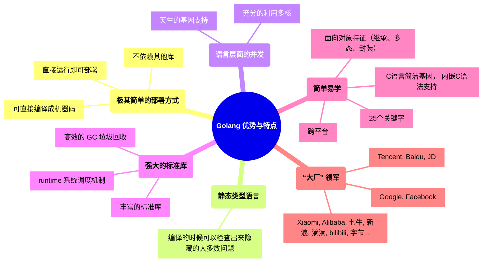

## Golang 优势与特点

1. 极其简单的部署方式：
    1. 可直接编译成机器码
    2. 不依赖其他库
    3. 直接运行即可部署
2. 静态类型语言：
    1. 编译的时候可以检查出来隐藏的大多数问题
3. 语言层面的并发：
    1. 天生的基因支持
    2. 充分的利用多核
4. 强大的标准库：
    1. runtime 系统调度机制
    2. 高效的 GC 垃圾回收
    3. 丰富的标准库
5. 简单易学：
    1. 25 个关键字
    2. C 语言简洁基因， 内嵌 C 语法支持
    3. 面向对象特征（继承、多态、封装）
    4. 跨平台
6. “大厂” 领军：
    1. Google, facebook,
    2. Tencent, Baidu, JD,
    3. Xiaomi, Alibaba, 七牛, 新浪，滴滴, bilibili，字节。。。

## 斐波那契函数性能测试：

编译速度排名：
Golang > C > JS/Node > PHP7 > C++ > Java > Python3

执行速度排名：
C++ > C > Golang > Java > Js/Node > PHP7 > Python3

## Golang 适用领域（强项）

1. 云计算设施领域: **docker**, **kubernetes**, etcd, consul, cloudflare CDN, 七牛云
2. 基础后端软：tidb, influxdb, cockroachdb
3. 微服务：go-kit, micro, monzo bank, typhon, blibili...
4. 互联网基础设施：hyperledger, 以太坊...

## Golang 的不足(缺点)

1. 包管理，大部分都在 Github 上
2. 无泛化类型
3. 所有的 Exception 都用 Error 来处理（比较有争议）
4. 对 C 的降级处理，并非无缝，没有 c 降级到 asm(汇编) 那么完美
