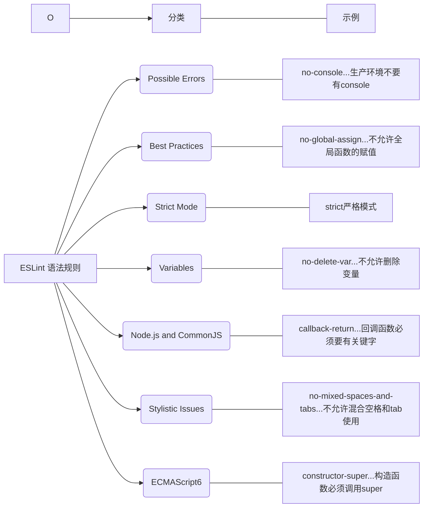

当ESLint 检查报错的时候，这些报错的起点在哪里？ ESLint 是按照什么规范来检查代码的呢？

## ESLint 语法规范的本质

- 就是 **函数**
- 可以通过 ESLint 源码查看: node_modules/eslint/lib/rules， 简单来说， 每条规则都是一个 create 函数， 在进行语法检查的时候， 会将代码传入这些函数内做检查。

这些规范函数， 可以分为七大类：

## 自定义语法规范

- 除了内置的规范外， 如果想加入自己的新规范怎么办？
- 我们就可以按照 ESLint 的机制来添加自己的规范了
- 比如我们下载的第三方规则包里有些就用了自己的规则

## 语法规范包类型

- 前面看到， ESLint 安装时自带 280 多个规范， 而开发时， 未必都要使用， 各个公司根据自己的习惯选择。 
- 所以就用了不同的选择组合:
  - **ESLint 内置规范包** : eslint-all / eslint-recommended
  - **标准规范包**: eslint-config-standard
  - **第三方规范包**: google/airbnb/facebook....

### 内置规范包

- 已经随 eslint 一起下载:
  - `eslint-all`: 使用全部 280 多个规则
  - `eslint-recommended`: 只使用推荐的 60 个规则

### 标准规范包 (需要下载)

- 包名: `eslint-config-standard` 也使用了 200 多个规则

  > 可以在 node_modules/eslint-config-standard/.eslintrc.json 这里看到 标准规范包的配置

- 下载方式:

  - 可以在前面创建 eslint 配置文件时，选择下载
  - 手动下载:`npm i eslint-config-standard -D`

