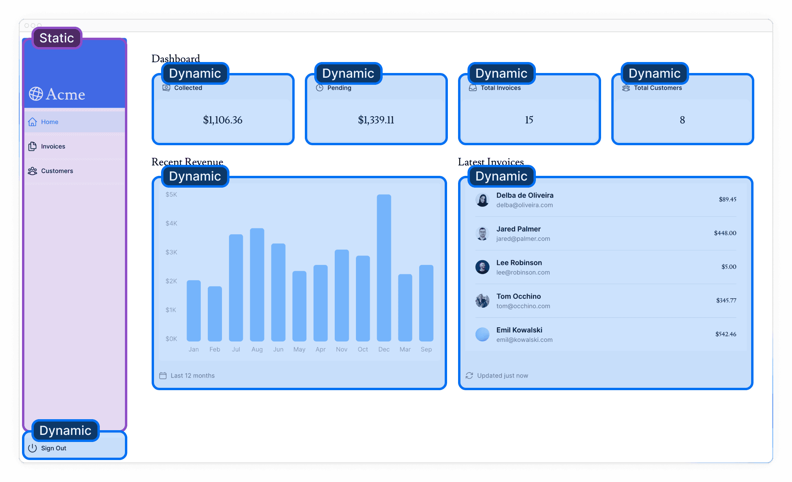
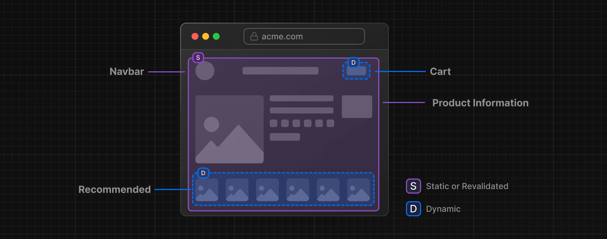

## 部分渲染 Partial Rendering

目前， 你已经学习了静态渲染和动态渲染，并且你知道如何流式的渲染依赖数据的内容。 在本章节中， 我们会通过 **Partial Prerendering (PPR)** 结合静态渲染，动态渲染，以及流式渲染在同一个路由中。

> So far, you've learned about static and dynamic rendering, and how to stream dynamic content that depends on data. In this chapter, let's learn how to combine static rendering, dynamic rendering, and streaming in the same route with **Partial Prerendering (PPR)**.


学习目标

- 什么是 PPR ？
- PPR 怎么工作的 ？


### 静态 vs 动态 路由

现如今的大多数 web 应用，要不为你的应用 或者 特定路由，选择静态渲染 就是动态渲染。

并且在 Next.js 中，如果你在一个路由中调用一个  [dynamic function](https://nextjs.org/docs/app/building-your-application/routing/route-handlers#dynamic-functions) ， 例如数据库查询， 那么这真个路由都会变成动态的。 

然而，大多数的路由，其实不是全部静态或者动态的， 例如， 某个电子商业网站的产品页面， 产品详情的部分可能是静态的，可是用户的购物车可能是动态的，又或者商品推荐部分可能是动态的。 

就本教程示例来说，静态和动态内容的分布如下：



- 侧边组件不依赖数据，且和用户无关， 因此它是静态的
- 而主页面部分则是依赖于数据变化，并且和用户关联， 所以他们是动态的


### PPR 是什么？

PPR 是 Next.js14 的一个实验特性，是一个新的渲染模式。 



当用户访问该路由页面的时候

- 路由 shell (壳/layout) 包括 导航栏，产品详情是静态的，这可以保证快速的初始化加载
- shell 为动态内容，像购物车，商品推荐这些UI 模块留了 "洞"（渲染区域）， 让他们可以异步的加载
- 这些异步的 "洞" 是并行流式渲染的，较少了页面总体的加载时间。


### PPR 是如何工作的？

PPR 使用 React 的 Suspense 组件去定义你的页面需要动态渲染的部分，例如等待页面加载才能渲染的 ui模块。

Suspense 的后备内容是和其他的静态内容一起嵌入到初始化的 HMTL 文件中的， 在打包阶段或者 revalidation(更新) 的时候，静态内容会 **预渲染** 创建一个 静态的 shell. 而动态部分的内容则被滞后知道用户请求了该路由。 

> <p style="font-size:.6em">The Suspense fallback is embedded into the initial HTML file along with the static content. At build time (or during revalidation), the static content is **prerendered** to create a static shell. The rendering of dynamic content is **postponed** until the user requests the route.</p>

将一个组件用 Suspense 包裹并不会让这个组件自己变成动态的， 而是 Suspense 是用作 静态代码和动态代码中间的一个边界。 


### 实现 PPR

在 Next.js 中开启PPR，只需要在 `next.config.mjs` 中配置：

```js
/** @type {import('next').NextConfig} */
 
const nextConfig = {
  experimental: {
    ppr: 'incremental',
  },
};
 
export default nextConfig;
```

`incremental`  值可以让你为指定的路由应用 PPR，

然后在特定的路由 layout 中暴露一个名为 `experimental_ppr ` 值为 `true` 的变量即可：

```tsx
// /app/dashboard/layout.tsx
import SideNav from '@/app/ui/dashboard/sidenav';
 
export const experimental_ppr = true;
 
// ...
```

PPR 的效果仅在生产阶段看到。  Next.js 将会预渲染路由的静态内容，并延迟动态的部分直到用户请求他们。 

