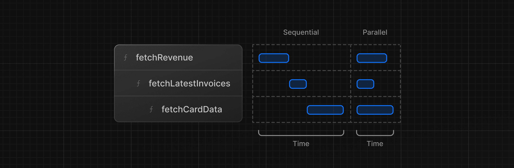

```
order: 8
```


## 数据获取 Fetching Data

学习目标

- 了解学习在 Next.js 中获取数据的几种方案： APIs, ORMs, SQL, 等等
- Server 组件是怎么帮你安全的获取后端数据资源
- 网络瀑布 waterfalls 是什么？
- 在 JavaScript 范式中如何实现数据的并行获取


### 选择如何获取数据

1. API

   就是后端程序， API 层是前端应用和数据库的中间媒介

   > 如果你必须使用三方 API， 或者你需要获取的数据需要通过后端程序安全的间接获取。

   **在 Nexts.js 中， 你可以使用  [Route Handlers](https://nextjs.org/docs/app/building-your-application/routing/route-handlers) 创建 API 端点（endpoints, 可以理解为接口）**

2. 数据库查询 Database queries

   当你通过  Next.js 创建一个全栈程序的时候，你可以直接编写和数据库的交互逻辑。对于像 Postgres 这种关系行数据库， 你可以使用 SQL 或者 [ORM](https://vercel.com/docs/storage/vercel-postgres/using-an-orm).

   有这样几种场景，你需要编写 sql:

   - 当你创建 API 接口的时候，你需要编写数据库交互逻辑
   - 如果你使用的是 React Server Components 服务端组件（在服务端获取数据）， 你可以跳过 API 层，直接安全的查询数据库。 


### 使用 Server Components 获取数据

Next.js 默认使用 React Server Component, 使用服务器组件获取数据是**一种相对较新的方法**，使用它们有一些好处：

- Server Components 支持 promises， 为数据获取这类的异步任务提供了更加简便的解决方案。 不再使用 `useEffect`, `useState` 或者数据获取库。 而是可以直接使用 `async/await` 语法
- Server Components 在服务端执行，所以可以保证数据安全； 同时由于可以直接查询数据库，所以就不用额外的  API 层了。 

### 使用 SQL

前面也提到过了服务端组件可以直接查询数据库， 而查询数据库通常有两种方式，一种是直接写 sql， 此外还可以通过数据库的抽象层工具 ORM 来间接生成sql。

文档中提到了直接使用sql 的几种好处：

1. SQL 是关系型数据库的工业标准

2. 对 SQL 有基本理解可以帮助你理解关系型数据库的核心理念，可以帮助你应用到其他工具

3. SQL 是通用的（versatile：多功能的/万能的），可以增删改查数据

4. Vercel Postgres SDK 提供了 SQL 注入攻击的防护措施， 它提供了 `sql` 方法允许你操作数据库：
   ```ts
   import { sql } from '@vercel/postgres';
   ```

   你只能在 **Server Component 服务端组件** 中调用 `sql` 方法，当然为了项目维护方便，通常是单独写在某个文件中导出。 在服务端组件中去调用。 

   


### 本教程中的数据获取用例

获取 revenue 数据

```tsx
// /app/dashboard/page.tsx
//...
import { fetchRevenue } from '@/app/lib/data';
 
export default async function Page() {
  const revenue = await fetchRevenue();
  // ...
}
```

```tsx
//  /app/lib/data.ts
//...
export async function fetchRevenue() {
  try {
    console.log('Fetching revenue data...');
    const data = await sql<Revenue>`SELECT * FROM revenue`;
    return data.rows;
  } catch (error) {
    console.error('Database Error:', error);
    throw new Error('Failed to fetch revenue data.');
  }
}
//...
```

获取 cards 数据

```ts
//  /app/lib/data.ts
export async function fetchCardData() {
  try {
    const invoiceCountPromise = sql`SELECT COUNT(*) FROM invoices`;
    const customerCountPromise = sql`SELECT COUNT(*) FROM customers`;
    const invoiceStatusPromise = sql`SELECT
         SUM(CASE WHEN status = 'paid' THEN amount ELSE 0 END) AS "paid",
         SUM(CASE WHEN status = 'pending' THEN amount ELSE 0 END) AS "pending"
         FROM invoices`;

    const data = await Promise.all([
      invoiceCountPromise,
      customerCountPromise,
      invoiceStatusPromise,
    ]);

    const numberOfInvoices = Number(data[0].rows[0].count ?? '0');
    const numberOfCustomers = Number(data[1].rows[0].count ?? '0');
    const totalPaidInvoices = formatCurrency(data[2].rows[0].paid ?? '0');
    const totalPendingInvoices = formatCurrency(data[2].rows[0].pending ?? '0');

    return {
      numberOfCustomers,
      numberOfInvoices,
      totalPaidInvoices,
      totalPendingInvoices,
    };
  } catch (error) {
    console.error('Database Error:', error);
    throw new Error('Failed to fetch card data.');
  }
}
```

```tsx
// /app/dashboard/page.tsx
import {
  fetchCardData,
} from '@/app/lib/data';

export default async function Page() {
    //...
  const {
    numberOfInvoices,
    numberOfCustomers,
    totalPaidInvoices,
    totalPendingInvoices,
  } = await fetchCardData();    
    //...
    return (
    //...
        <Card title="Collected" value={totalPaidInvoices} type="collected" />
        <Card title="Pending" value={totalPendingInvoices} type="pending" />
        <Card title="Total Invoices" value={numberOfInvoices} type="invoices" />
        <Card
          title="Total Customers"
          value={numberOfCustomers}
          type="customers"
        />
    //...
    )
}
```


### 什么是请求瀑布 request waterfalls ?

请求瀑布就是 one-by-one 的请求，当前一个请求完成，后面的请求才会开始发起。 



waterfalls 有的时候是需要的， 例如当 b 请求的发起 依赖于 a 请求的返回数据。

但是有的时候这种行为会影响性能。 

例如教程实例中，

```tsx
// /app/dashboard/page.tsx
// ...
export default async function Page() {
  const revenue = await fetchRevenue();
  const latestInvoices = await fetchLatestInvoices();
  const {
    numberOfInvoices,
    numberOfCustomers,
    totalPaidInvoices,
    totalPendingInvoices,
  } = await fetchCardData();
// ...    
```

只有当所有请求结束，页面才会展现。 


### 并行数据获取 Parallel data fetching

在这种情况下，我们可以使用 JavaScript 中的 `Promise.all` 或者 `Promise.allSettled` 方法, 这些方法确实能够一定程度上优化请求速度，例如上述示例中 `fetchCardData` 这个方法内部就是如此

但是，这种方式也不是所有场景都适用，有一些缺点：

- 如果某个请求出错怎么办？ `Promise.all` 就不行了，但是 `Promise.allSettled` 可以，具体这些方法的区别，可以看 [这篇](https://dev.to/shameel/javascript-promise-all-vs-allsettled-and-race-vs-any-3foj) 文章, 总结的很好。 

- 如果某个请求特别慢怎么办？ 会拖慢整个 Promise 的 resolve 时间。

  