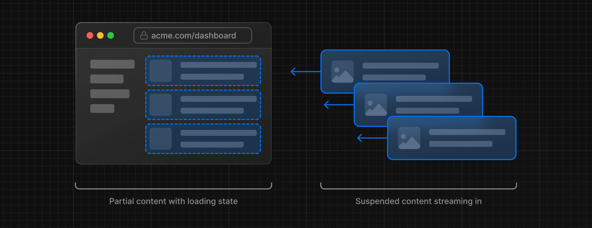
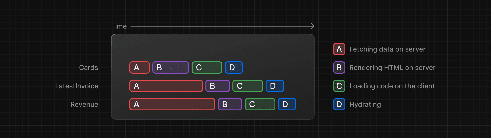
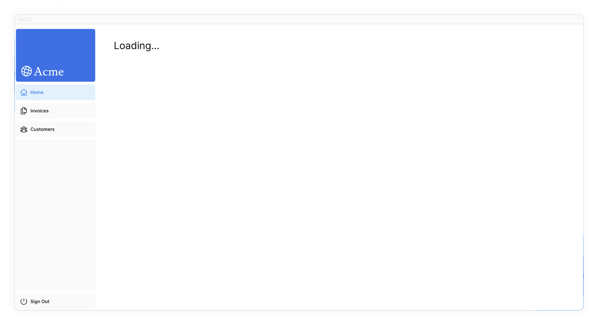

## 流式渲染 Streaming

在前面的章节中，我们提到，数据的获取，可能会影响到页面的性能， 具体会怎么影响呢？ 这里总结一下：

首先：在 `/app/dashboard/page.tsx` 中：

```tsx
// ...
import {
  fetchRevenue,
  fetchLatestInvoices,
  fetchCardData,
} from '@/app/lib/data';

export default async function Page() {
  const revenue = await fetchRevenue();
  const latestInvoices = await fetchLatestInvoices();
  const {
    numberOfInvoices,
    numberOfCustomers,
    totalPaidInvoices,
    totalPendingInvoices,
  } = await fetchCardData();

  return (// Ui Part  );
}
```

UI 部分必须等到所有请求结束完毕获取到数据后才会渲染。

在 `fetchCardData()` 方法中，通过了 `Promise.all` 来优化，但是也要等到最慢的哪个子查询方法完毕后才会 resolve

为了解决这些问题，本章节介绍了 Streaming， 这里翻译为 流式渲染。

所谓流式渲染其实就是将页面划分为多个独立的 "块"， 让他们各自渲染，互补影响。





### 整个页面的流式渲染

> 其实我也不是很懂为什么这叫做流式渲染， 该英文的标题为 Streaming a whole page with `loading.tsx`

其实就是为整个页面弄个 “加载中”的状态页， 作为就是在 `/app/dashboard` 根目录中加一个名为 `loading.tsx` 的文件， 文件内容就是返回一个普通的 React 组件：

```tsx
export default function Loading() {
    return <div>Loading...</div>;
    //   return <DashboardSkeleton />; 后面优化了下，整了个骨架屏
}
```

效果就是把之前的页面空白换成了：



这个 `loading.tsx` 文件是一个 Next.js 中的特殊文件，它构建于 Suspense 之上。用于提供一个页面加载完成前的后备页面（fallback）

然后后面的教程中说了，这个 `loading.tsx` 的优先级别比较高，当前的目录(路由)结构大致如下：

```bash
.
└── app
    ├── dashboard
    │   ├── customers
    │   │   └── page.tsx
    │   ├── invoices
    │   │   └── page.tsx
    │   ├── layout.tsx
    │   ├── loading.tsx # 新加的 loading.tsx
    │   └── page.tsx
    ├── layout.tsx
    └── page.tsx
```

它会同时作为 其他的子路由的 Loading 后备页面。

要解决这个问题，需要给 app/dashboard/page.tsx 和 app/dashboard/loading.tsx 捆绑在一起， 做法就是把他俩放到一个特殊命名的文件夹中，`(overview)`, 这个`()` 中间的名称随便取， 可以把它当作一个命名空间。 在 Next.js 中，管它叫做 Route Group。 现在的目录结构就是:

```bash
.
└── app
    ├── dashboard
    │   ├── (overview) # 加这个玩意
    │   │   ├── loading.tsx # 移进来
    │   │   └── page.tsx# 移进来
    │   ├── customers
    │   │   └── page.tsx
    │   ├── invoices
    │   │   └── page.tsx
    │   └── layout.tsx
    ├── layout.tsx
    └── page.tsx
```

### 组件的流式渲染

通过 React Suspense 来实现组件级别的流式渲染

首先将 /app/dashboard/(overview)/page.tsx 中的数据获取移入到各个 UI 组件内部，在 /app/dashboard/(overview)/page.tsx 中，使用 Suspense 组件，和后背的 骨架屏组件包裹对应的组件。 如下：

```tsx
// /app/dashboard/(overview)/page.tsx
//...
import { Suspense } from 'react';
import { RevenueChartSkeleton } from '@/app/ui/skeletons';
export default async function Page() {
//...
      <Suspense fallback={<RevenueChartSkeleton />}>
          <RevenueChart />
        </Suspense>
//...
```

```tsx
// /app/ui/dashboard/revenue-chart.tsx
//...
import { fetchRevenue } from '@/app/lib/data';
//...
export default async function RevenueChart() { // Make component async, remove the props
  const revenue = await fetchRevenue(); // Fetch data inside the component
  //...
  return (  // ... UI Part  );
```
