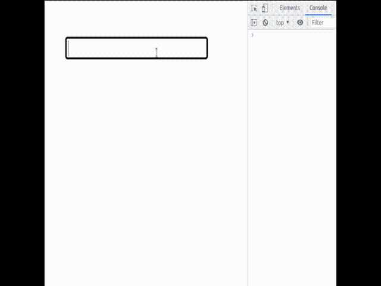

watchEffect 

立即运行一个函数， 同时响应式地追踪其依赖，并在依赖更改时重新执行。

> 有点像计算属性

1. 非惰性的， 即立即执行，有点类似启用 watch 中的 `immediately` 属性

2. 清除副作用， watchEffect 的第一个参数接受一个工厂函数，其传参为一个 `onInvalidate` 的回调函数。 该回调函数的执行时机是：

   - 副作用即将重新执行时
   - 侦听器被停止 (如果在 `setup()` 或生命周期钩子函数中使用了 `watchEffect`，则在组件卸载时)

   > 关于副作用清除， 可以看看这个
   > https://www.youtube.com/watch?v=K7zx0tZQO7E， 有一个很重要的总结就是：“ Stop async methods if our watcher is retriggered ”


关于副作用清除，让我们做一个简单的demo， 

我们期望实现这样一个需求： 打印用户的输入状态，即如果用户正在输入，那么就显示 “正在输入...“， 停止输入，我们就延迟一秒以后取消掉这个状态的显示。

1. 首先，构建基本的结构，我们需要用双向绑定处理用户的输入。 

   ```vue
   <script setup lang="ts">
   import { ref } from "vue"
   let input = ref('')
   
   </script>
   
   <template>
     <input type="text" v-model="input">
   </template>
   ```

2. 然后我们应该需要一个变量去控制是否显示 '"正在输入..."' 字符串。我们会用到 条件渲染

   ```vue
   <script setup lang="ts">
   import { ref } from "vue"
   let input = ref('')
   let isTyping = ref(false);
   
   </script>
   
   <template>
     <input type="text" v-model="input">
     <p v-if="isTyping">正在输入中...</p>
   </template>
   ```

3. 接着，我们需要考虑怎么实现核心的逻辑（注意，我们计划使用 监听实现），

   我们将使用监听器， 监听用户的输入值， 如果输入值变化了，我们就把 “ 正在输入... ” 的字符串显示出来。 让我们先用 watch 尝试实现一下：

   ```vue
   <script setup lang="ts">
   import { ref, watch } from "vue"
   let input = ref('')
   let isTyping = ref(false);
   
   watch(input, () => {
     isTyping.value = true
     setTimeout(() => {
       isTyping.value = false
     }, 1000)
   })
   </script>
   
   <template>
     <input type="text" v-model="input">
     <p v-if="isTyping">正在输入中...</p>
   </template>
   ```

   我们监听用户输入值变化，就说明用户正在输入，等到用户停止输入后一秒，我们把 " 正在输入... " 字符串隐藏掉。 

   看起来逻辑很通顺，让我们试试看效果：

   

   发现了吗， 如果输入的间隔时间超过了1秒。 那么“ 正在输入中... ” 字串，会开始频闪， 这不是我们期望的。 出现这个情况的原因也好分析， 假如，持续输入，在1秒输入了10个字符，那么就会出现10个 setTimeout 定时器， 他们将会在每一次输入后延迟1秒触发，结果就是1秒之后来连续10个定时器执行，我们在触发的时候把字符串显示，然后定时器又会立刻将其隐藏，所以会出现频闪。 知道什么问题后也就好解决了，这明显是个防抖问题。 我们只需要在设置新的 setTimeout 定时器之前，将旧的定时器取消掉就行了。 

   ```vue
   <script setup lang="ts">
   import { ref, watch } from "vue"
   let input = ref('')
   let isTyping = ref(false);
   let timer: any = null
   watch(input, () => {
     isTyping.value = true
     if (timer) {
       clearTimeout(timer)
     }
     timer = setTimeout(() => {
       isTyping.value = false
     }, 1000)
   })
   </script>
   
   <template>
     <input type="text" v-model="input">
     <p v-if="isTyping">正在输入中...</p>
   </template>
   ```

   再来试试：

   

4.  我们主要是为了学习 watchEffect 的副作用清除， 让我们尝试用它来实现。 

   在上一步的实现中，我们留意到了， 我们需要在设置新的定时器之前将旧的定时器清除掉。 我们回顾看看 watchEffect的 `onInvalidate` 有什么执行特点：

   - 副作用即将重新执行时
   - 侦听器被停止 (如果在 `setup()` 或生命周期钩子函数中使用了 `watchEffect`，则在组件卸载时)

   第一点让我们写个简单的 demo 认识一下：

   ```vue
   <script setup lang="ts">
   import { ref, watchEffect } from "vue"
   let input = ref('0')
   
   watchEffect((clearUp) => {
     console.log(input.value)
     clearUp(() => {
       console.log("clear up")
     })
   })
   
   </script>
   
   <template>
     <input type="text" v-model="input">
     <!-- <p v-if="isTyping">正在输入中...</p> -->
   </template>
   ```

   

   由于非惰性的特性，首次将立即执行, 打印 “0”
   而后， 依赖值发生变化，可以看到。每次都是先执行 `onInvalidate` 回调，然后再去执行监听逻辑。 

   那么利用，它每次会先执行 onInvalidate 的特点，我们可以把定时器的取消放在这个里面。

   ```vue
   <script setup lang="ts">
   import { ref, watchEffect } from "vue"
   let input = ref('')
   let isTyping = ref(false);
   
   
   watchEffect((clearUp) => {
     if (input.value.length > 0) {
       // 为了首次渲染不显示
       isTyping.value = true;
     }
     const timer = setTimeout(() => {
       isTyping.value = false
     }, 1000)
     clearUp(() => {
       clearTimeout(timer)
     })
   })
   
   </script>
   
   <template>
     <input type="text" v-model="input">
     <p v-if="isTyping">正在输入中...</p>
   </template>
   ```

   


我们可以把以上实践模式进一步抽象， 就是 watchEffect 的防抖实现

```vue
<script setup lang="ts">
import { ref, watchEffect } from "vue"
let input = ref('')

const mockGetData = (value) => {
  return setTimeout(() => {
    // do something
    console.log('do something!', value)
  }, 1000)
}
watchEffect((clearUp) => {
  const timer = mockGetData(input.value)
  clearUp(() => {
    if (timer) {
      clearTimeout(timer)
    }
  })
})

</script>

<template>
  <input type="text" v-model="input">
</template>
```


