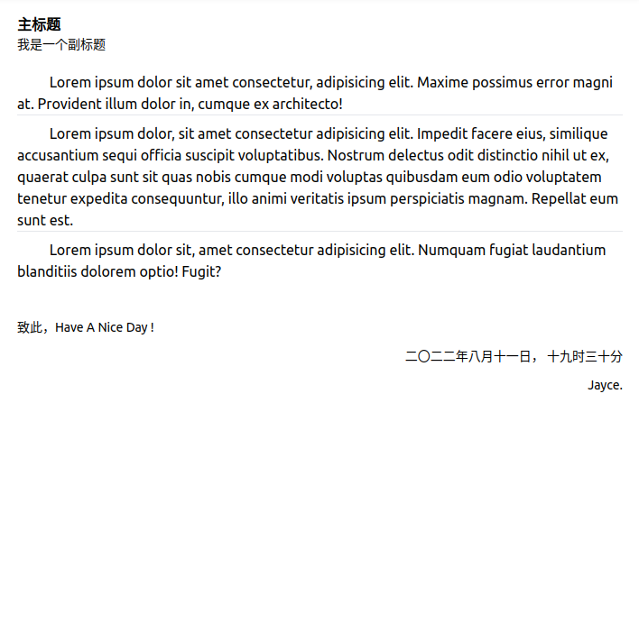

[toc]

## slot 插槽

slot 插槽分为四个知识点：

1. 匿名插槽
2. 具名插槽
3. 作用域插槽
4. 动态插槽


### 匿名插槽  和 具名插槽

匿名插槽就是不指定 `name` 属性， 具名插槽就是指定了 `name` 属性，  匿名插槽会有一个默认的 name 值， 即 "default"



**src/layout/Content/index.vue**

```vue
<script setup lang="ts">
import ArticleHeaderVue from '@/components/Article/ArticleHeader.vue';
import ArticleMainVue from '@/components/Article/ArticleMain.vue';
import ArticleFooterVue from '@/components/Article/ArticleFooter.vue';
</script>

<template>
  <div class="p-5">
    <div class="article">
      <ArticleHeaderVue>
        <template v-slot:title>主标题</template>
        <template v-slot:subtitle>我是一个副标题</template>
      </ArticleHeaderVue>
      <ArticleMainVue>
        <template v-slot:main-intro>
          Lorem ipsum dolor sit amet consectetur, adipisicing elit. Maxime possimus error magni at. Provident illum
          dolor in, cumque ex architecto!
        </template>
        <template v-slot:main-body>
          Lorem ipsum dolor, sit amet consectetur adipisicing elit. Impedit facere eius, similique accusantium sequi
          officia suscipit voluptatibus. Nostrum delectus odit distinctio nihil ut ex, quaerat culpa sunt sit quas nobis
          cumque modi voluptas quibusdam eum odio voluptatem tenetur expedita consequuntur, illo animi veritatis ipsum
          perspiciatis magnam. Repellat eum sunt est.
        </template>
        <template v-slot:main-summary>
          Lorem ipsum dolor sit, amet consectetur adipisicing elit. Numquam fugiat laudantium blanditiis dolorem optio!
          Fugit?
        </template>
      </ArticleMainVue>
      <ArticleFooterVue>
        <template v-slot:footer-writersaying>致此，Have A Nice Day !</template>
        <template v-slot:footer-date>二〇二二年八月十一日， 十九时三十分</template>
        <template v-slot:footer-writersign>Jayce.</template>
      </ArticleFooterVue>
    </div>
  </div>
</template>
```

**src/components/Article/ArticleHeader.vue**

```vue
<template>
  <div>
    <h2 class="font-bold text-black-700">
      <slot name="title"></slot>
    </h2>
    <h3 class="text-sm text-black-700">
      <slot name="subtitle"></slot>
    </h3>
  </div>
</template>
```

**src/components/Article/ArticleMain.vue**

```vue
<template>
  <div class="mt-5">
    <!-- &emsp;是制表符 tab缩进 -->
    &emsp;&emsp;
    <slot name="main-intro"></slot>
  </div>
  <hr>
  <div class="mt-2">
    &emsp;&emsp;
    <slot name="main-body"></slot>
  </div>
  <hr>
  <div class="mt-2">
    &emsp;&emsp;
    <slot name="main-summary"></slot>
  </div>
</template>
```

**src/components/Article/ArticleFooter.vue**

```vue
<template>
  <div class="mt-10 text-sm">
    <div>
      <slot name="footer-writersaying"></slot>
    </div>
    <div class="mt-3 text-end">
      <slot name="footer-date"></slot>
    </div>
    <div class="mt-3 text-end">
      <slot name="footer-writersign"></slot>
    </div>
  </div>
</template>
```


**以上实例中， `v-slot` 可以被缩写为 `#`**, 修改以上的实例，看起来就像这样：

**src/layout/Content/index.vue**

```vue
<script setup lang="ts">
import ArticleHeaderVue from '@/components/Article/ArticleHeader.vue';
import ArticleMainVue from '@/components/Article/ArticleMain.vue';
import ArticleFooterVue from '@/components/Article/ArticleFooter.vue';
</script>

<template>
  <div class="p-5">
    <div class="article">
      <ArticleHeaderVue>
        <template #title>标题</template>
        <template #subtitle>我是一个副标题</template>
      </ArticleHeaderVue>
      <ArticleMainVue>
        <template #main-intro>
          Lorem ipsum dolor sit amet consectetur, adipisicing elit. Maxime possimus error magni at. Provident illum
          dolor in, cumque ex architecto!
        </template>
        <template #main-body>
          Lorem ipsum dolor, sit amet consectetur adipisicing elit. Impedit facere eius, similique accusantium sequi
          officia suscipit voluptatibus. Nostrum delectus odit distinctio nihil ut ex, quaerat culpa sunt sit quas nobis
          cumque modi voluptas quibusdam eum odio voluptatem tenetur expedita consequuntur, illo animi veritatis ipsum
          perspiciatis magnam. Repellat eum sunt est.
        </template>
        <template #main-summary>
          Lorem ipsum dolor sit, amet consectetur adipisicing elit. Numquam fugiat laudantium blanditiis dolorem optio!
          Fugit?
        </template>
      </ArticleMainVue>
      <ArticleFooterVue>
        <template #footer-writersaying>致此，Have A Nice Day !</template>
        <template #footer-date>二〇二二年八月十一日， 十九时三十分</template>
        <template #footer-writersign>Jayce.</template>
      </ArticleFooterVue>
    </div>
  </div>
</template>
```


### 作用域插槽

作用域插槽 在 匿名插槽 和 具名插槽 的使用上存在差异，

此外，在学习这个的时候，有一个疑问，就是 作用于插槽的应用场景是什么 ？

官方的文档对此的描述是：

> 你可能想问什么样的场景才适合用到作用域插槽，这里我们来看一个 `<FancyList>` 组件的例子。它会渲染一个列表，并同时会封装一些加载远端数据的逻辑、使用数据进行列表渲染、或者是像分页或无限滚动这样更进阶的功能。然而我们希望它能够保留足够的灵活性，将对单个列表元素内容和样式的控制权留给使用它的父组件。[link](https://cn.vuejs.org/guide/components/slots.html#fancy-list-example).

简单的说，就是 你可以将数据处理在 子组件中去完成，然后向上层暴露，  上层可以去控制 这些数据展示。 
以 ant-design 的 UI 框架为例， table 组件 可以通过 slot 自定义的定义当前 行 某个字段怎么去展示。 它是先将整个 Record 传入 子组件， 然后通过 作用域插槽去自定义 该字段怎么去展示。 我们可以将 record 中的多个字段处理，然后再展示 等等。

以下是一个实例， 用于介绍作用域插槽， 同时，更为了传达 作用域 插槽可以怎么用，有什么样的应用场景。 

传入 User 组件查询条件， 然后渲染出对应的用户卡片：

**src/views/SlotScope/index.vue**

```vue
<script setup lang="ts">
import User from './User.vue'; 
</script>
<template>

  <User gender="female" country="ch">
      <template #default="slotProps">User Id:{{slotProps.id}}</template>
      <!-- <template v-slot:default="slotProps">User Id:{{slotProps.id}}</template> -->
      <template #userinfo="{user:{cell,email,picture:{thumbnail},name:{title,first,last}}}">
        <!-- <template v-slot:userinfo="{user:{cell,email,picture:{thumbnail},name:{title,first,last}}}"> -->
        
        <p>User Name: {{title+'.'+ first+' '+ last}}</p>
        <p>Emial: {{email}}</p>
        <p>Cell: {{cell}}</p>
      </template>
  </User>  
</template>
```


**src/views/SlotScope/User.vue**

```vue
<script setup lang="ts">
import { onBeforeMount, ref } from 'vue'
let userinfo: any = ref(null)
let userId = ref('')
const props = defineProps({
  gender: {
    default: 'male'
  },
  country: {
    default: 'us'
  }
})
const { gender, country } = props
onBeforeMount(() => {
  // https://randomuser.me/documentation#howto
  fetch(`https://randomuser.me/api/?gender=${gender}?nat=${country}`).then(res => {
    res.json().then(parse => {
      userinfo.value = parse.results[0]
      userId.value = parse.results[0].id.value
    })
  })
})
</script>
<template>
  <div class="w-96 border shadow-md rounded-lg m-10 p-4">
    <div class="text-red-400">
      <slot :id="userId"></slot>
    </div>
    <div class="mt-5 text-sm text-gray-500">
      <slot name="userinfo" :user="userinfo"></slot>
    </div>
  </div>
</template>
```


> TODO: 这个例子中点问题， 写了两个卡片，只会渲染一个
>
> 
>
> 问题已经解决， 是使用层面的问题：https://github.com/vuejs/core/issues/6450
>
> 出现这个错误是有使用层面的错误，原因是, 尝试在未获取到数据的阶段去 渲染组件， 导致报错 阻塞页面逻辑往下执行。 可以通过以下方式去解决该问题：
>
> 1. 使用异步组件
> 2. 使用 v-if 控制组件何时渲染， 在 fetch 成功到数据以后
> 3. 设定一组初始值
> 4. 不要使用解构语法，并在插值的时候用三元表达式判断油脂再渲染， 因为解构的时候，会尝试访问数据值， 而这些数据，有可能还没有，所以会报错阻塞执行。

### 动态插槽

动态插槽，就是 插槽的名称可以不用写死，而是通过 变量去绑定。 

**src/views/DynamicSlot/Child.vue**

```vue
<template>
  <div class="w-48 border">
    <div class="h-12 bg-red-300 ">
      <slot name="foo"></slot>
    </div>
    <div class="h-12 bg-green-300 ">
      <slot name="bar"></slot>
    </div>
  </div>
</template>
```

**src/views/DynamicSlot/index.vue**

```vue
<script setup lang="ts">
import Child from './Child.vue';
import { ref } from 'vue'
let slotName = ref('foo')
</script>
<template>
  <Child>
    <template #[slotName]>
      Hello Dynamic Slot
    </template>
  </Child>
</template>
```


**src/views/DynamicSlot/index.vue**

```js
let slotName = ref('bar')
```


