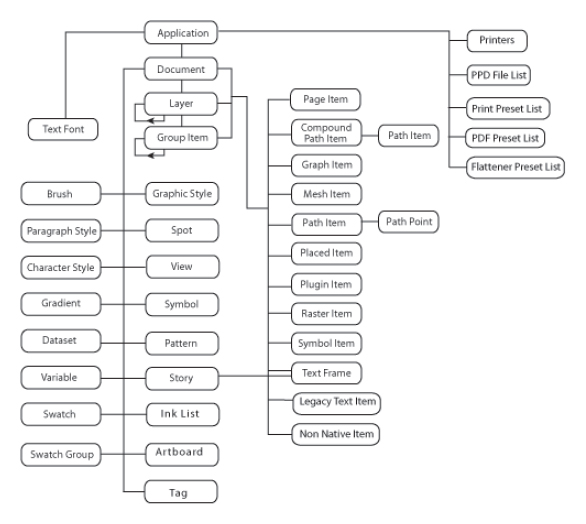

# Illustrator 脚本对象模型

## 顶层对象

通过以下全局对象以访问 Illustrator 应用或者某个独立文档的全局信息

### Application

- 用户偏好信息，用户通过 Edit > Preferences 设定的值
- 系统信息， 例如安装的字体，打印机列表
- 一些应用级别的信息，例如安装的位置， 版本，以及是否可见
- 当前活动文档， 所有打开的文档列表

`application` 对象的方法或者命令允许你可以执行一些应用级的操作，例如打开文件， 撤销和重做，退出 illutrator 等等。

### Document

你的脚本能够通过 Application 对象创建或者访问 Document 对象， 它代表一个画布或者说被载入的 illustrator 文件。

`document` 对象的属性使得开发者具备访问 文档 内容的能力，例如：

- 用户当前选中的对象 `selection`
- 我们把 一个 Illustrator document 中的内容，称作 artwork tree, 而所有的  art objects, 叫做 `page items`，而 art object 可以是不同的类型，例如 `symbols` 以及 `text frames`
- 我们还能访问到所有的图层 `layers`, 以及当前活动的 `active layer`
- 

### Layer