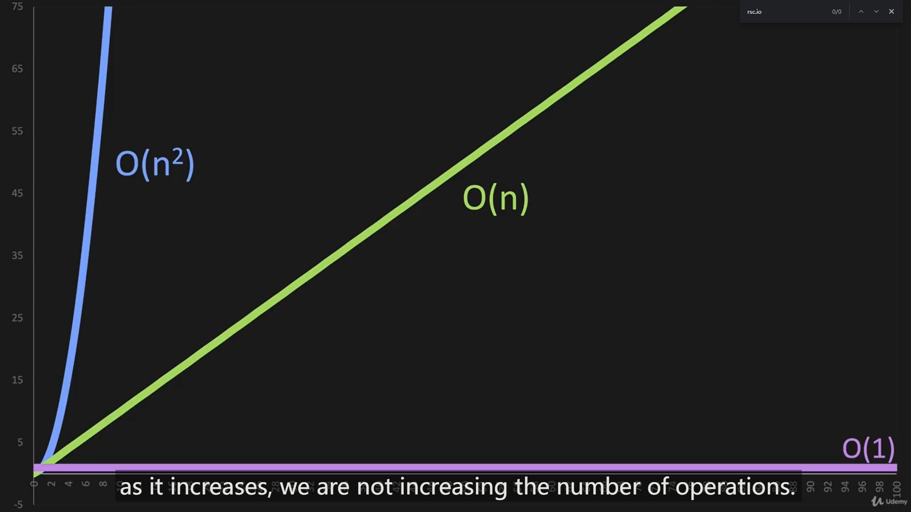

```python
def add_items(n):
    return n + n #O(1)
#    return n + n +n #O(2) ==> simplify to O(1)
```

In this case the operation is the addition, So if it is one, you have one operation. Which can be describe as `O(1)`. And if there are two addition operation, you have two operations. which can be describe as `O(2)`.

`O(1)` is also called constant time, meaning that as in increases, the number of operations is going to remain constant. 



`O(1)` is the most efficient Big O. 