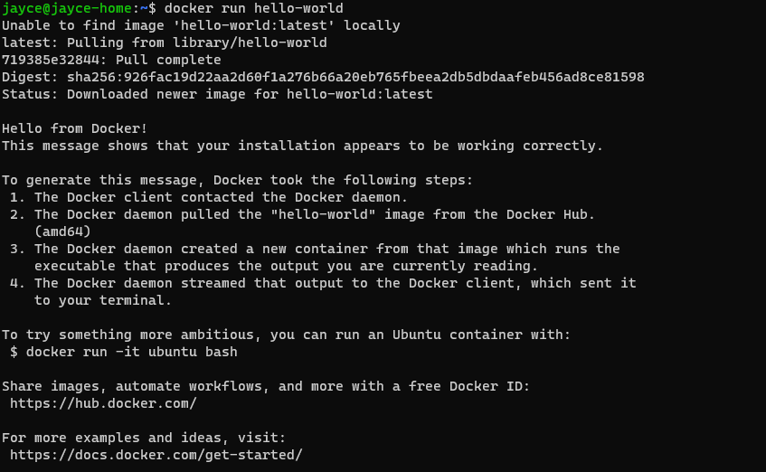
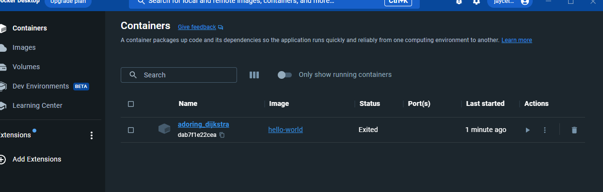
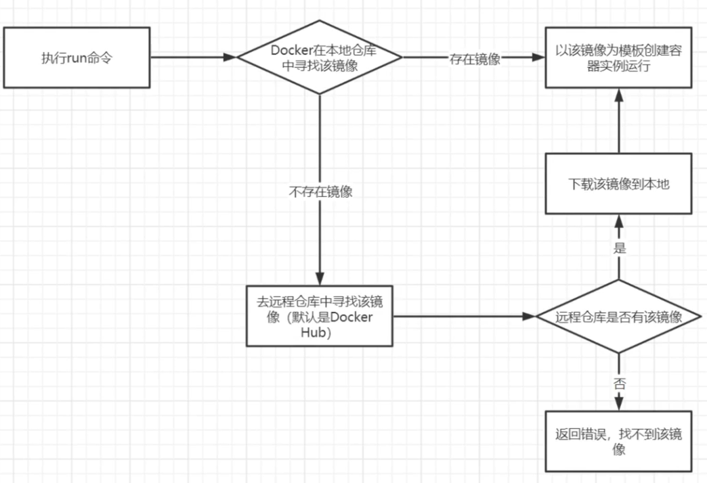

# 4.Docker 运行机制

1. 安装并启动 Docker 服务
2. 下载镜像， (如果本地仓库已经有了该镜像， 则跳过下载步骤)
3. 启动该镜像得到一个容器
4. 容器里面运行着我们想要的程序


| 英文名        | 中文名          | 描述                                                         |
| ------------- | --------------- | ------------------------------------------------------------ |
| Docker Daemon | Docker 守护进程 | 监听 Docker 命令请求， 管理 Docker对象，例如镜像，容器，网络，卷等 |
| Client        | Docker 客户端   | 用户与 Docker 交互的主要方式， 客户端将用户输入命令交由 Docker 守护进程来执行 |
| Registry      | Docker 注册表   | 用户存储 Docker 镜像的地方，其中 Docker Hub 是Docker 为我们提供的公共注册中心， 默认情况下， Docker 镜像在 Docker Hub 中寻找并下载， 我们也可以自己搭建自己的注册表。 当使用 docker pull 或 docker run 命令的时候，将从配置的注册表中提取所需的镜像， 使用 docker push 命令的时候，镜像会被推送到配置的注册表中 |
| images        | Docker 镜像     | Docker 镜像就是一个只读的模板，可以用来创建 Docker 容器，例如一个镜像可以包含一个完整的 centos 操作系统环境， 里面仅安装了 Mysql 或则用户需要的其他应用程序。 Docker 提供了一个非常简单的机制来创建镜像或者更新现有的镜像。用户甚至可以直接从其他人那里下载一个已经做好的镜像来直接使用。 |
| Containers    | Docker 容器     | 容器是从镜像创建的运行实例， 它可以被启动，停止，删除，每个容器都是相互隔离的，能够保证安全，可以把容器看作一个简单版本的 Linux环境，包括 root 用户权限，进程空间，用户空间，和网络空间，以及运行在其中的应用程序，Docker 利用容器来运行应用，镜像是只读的， **容器在启动的时候创建一层可写层作为最上层**。 |


### 4.1 HelloWorld 实现

1. 将 Docker 服务启动

2. 运行官方提供的 HelloWorld 容器

   ```bash
   docker run hello-world
   ```

   

   > 运行成功

   如果安装了 docker-desktop, 也能看到

   

### 4.2 HelloWorld 过程中，究竟干了什么？



