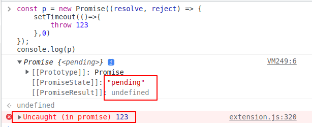

## 手写 Promise - 构造器的实现

[toc]


### 基本结构

```js
const p = new Promise((resolve, reject) => {
  resolve(1);
});
console.log('[p]: ', p);
```

在使用 Promise 的时候， 是通过 `new` 关键字实例化一个 Promise 对象， 传入一个 callback 函数， 根据这点，我们能知道大概的结构是这样的：

```js
class MyPromise {
  constructor(executor) {
    executor();
  }
}
```

进一步，我们知道， 传入的 callback 函数也有两个参数， 这两个参数又是函数， 也就是一个嵌套的 回调函数。

```js
class MyPromise {
  constructor(executor) {
    const resolve = () => {};
    const reject = () => {};
    executor(resolve, reject);
  }
}
```

### 一些问题思考

> 思考问题： 这里的 resolve 和 reject 是放在构造器中定义的， 能不能放在原型上？ 这样就不会每次 `new` 的时候都重新创建了。 就像这样：
>
> ```js
> class MyPromise {
>   constructor(executor) {
>     executor(resolve, reject);
>   }
>   resolve = () => {};
>   reject = () => {};
> }
> ```
>
> - 答：不可以
>
> 因为这里面涉及到一个 `this` 的指向问题， 在 `resolve` 和 `reject ` 函数体中，肯定会用到 `this`,  如果希望指向当前对象， 是做不到的， 因为 `resolve`, `reject` 作为回调函数的参数， 同时是函数， 他是在外部执行的：
>
> ```js
> const p = new Promise((resolve, reject) => {
>   resolve(1);
> });
> ```
>
> 函数的 `this` 是指向其调用者的， 而在回调函数的函数体中，它是直接执行的， 所以会指向 `全局对象` 。无法达到我们期望的指向 被 `new` 出来的对象。 
>
> > 进一步思考问题： 如果就要定义在原型上，有没有什么办法？
> >
> > - 答： 有，  使用bind 绑定 this, 同时产生一个新函数
> >
> > ```js
> > class MyPromise {
> >   constructor(executor) {
> >     executor(this.resolve.bind(this), this.reject.bind(this));
> >   }
> >   resolve = () => {};
> >   reject = () => {};
> > }
> > ```
> >
> > 

### 这两个函数有参数吗？

在调用 `resolve` 的时候需要返回值，或者 `undefined`, 调用 `reject`  的时候， 需要返回一个错误对象。

```js
class MyPromise {
  constructor(executor) {
    const resolve = (data) => {};
    const reject = (reason) => {};
    executor(resolve, reject);
  }
}
```

根据我们学过的 promise 知识， 当 `resolve` 执行的时候，需要做什么？ 去改变当前 Promise 的状态


`[[PromiseState]]`: 当前promise 的状态

`[[PromiseResult]]`: 当前promise 的结果

所以 Promise 中会有两个属性， 一个是状态， 一个是结果：

```js
class MyPromise {
  #state = 'pending';// 初始状态
  #result = undefined;
    
  constructor(executor) {
    const resolve = (data) => {};
    const reject = (reason) => {};
    executor(resolve, reject);
  }
}
```

> `#` 是 es6 私有属性的标记

接下来， 回过头思考，这两个函数需要干嘛？ 去修改状态和 Promise 结果

```js
class MyPromise {
  #state = 'pending';// 初始状态
  #result = undefined;
  constructor(executor) {
    const resolve = (data) => {
      this.#state = 'fulfilled';
      this.#result = data;
    };
    const reject = (reason) => {
      //调用 reject 的时候,也是一样的
      this.#state = 'rejected';
      this.#result = reason;
    };
    executor(resolve, reject);
  }
}
```

但是,每一次调用都应该改变状态吗?

要是像下面这样连续调用呢?

```js
const p = new Promise((resolve, reject) => {
  resolve(1);
  reject(123);
});
```

我们在学习 Promise 的时候, 知道了, Promise 的状态一经变化,不可再修改, 所以这里肯定是不行的, 

怎么解决这个问题呢?

我们需要在改变状态的时候去判断一下状态是否改变过:

```js
class MyPromise {
  #state = 'pending';
  #result = undefined;
  constructor(executor) {
    const resolve = (data) => {
      if (this.#state !== 'pending') return; //判断状态是否改变过
      this.#state = 'fulfilled';
      this.#result = data;
    };
    const reject = (reason) => {
      if (this.#state !== 'pending') return; //判断状态是否改变过
      this.#state = 'rejected';
      this.#result = reason;
    };
    executor(resolve, reject);
  }
}
```


代码优化, 我们可以看到上面的代码中, 有些地方都长得差不多, 所以我们稍微做一些提取:

```diff
class MyPromise {
  #state = 'pending';
  #result = undefined;
  constructor(executor) {
    const resolve = (data) => {
+      this.#changeState('fulfilled', data);
-      if (this.#state !== 'pending') return; //判断状态是否改变过
-      this.#state = 'fulfilled';
-      this.#result = data;
    };
    const reject = (reason) => {
+      this.#changeState('rejected', reason);
-      if (this.#state !== 'pending') return; //判断状态是否改变过
-      this.#state = 'rejected';
-      this.#result = reason;
    };
    executor(resolve, reject);
  }

+  // 私有方法
+  #changeState(state, result) {
+    if (this.#state !== 'pending') return; //判断状态是否改变过
+    this.#state = state;
+    this.#result = result;
+  }
}
```

我们接着思考, 代码中有些地方写死的字符串, 叫做硬编码, 硬编码会给代码的维护带来负担,

<pre>
  constructor(executor) {
    const resolve = (data) => {
      this.#changeState(<mark>'fulfilled'</mark>, data);
    };
    const reject = (reason) => {
      this.#changeState(<mark>'rejected'</mark>, reason);
    };
    executor(resolve, reject);
  }
</pre>  


所以在开发中,有这样一个技巧是很常见的, 使用 常量

```diff
+ const PENDING = 'pending'
+ const FULLFILLED = 'fulfilled'
+ const REJECTED = 'rejected'

class MyPromise {
  #state = 'pending';
  #result = undefined;
  constructor(executor) {
    const resolve = (data) => {
+      this.#changeState(FULLFILLED, data);
-      this.#changeState('fulfilled', data);
    };
    const reject = (reason) => {
+      this.#changeState(REJECTED, reason);
-      this.#changeState('rejected', reason);
    };
    executor(resolve, reject);
  }

  // 私有方法
  #changeState(state, result) {
+    if (this.#state !== PENDING) return; //判断状态是否改变过
-    if (this.#state !== 'pending') return; //判断状态是否改变过
    this.#state = state;
    this.#result = result;
  }
}

```


### 回调函数的错误捕获

思考这样一个问题日, 如果在 回调函数执行 过程中报错,会对 Promise 产生影响吗?

```js
const p = new Promise((resolve, reject) => {
  throw 123
});
```


状态会变成 `rejected`, 结果变成了抛出的错误

因此我们需要捕获这个执行函数的错误, 如果报错那么就调用一下 `reject`

```diff

const PENDING = 'pending'
const FULLFILLED = 'fulfilled'
const REJECTED = 'rejected'
class MyPromise {
  #state = 'pending';
  #result = undefined;
  constructor(executor) {
    const resolve = (data) => {
      this.#changeState(FULLFILLED, data);
    };
    const reject = (reason) => {
      this.#changeState(REJECTED, reason);
    };

-      executor(resolve, reject);

+    try{
+      executor(resolve, reject);
+    }catch(err){
+      reject(err);
+    }
+  }

  // 私有方法
  #changeState(state, result) {
    if (this.#state !== PENDING) return; //判断状态是否改变过
    this.#state = state;
    this.#result = result;
  }
}

```


### 一个大坑!!!

如果是异步错误会改变 Promise 的状态吗?

```js
const p = new Promise((resolve, reject) => {
 	setTimeout(()=>{
        throw 123
    },0)
});
console.log(p)
```

不会改变!!



异步报错是捕获不到