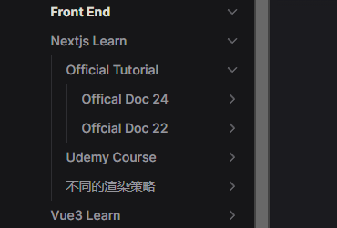

---
# https://vitepress.dev/reference/default-theme-home-page
layout: doc

hero:
    name: "sunzy.learn"
    text: "personal learning content"
    tagline: My great project tagline
    actions:
        - theme: brand
          text: Markdown Examples
          link: /markdown-examples
        - theme: alt
          text: API Examples
          link: /api-examples

features:
    - title: Feature A
      details: Lorem ipsum dolor sit amet, consectetur adipiscing elit
    - title: Feature B
      details: Lorem ipsum dolor sit amet, consectetur adipiscing elit
    - title: Feature C
      details: Lorem ipsum dolor sit amet, consectetur adipiscing elit
---


## contents 下目录结构

contents 下目录结构应该形如：

```bash
学习主题1
  - 学习资料来源1
    - README.md // 介绍说明当前学习资源的来源等基本信息
    - code.md // 用于打开对应代码的 github 地址
    - code: 代码code base
        - codebase1
        - codebase2
        - ....
    - node: 笔记 base
        - 笔记1
        - 笔记2
        - ...
  - 学习资料来源2
  - 学习资料来源3
  - ...

学习主题2
...

```

## 学习主题 X/index.md

每一个学习主题目录下，应该有一个 index.md 文件，其内容为：一个一级标题，作为生成的 sideBar 目录名称

## code.md

如果你的学习主题下面有 code 目录的时候，你应该在其同级目录下同时创建一个 code.md 文件, 这个文件复制自 “contents/.tmp/code.md”， 从而使得页面可以生成打开 github 的链接

## 目录结构顺序

关于菜单的排序

首先比较高层级的如 1 级别 2 级别 菜单是通过 .vitepress/config.mts 的 manualSortFileNameByPriority
字段来指定的。

比较低层级的， 例如 contents/Front-End/nextjs_learn
是通过 同级别目录下的 index.md 文件中 的 frontmatter 文件头字段 order 来指定的。
具体的如：
contents/Front-End/nextjs_learn/official-tutorial/index.md

```
---
order: 1
---
```

和
contents/Front-End/nextjs_learn/udemy-course/index.md

```
---
order: 2
---
```

和
contents/Front-End/nextjs_learn/不同的渲染策略/index.md

```
---
order: 3
---
```

以及 contents/Front-End/nextjs_learn/official-tutorial 的子级别，也是如此， 例如：
contents/Front-End/nextjs_learn/official-tutorial/offcial-doc-22/index.md

```
---
order: 2
---
```

contents/Front-End/nextjs_learn/official-tutorial/offical-doc-24/index.md

```
---
order: 1
---
```

这些设定规则，全是由于 sortMenusByFrontmatterOrder 这个配置字段


