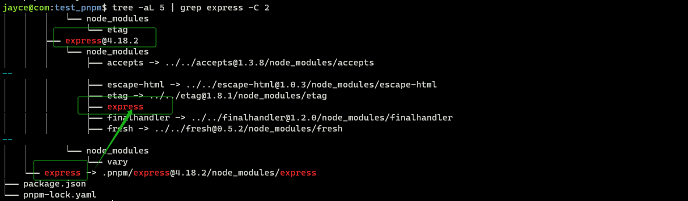

Monorepo 已经爆火了很长一段时间了， 近期自己打算写一个组件库， 也看大几乎所有的开源库作者，甚至工具类项目都是用到了 monorepo, 所以很有必要先学习了解一下。 一下是一些学习总结，心得。

## 为什么是 monorepo?

官方文档给出了项目初衷——节省磁盘空间+提高安装速度， [文档](https://pnpm.io/zh/motivation)上描述的非常清楚：

> 使用 npm 时，依赖每次被不同的项目使用，都会重复安装一次。  而在使用 pnpm 时，依赖会被存储在内容可寻址的存储中，所以：
>
> 1. 如果你用到了某依赖项的不同版本，只会将不同版本间有差异的文件添加到仓库。 例如，如果某个包有100个文件，而它的新版本只改变了其中1个文件。那么 `pnpm update` 时只会向存储中心额外添加1个新文件，而不会因为仅仅一个文件的改变复制整新版本包的内容。
> 2. 所有文件都会存储在硬盘上的某一位置。 当软件包被被安装时，包里的文件会硬链接到这一位置，而不会占用额外的磁盘空间。 这允许你跨项目地共享同一版本的依赖。
>
> 因此，您在磁盘上节省了大量空间，这与项目和依赖项的数量成正比，并且安装速度要快得多！

至于如何提高安装速度的，大概就是得益于 磁盘空间节省 的好处， 项目依赖并非单独下载的，而是通过硬链接公用依赖。 这样全局范围即便多个项目用到了同一个依赖，也不会下载多次，会直接通过硬链接引用。 从而只需要下载全局没有的依赖，进而就提高了安装速度。 

## 非扁平的 node_modules 目录

使用 npm 或 Yarn Classic 安装依赖项时，所有的包都被提升到模块目录的根目录。 这样就导致了一个问题，源码可以直接访问和修改依赖，而不是作为只读的项目依赖。

> 在 npm 或者 yarn 安装的时候，引入所有包和非显式安装的子包都可以被访问，就容易导致一种情况， 加入 A 包现在引用了 B 包，后续升级 去除了 B 包， 而开发项目中又引入了这个A包 隐式安装的子包 —— B包。 一旦我们升级了A包， 那么项目就会报错，因为升级后的 A包中，已经不再引用 B 包了。 所以正确的情况应该是项目中 A 包 引用了 B 包， 但是我们只是显式的安装了 A 包， 那么 B 包则不应该被访问到。 如果我们需要用到 B 包，那么就应该显式的去安装引入B包。

pnpm 是如何做的呢？ 默认情况下，pnpm 使用符号链接将项目的直接依赖项添加到模块目录的根目录中。


我们可以测试看看，通过npm 和 pnpm 安装项目依赖的区别：

```bash
$ mkdir test_npm test_pnpm

# 初始化
$ cd test_npm/;npm init -y;cd ..
$ cd test_pnpm/;pnpm init;cd ..

# 分别安装 express 依赖
$ cd test_npm/;npm add express;cd ..
$ cd test_pnpm/;pnpm add express;cd ..

# 查看目录结构
$ cd test_npm/; tree -L 3 | head -n 8;cd ..; cd test_pnpm/; tree -aL 2;cd ..

# npm
.
├── node_modules
│   ├── accepts
│   │   ├── HISTORY.md
│   │   ├── LICENSE
│   │   ├── README.md
│   │   ├── index.js
│   │   └── package.json
# pnpm
.
├── node_modules
│   ├── .modules.yaml
│   ├── .pnpm
│   └── express -> .pnpm/express@4.18.2/node_modules/express
├── package.json
└── pnpm-lock.yaml

```

可以看到， 通过 npm 安装 express 时， 所有子包都被平铺到根目录， pnpm 则是通过硬链接到将 express 这个依赖链接到顶层目录

```bash
$ cd node_modules/.pnpm/
$ tree -L 3 | grep -C 1 express
│       └── etag
├── express@4.18.2
│   └── node_modules
--
│       ├── etag -> ../../etag@1.8.1/node_modules/etag
│       ├── express
│       ├── finalhandler -> ../../finalhandler@1.2.0/node_modules/finalhandler
```

> `grep -C 1` 展示目标匹配上下文行数为1， 即 匹配关键字 “express” 上下各一行



这也是为什么 node_modules/express 下没有 node_modules 的原因：
```bash
$ tree
.
├── History.md
├── LICENSE
├── Readme.md
├── index.js
├── lib
│   ├── application.js
│   ├── express.js
│   ├── middleware
│   │   ├── init.js
│   │   └── query.js
│   ├── request.js
│   ├── response.js
│   ├── router
│   │   ├── index.js
│   │   ├── layer.js
│   │   └── route.js
│   ├── utils.js
│   └── view.js
└── package.json
```

以 express 所依赖的子包 encodeurl 为例， 实际上它位于：
```bash
$ tree -aL 3 | grep  encodeurl
│   ├── encodeurl@1.0.2
│   │   ├── encodeurl -> ../encodeurl@1.0.2/node_modules/encodeurl
```

总的来说， 我们显示的引入了 express, 所以我们的node_modules 长这样：
```bash
node_modules$ tree -aL 1
.
├── .modules.yaml
├── .pnpm
└── express -> .pnpm/express@4.18.2/node_modules/express
```

express 实际上是一个硬链接， 被提升到顶层，它实际位于  .pnpm 目录下的硬链接。

```bash
$ cd .pnpm/express@4.18.2/node_modules/
$ ls -a
lrwxrwxrwx 1 jayce jayce   40 Nov 13 14:54 accepts -> '../../accepts@1.3.8/node_modules/accepts'/
lrwxrwxrwx 1 jayce jayce   52 Nov 13 14:54 array-flatten -> '../../array-flatten@1.1.1/node_modules/array-flatten'/
lrwxrwxrwx 1 jayce jayce   49 Nov 13 14:54 body-parser -> '../../body-parser@1.20.1/node_modules/body-parser'/
......
......
lrwxrwxrwx 1 jayce jayce   64 Nov 13 14:54 content-disposition -> '../../content-disposition@0.5.4/node_modules/content-disposition'/
lrwxrwxrwx 1 jayce jayce   50 Nov 13 14:54 content-type -> '../../content-type@1.0.5/node_modules/content-type'/
```

这些依赖都是 express 的显示依赖，他们也是硬链接， 这些依赖则被平铺到了  上上层的 `.pnpm`目录， 其他的依赖也是如此， 全部都是硬链接到`.pnpm`目录。 

`pnpm` 通过这种方式，让我们的项目中显式的依赖得以被访问， 其他的子依赖又被平铺到 `.pnpm` 以完全适配Node.js。

> 官方有一篇文章对 pnpm 的包依赖组织关系做了详细的说明 https://pnpm.io/zh/symlinked-node-modules-structure

