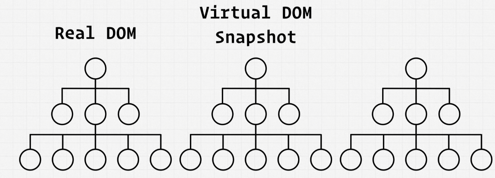

本节内容以之前的 Monster Rolodex 项目为基础：

以上，浏览器直接渲染的结构，也就是真实的 Dom（Real Dom)

真实Dom 的问题在于，对其直接进行修改是非常昂贵的开销。 具体的指的是 所谓的 reflow(# 回流) ，当你要删除 Dom 的节点或者片段时，或者你要更新 Dom 片段， 为了进行这些更改，需要做很多的计算。 

React 的做法是，在这种情况下， React 用JavaScript 复制了真实的 Dom, 构建了 Dom tree， 但是它并没有使用真正的 dom 元素， 而是在 JavaScript 中反映了所有这些元素的映射关系。 JavaScript 在实际创建和反映这些更改方面要快得多。所以上述的 reflow 过程在 JavaScript 上能够很高效的完成。

用户需要的是浏览器可以直接渲染的真正的 Dom 树，我们不能使用 JavaScript 构建的 Dom 映射树来直接用以渲染，但是我们可以利用这颗树来确定发生了什么变化。 这颗树，也叫做虚拟Dom (Virtual Dom)。 

让我们以我们的 Monster Rolodex Demo 为例，以用户输入搜索来分析一些 React 是怎么利用虚拟Dom 来工作的。 

首先，React 将会另外复制一个虚拟 Dom 的副本，并将之前的虚拟 Dom 保存为一个快照：

当我们子 SearchBox 中输入内容时， 如 "Lea"：

这个搜索框在每次用户输入字符的时候触发一个 onChange 事件， 这些更改返过来会在我们的应用程序内部调用 `setState`， 下图中将其表示为一个蓝色的部分：

由于我们会输入"Lea", 那么将会调用三次 `setState` 方法， React 实际上会将这些调用组合在一起。如果它们足够慢或者足够快，则确实有所不同。(# If thet're slow enough or if they're fast enough, it really differs.)

React 有一大堆的内部优化，去使得这些调用在后台的执行过程更加高效。

即使它在JavaScript 中，它仍然希望尽可能优化并减少最终需要发生改变的总数。   

React 足够聪明 去找到需要渲染的部分——所有该组件的所有子级组件， 在这个示例中，即唯一需要更新的组件就是CardList， 实际上，当组件的props改变时，就会发生re-render。 

在我们的示例中，card-list 在用户输入后，接收的 props 将会发生变化。因此将会去渲染新的 cards 

或许在这些 cards 中，由于 "Lea" 的输入，触发的过滤，导致传入 card-list 的 props 的 “cards” 数据更少了。React 会找出哪些 card 是不再需要的，

然后 React 将会把它们从 虚拟 Dom Tree  Copy 中删除.

然后 React 将会将这个 Virtual DOM Copy 和 Virtual DOM Snapshot 进行比较，

一旦找出差异，它将会对真实的DOM 进行修改。 

真正的 Dom 则会经历回流，它会移除那些组件 或者 那些不同的元素 。 真实的 Dom 将会采取最终应有的形式，最终反应在渲染的页面上。 

