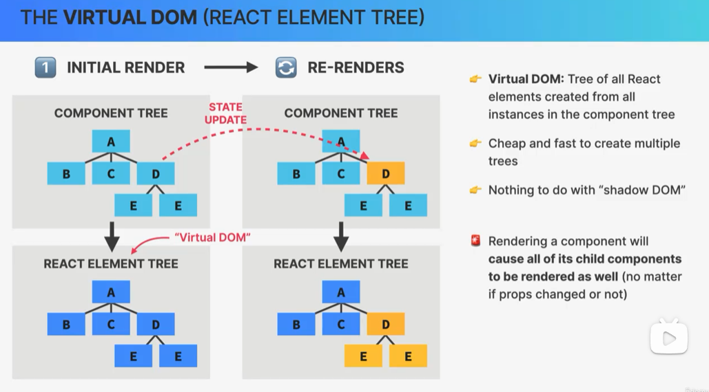
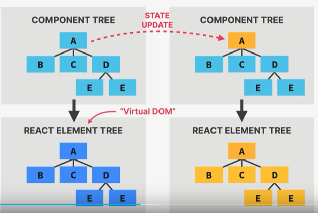
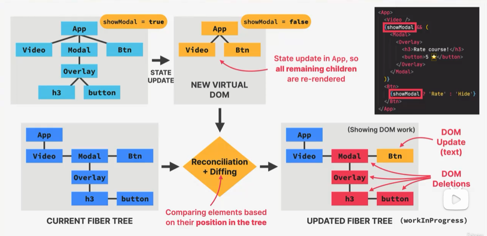
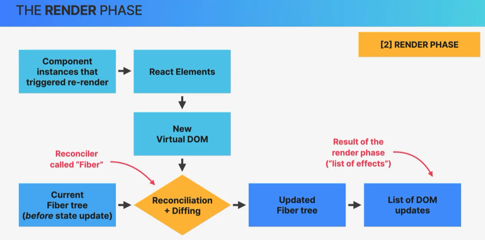
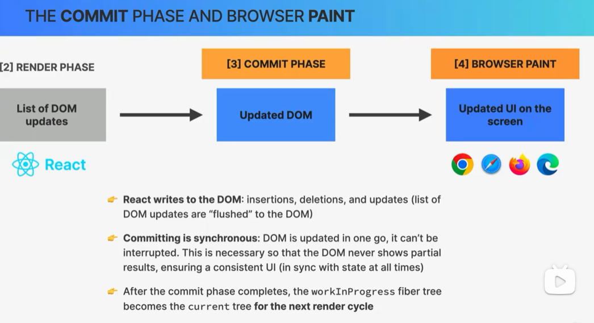
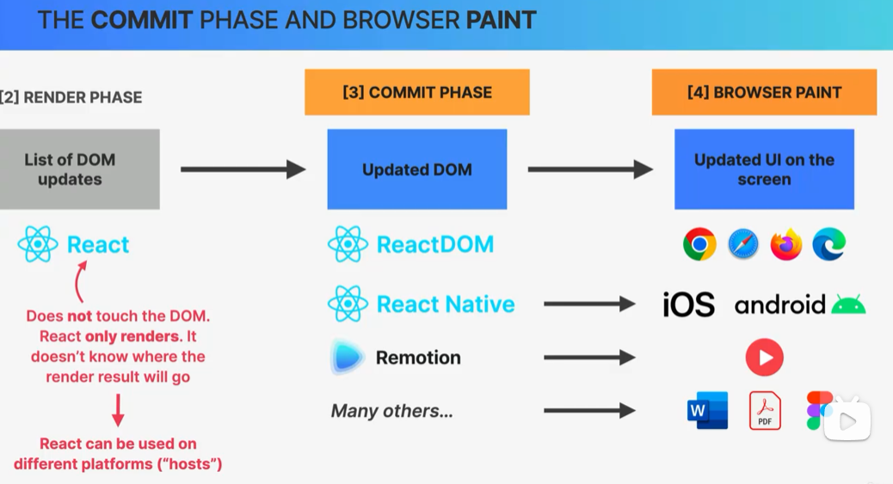
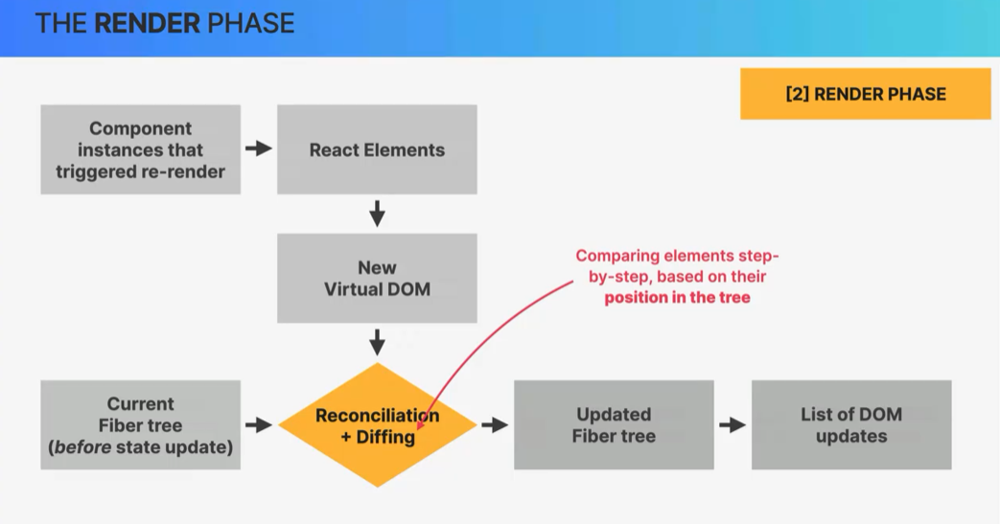
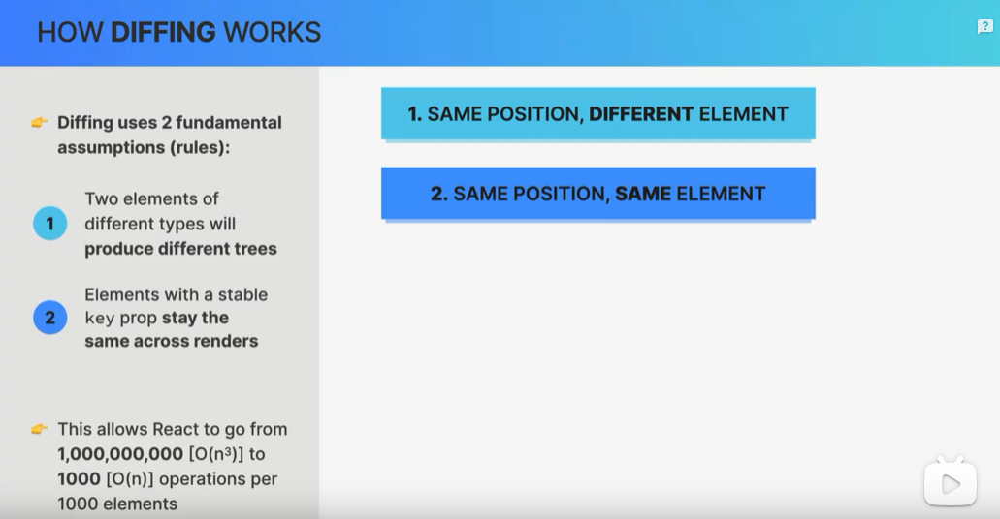
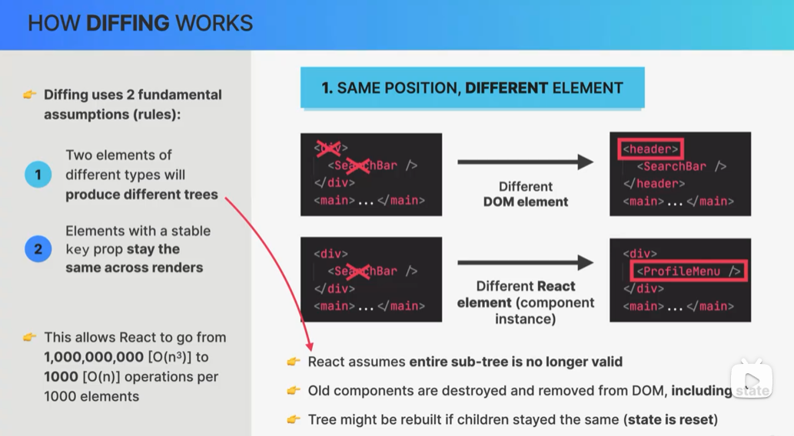
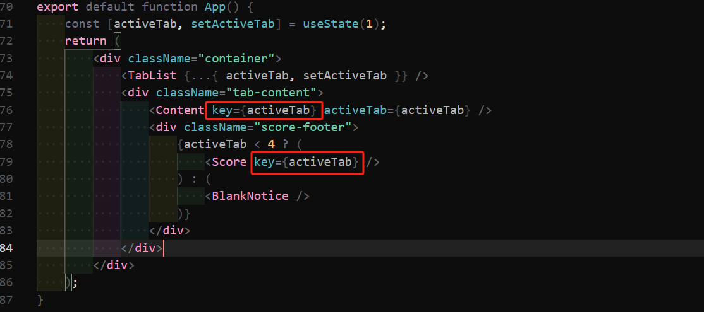

## Component、Instance、和 Element、DOM Elements 四者的关系

### 组件 Component

-   组件是 UI 的 **描述 Description**
-   一个组件就是一个返回 React Elements(element tree) 的函数， 通常使用 JSX 编写
-   可以将 Component 理解为一个 蓝图 或者 模板 (Blueprint/Template)

```jsx
function Card() {
    return (
        <div className="card">
            <p>Hello</p>
            <p>React!</p>
        </div>
    );
}
```

### Instance

-   当一个 组件 Component 被 **使用** 的时候，实例就会被创建
-   React 内部实际上会去调用 组件函数
-   每个组件实例拥有自己独立的 state 和 props
-   每个组件实例有自己的生命周期，包括 诞生，生存，消亡(be born/lilve/die), 也叫：挂载（mounting）、更新（updating）、卸载（unmounting）。

```jsx
export default function App() {
    return (
        <>
            <header>This is header</header>
            <Card />
            {/* 这里使用Card就会创建 Card 这个组件的实例 */}
            <Card />
            <Card />
            <footer>This is footer</footer>
        </>
    );
}
```

### React Element

-   JSX 将会被转换为 `React.createElement()` 方法
-   `React.createElement()` 方法执行后返回的结果就是 React Element
-   React Element 中会含有一些必要的信息用于创建真实的 **DOM Elements**

React 通过 Babel 来转换 JSX 语法， 我们可以通过以下示例体验具体的转换结果。
可以直接在 babel 的官网 [playground](https://babeljs.io/repl#?browsers=defaults%2C%20not%20ie%2011%2C%20not%20ie_mob%2011&build=&builtIns=false&corejs=3.21&spec=false&loose=false&code_lz=GYVwdgxgLglg9mABAYQIYCcAmAKAlIgbwChFTF0BTKEdJbEsxgHkxgDdEIAbVAZ14ByqALYUAvACIIGTBIB8DRksRMADnIASFLlzhMA9OsXKyauQCUKqaAEIDRkyv2s2CxrgDcRAL5EKAD1U4dChETApgVBAuUNBIWAREAEFVVTxCY0pqWkR6RyY3R1MACytw9DkAFWKYXkRaxFLUcoMm8sKilTQsRH0OooJ9ACpEQE34wBnEwH95QApXbsxARh1ALHlAbCVAL70UGTHAKjlAEb9AN7lAELdAPO1AaPlEIf1fTtImOd7-_Lu-43zgODgoCgrqhoa3j6-Bn-nwqL1Mz3cXl8RAgCF4cC4FAAdLoAObYJgpVT3TxEIA&debug=false&forceAllTransforms=false&modules=false&shippedProposals=false&circleciRepo=&evaluate=false&fileSize=false&timeTravel=false&sourceType=module&lineWrap=false&presets=env%2Creact%2Cstage-3&prettier=true&targets=&version=7.24.7&externalPlugins=&assumptions=%7B%7D) 查看，可以通过下面的步骤手动尝试。

以下是官网的转换截图：


```bash
# 项目初始化
mkdir babel-jsx; cd babel-jsx
npm init -y
# 安装 @babel/cli @babel/core 和 @babel/preset-react
pnpm add --save-dev @babel/core @babel/cli @babel/preset-react
# 创建babel 配置文件 babel.config.json
# 内容如下：
{
    "presets": [
        "@babel/preset-react"
    ]
}
# 创建待转换文件
mkdir src; touch src/main.jsx # 在main.jsx 中写入需转换的 jsx 代码

# 执行转换指令
./node_modules/.bin/babel src --out-dir lib

# 转换结果输出为 lib/main.js
```

### DOM Elements

DOM Elements 就是浏览器上真实的 DOM， React 通过 React Element 中的必要信息创建这些真实的 Dom 元素。

这四者的大致过程如下图所示：


具体的 组件 是如何被展示到屏幕上的，还需要更进一步分析：

p121


## 组件被展示到屏幕上分为 四个步骤，分别是：

1. **触发组件 render**

    大多时候，组件的渲染，通过某些地方的 state 更新而触发。 注意，在 React 中，如果父组件的 state 更新，那么所有子组件都将触发更新。

2. **render 阶段**

    在这个阶段， React 通过调用 组件函数 并分析将如何更新 DOM， 但是在这个阶段，页面还不会重新渲染。Rendering 发生在 React 内部，并不会产出任何视觉上的变化。

3. **commit 阶段**

    在这个阶段， React 将会着实的修改 DOM，包括插入/更新/删除元素。

4. **浏览器绘制**

    这个阶段就和 React 本身没有关系了。

> 值得注意的是，
>
> -   通常，人们 **语义上** 提及 Rendering 的时候，实际上可能指的是 Render 阶段 + Commit 阶段
>
> -   有两种场景会触发 Render:
>
>     1. 应用初始化
>     2. State 更新
>
> -   Render 并不是立即触发，而是**异步**的，同时会**合并**同步的 setState 行为

### Render 阶段

在深入接下来的内容之前，有两个误区需要先指明：


1. **Rendring 就是更新屏幕或者 DOM ❌**

    刚才已经说过了， Rendring 实际上不不包含视图或者 DOM 的修改的, 视图/DOM 的修改发生在 Commit 阶段。 后文会详细说明。

2. **在 Re-render 的时候 React 完全丢弃旧的 DOM ❌**

    并不会完全丢弃旧的 DOM, 下文会详细说明。

#### 虚拟 DOM（React Element Tree）


React 中，一个 React 应用，都是由组件嵌套而成， 最终形成一个大的 组件树。组件树只是一个高层的抽象。React 底层会将这个 组件树转换为一个 **React Element 树**。这个树 **也被称为虚拟 DOM** (官方不再这么称呼)。它实际上就是一个树形的 JS 对象。

当某个组件的 State 发生更新时，将会触发 **Re-render** 流程。 组件树就会形成一个**新的** 虚拟 DOM。 **再次强调，这个过程（render/re-render），只是更新虚拟 DOM，并不会直接修改真实 DOM.**

❓ 为什么不重用虚拟 DOM ,而是直接重新构建新的 虚拟 DOM 呢？

1. 简化逻辑：重用相对直接构建更复杂，存在潜在风险
2. 稳定性和一致性：避免因为重用旧的虚拟 DOM 从而引起潜在状态不一致或者错误
3. Fiber 架构优化：Fiber 架构支持增量渲染和优先级调度，使得虚拟 DOM 的重建过程和比较过程性能良好

> 注意： **父组件一旦触发更新， 子组件也会触发更新**， 不管其 Props/State 有没有发生改变。
> 
> 上图中，如果 A 根组件触发了更新，那么整个组件树都将触发更新，因为 React 无法知道子组件是否会被影响。

❓ 为什么底层会维护一套虚拟 DOM 呢？原因在于相比于直接操作 DOM 元素， 虚拟 DOM 的操作开销要小的多。

#### Reconciliation(调和/协调)

我们需要带着两个核心问题去深入：

1. 是什么？
2. 为什么需要它？

为什么不在有 state 变动的时候直接更新整个 DOM 呢？这是因为直接更新整个 DOM 这个操作 低效 且 浪费资源。因为首先相对于 JS 内存数据操作来说，DOM 操作缓慢的；此外， 大多数时候，页面上只有一小部分区域内容需要被更新。

所以， **React 会尽可能的重用即存的 DOM**。那么 React 怎么实现最大重用的呢？ 就是通过 **调和机制**。

Reconciliation 调和过程就是分析 Re-render 的时候，到底哪些 DOM 元素需要被插入/删除/更新

#### Reconciler：**FIBER**

##### Fiber 的概念

###### Fiber 是 React 内部使用的一种**数据结构**

Fiber 树是由 Fiber 节点链接而成的数据结构。是一种链表结构。具体的结构描述为，每个父元素和其第一个子元素建立一个链接，其他子元素和兄弟元素之间建立链接。

###### Fiber 架构

Fiber 架构即基于 Fiber 的**架构设计**。它出现的目的为了提高 调和 过程的 性能和效率。 Fiber 的引入使得 React 能够更加灵活高效地处理 UI 更新。

Fiber 架构有这样几个优点：

1. 增量渲染： Fiber 将调和过程分解为多个小任务，可以在浏览器的帧之间进行分段执行，避免传统调和过程的 递归机制 导致的长时间阻塞。
2. 优先级调度：Fiber 架构允许 React 根据不同的任务重要性分配优先级，高优先级任务可以打断低优先级任务，从而提高应用的响应性。
3. 细粒度更新： 每个 Fiber 节点表示一个虚拟 DOM 节点或者组件示例，包含其状态，属性和相关信息，便于精确管理和更新。

##### Reconciler 调和器的概念以及 和 Fiber 的关系

Reconciler 是 React 中的调和器。它用于

-   **确定 UI 的哪些部分需要更新**
-   **生成更新操作**。

1. Fiber 是 Reconciler 的基础结构
    1. Fiber 架构是 Reconciler 的基础， Reconciler 依赖 Fiber 节点来表示和管理虚拟 DOM 树。
    2. 每个 Fiber 节点包含了虚拟 DOM 节点的类型、属性、状态等信息， 并通过链表结构连接起来，形成 Fiber 树
2. 调和过程中的协同工作：
    1. 在调和过程中， Reconciler 会通过 Fiber 树对比新的虚拟 DOM 和当前的 Fiber 树。
    2. Reconciler 根据新的 虚拟 DOM 生成或者更新 Fiber 节点，形成新的 Fiber 树。

#### 调和过程的具体步骤

**首次渲染**
首次渲染的时候， React 从根组件开始构建一颗 React Element 树，也叫虚拟 DOM。 并基于该虚拟 DOM ，构建一棵 Fiber 树。

Fiber 树有几个重要特征：


1. Fiber 树的每个节点称为 Fiber, 每个 Fiber 都对应了某个组件实例和 DOM 元素，可以理解为一种映射关系，Fiber 会持有映射组件的当前状态，Props,副作用等信息
2. 区别于虚拟 DOM 中的 React 元素，每次更新都会导致完全构建新的 虚拟 DOM。 **Fiber 树一旦创建，后续的每次渲染，该 Fiber 树并不会完全重新创建，只会局部的变更**。

3. Render 阶段中，得益于 Fiber 架构，Rendering 处理可以被切分为多个 chunks， 任务执行可以被优先级调度， 整个过程可以被暂停，重用，或者移除。这样一来就不会阻塞浏览器的渲染线程。

4. 初始渲染
    1. React 创建初始的虚拟 DOM 树和对应的 Fiber 树。
    2. Fiber 树用于管理虚拟 DOM 节点和组件实例。
5. 状态或者属性更新
    1. 当组件的状态或者属性发生变化时，生成新的虚拟 DOM 树。
    2. Reconciler 对比新的虚拟 DOM 树和旧的 Fiber 树，找出差异。
6. 更新 Fiber 树：
    1. Reconciler 根据新的 虚拟 DOM 生成新的 Fiber 节点，并更新 Fiber 树。
    2. 标记需要更新的节点，并记录需要进行的 DOM 操作
7. 提交阶段：
    1. Reconciler 将生成的更新操作应用到实际 DOM 中，更新 UI.


showModal 只 App 组件中的 state， 当该 state 发生更新，将会**触发 Re-render**。
父组件更新，所有子组件也会更新。
React 会**构建一棵新的 虚拟 DOM 树**，

应用第一次创建的时候，会通过虚拟 DOM 构建一棵 Fiber 树，Fiber 树是一个链表结构，每个元素节点都会链接子节点和兄弟节点。
紧接着， React 进入 调和+Diff 过程， 该过程以旧的 Fiber 树和新的虚拟 DOM 为输入，将新的虚拟 DOM 和当前的 Fiber 树进行 **调和** 。

React 将基于新的 虚拟 DOM 对该 Fiber 树进行遍历 ，对这个 Fiber 树一个节点一个节点的分析需要更改的内容，这个过程称之为 **Diffing**, 变更后的这棵 Fiber 树在内部被称为 **workInProgress** 树。在这棵树中，图中示例， Btn 按钮文字部分被标记为更新， 而由于 Modal 及其子元素不存在于新的 虚拟 DOM， 因此这些节点在 Fiber 树种被标记为 删除。 而 App 以及 Video 元素虽然也参与到了 Re-render 流程，但是由于新的 虚拟 DOM 中，这些节点没有变更，因此 Fiber 将不会被做任何标记处理，从而达到了 重用的目的。

这些变更将会被收集到一个称之为 副作用列表 的数据对象中，用于供给下一个阶段——Commit 阶段，去实际的修改 DOM。

#### Render 阶段图示总结



下面对 Render 阶段（Re-render）进行总结。

当组件实例触发了 re-render, 产生新的 虚拟 DOM，然后 React 将进入调和流程， 将基于新的虚拟 DOM, 对当前的 Fiber 树进行遍历，标记所有需要更新的 Fiber 节点信息。 调和过程的结果就是产生更新后的 Fiber 树。然后 React 将所有需要更新操作收集起来 (list of effects) 交给下一个 Commit 阶段。

> render 函数执行，将会产出 React Elments, React Elment 构建而成的树形 js 数据对象被称之为 新的 虚拟 DOM

### Commit 阶段

在 Commit 阶段，就不再是由 React 完成了， 在浏览器中，则是由 React-dom 来接管。

在这个过程中， React-dom 会去进行 DOM 操作，包括插入/删除/更新。
Committing 操作是异步进行的。不可被中断，这样可以避免中断导致的页面部分渲染。导致应用无法正常工作。

在 Commit 阶段完成后， workInProgress fiber 树就成为了当前的 fiber 树。在下一次 render 循环的时候，就会被作为输入处理。

接下来就会交给浏览器去处理绘制。



#### 深入更多



在 Render 阶段， React 只是去找到该怎么 render,并不会触及真实的 DOM 元素。 Commit 阶段才会去执行真正的 DOM 操作。 而这个 DOM 操作不仅仅只是浏览器，可以是原生应用。这时候就以来 React Native 或者 Remotion 等其他库。

### Diff 具体是怎么执行的？



Diff 有两个重要原则：

1. 两个不同类型的元素，将会产生不同的 Trees
2. 元素的 key 不变，那么将会保持不变

这个操作使得常规 Diff 需要 O(n^3) 的操作复杂度降低为 O(n)。

> @refer: https://legacy.reactjs.org/docs/reconciliation.html#motivation

Diff 过程中，只有两种场景需要被讨论：

1. 同位置，不同元素
2. 同位置，相同元素



#### 场景 1. 同位置，不同元素



在第一个示例中，可以看父元素从 `<div>` 变成了 `header`
这时候，React 会重建整个元素节点，包括其所有子节点，以及状态。也就是 `<div>` 和 `<Searchbar>` 都会从 DOM 中移除。替换为 `<header>` 和全新的 `<SearchBar>`。
在第二个示例中， `<SearchBar>` 元素被替换成了 `<ProfileMenu>`
有几点可以总结：

1. 当父元素类型变更的时候，React 假定整个子树都失效，重建
2. 旧的组件将会被销毁并从 DOM 中移除，包括其状态也会被重置

#### 场景 1. 同位置，相同元素


在第一个示例中，原生的 `<div>` 元素没有改变，只是修改了 className, 第二个示例中， `<SearchBar>` React 元素类型没有改变，只是修改了 props.wait 的值。
这两种情况下，元素都会被保留，包括其状态。
有几点总结如下：

1. 如果同位置的元素类型没有改变，那么元素将会被保留，包括其子树元素。同时会保留其状态
2. 新的 props/atrributes 将会被传入
3. **有的时候，我们不希望这种默认行为，可以通过指定新的 key prop 使得元素强制被更新**

下面通过一个 demo 来观察这个过程：


关键代码如下：

```jsx
export default function App() {
    const [activeTab, setActiveTab] = useState(1);
    return (
        <div className="container">
            <TabList {...{ activeTab, setActiveTab }} />
            <div className="tab-content">
                <Content activeTab={activeTab} />
                <div className="score-footer">
                    {activeTab < 4 ? <Score /> : <BlankNotice />}
                </div>
            </div>
        </div>
    );
}
```

这个组件的基本逻辑是，4 个 tab 显示不同的 content 内容，第四个 tab 种，没有 score 这个打分组件，取而代之的是一个文本提示。此外， Content 组件中维护了一个 state 绑定了 input 元素。

可以看到，当我们先设定了打分，和 input 值。 然后在前 3 个 tab 中切换的时候， tab content 的内容改变了，但是 score 的状态还是持有，没有清除。第四个 Tab 中由于替换了 score 元素，切换回去(tab1、tab2、tab3)的时候，score 的状态被重置了。 而 input 元素从输入以后，后面的切换始终保持状态。

这些现象正是由于 React 的 Diff 原则所导致的。

当 tab-content 的内容改变，但是元素类型没有变动时。 React 会复用这个元素，并不会销毁。 包括其 State, 其内容为动态计算值。
score 组件，由于在前三个 tab 中，同位置的同元素类型没有变更，所以也会被保留复用。包括其状态。 但是在第四个 Tab 中，由于元素类型变更， 所以 score 元素会被移除替换。下次切换回去的时候，score 元素又被重新创建，因此状态被重置。

那这种场景下，加入我们需要每次 tab 切换 input 和 score 元素都更新怎么办？
只需要通过添加 key 属性，让 React 强制更新即可。



## React 渲染相关核心概念总结

### 组件

一个组件相当于一个屏幕上一个 UI 元素的蓝图或者模板。
当我们 “使用” 一个组件的时候， React 将会创建一个 **组件实例** (这个过程背后其实就是调用组件函数)， 它包含了 Props, State 等等信息。一个组件实例在渲染后将会返回一个 **React Element**。


### Rending 渲染

**渲染** 仅意味着 **调用组件函数** 和 **计算** 哪些 DOM 元素需要被插入，删除，或者更新。但是这个过程实际上并不会做任何的真实 DOM 操作。因此， **每次组件实例被渲染或者重渲染，这个组件函数就会被再次调用**。

> Each time a component instance is rendered and re-rendered, the function is called again.


### 触发 渲染

只有应用首次渲染和状态更新才会引发一次渲染过程，渲染过程并不是局部发生在某个组件， 而是**整个应用**。


### 某个组件实例重新渲染的时候，其子组件全部重新渲染

当一个组件实例被触发了重渲染（re-render）的时候，其所有的子树上的子组件都会重新渲染。但是特别注意， 这并不意味所有的子组件都会在真实 DOM 上更新。主要是由于 Render 的过程中涉及一个非常重要的流程 —— Reconciliation（调和），在这个过程中， React 会去找到哪些元素确实发生了变更。 且会将所有的变更收集起来传递给 Commit 阶段去操作 DOM。


### Diff

Diff 是调和 Conciliation 过程中的重要步骤，正式 Diff 使得 React 找到了需要真实被更新的元素。
Diff 的过程简单来说，就是对比新的 虚拟 DOM 和 当前 Fiber 树，同位置的元素类型是否相同。如果不相同，那么就会销毁旧的 元素，更新为新的元素，如果相同，会去检查属性值是否相同，传递新的属性和 Props。


### Key 属性

Key 的作用主要有两个，但是归根结底核心就是组件的 Key 发生了更新，那么这个组件一定会被更新。
所以其作用，一方面是提高 页面 更新的效率，相同 Key 的元素会被保留重用；另一方面，可以利用 重设定 Key 来强制更新组件。

> 这里也能说明，列表渲染的时候，为什么不要使用 index 作为 key， 因为 index 不能确保和每个列表元素一一对应，也就做不到重用，提高性能。


### 永远不要在另一个组件中声明新的组件

永远不要在另一个组件中声明新的组件， 因为这么做的话，每次父组件 re-render 的时候，都会重新创建这个嵌套子组件，导致每次父组件状态更新触发 re-render 的时候，子组件都会重置其状态。


错误实践示例：

```jsx
function ParentComponent() {
    const [parentState, setParentState] = useState(0);

    const ChildComponent = () => {
        const [childState, setChildState] = useState(0);

        return (
            <div>
                <p>Child State: {childState}</p>
                <button onClick={() => setChildState(childState + 1)}>
                    Update Child State
                </button>
            </div>
        );
    };

    return (
        <div>
            <p>Parent State: {parentState}</p>
            <button onClick={() => setParentState(parentState + 1)}>
                Update Parent State
            </button>
            <ChildComponent />
        </div>
    );
}
```
