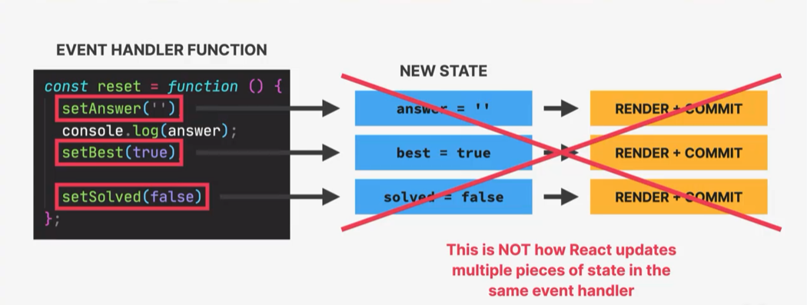
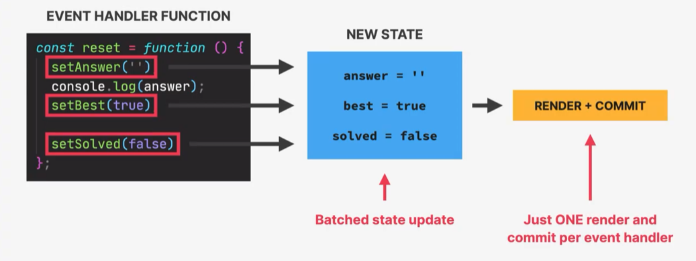

## React 中状态的更新是 异步 + 批处理的 Batched

有这样一个示例：


React 在背后将会如何处理同一个上下文中多个 setState 方法？ 会触发三次 Re-render 吗？ console 打印值将会是什么？ 是更新后的值吗？

我们知道 React 的更新流程或者说 Re-render 流程， Trigger Render（触发渲染） -> Render Phase（Render 阶段） -> Commit Phase（Commit 阶段）-> 浏览器绘制

❓ 那么示例中的 `reset` 函数执行会是如下阶段吗？


并不会，React 中， setState 方法是异步执行的，这意味着 setState 方法的执行并不会立即更新组件的状态和重新渲染组件。React 会将多个 setState 状态更新请求放入一个队列中，并在合适的时机进行批量处理。

因此，上面的三次 setState 方法，会被异步的批处理。 它们只会触发一次 render + commit 流程。


❓ 那么 `console.log(answer)` 将会打印更新后的值吗？

并不会，State 在 Render 阶段存储在 Fiber 树中，而在这里，打印的时候， Re-render 流程还没有触发。所以打印将会是旧的值。


我们容易发现一个问题， 以上示例是 set 不同的状态，如果有多个更新操作针对同一个 state，最终将会如何影响?

```jsx
const [count, setCount] = useState(0);
setCount(count + 1);
setCount(count + 1);
console.log(count); //0
setCount(count + 1);
setCount(count + 1);
console.log(count); //0
// 页面上的count的引用最终显示1
```

首先，两次打印，都打印初始值 0， 这一点我们在上面已经讨论过， 因为 setState 方法是异步执行的。
但是，页面上的值为什么会是 1 呢？

其实，这是因为，像这样调用 `setState(count + 1)`的时候， count 值始终都是初始值。所以这个过程实际上等同于：

```jsx
setCount(0 + 1);
setCount(0 + 1);
setCount(0 + 1);
setCount(0 + 1);
// 所以最后结果是1
```

我们再看一下下面的示例：

```jsx
setCount(count + 4);
setCount(count + 1);
setCount(count + 2);
setCount(count + 3);
```

根据上面的分析，我们知道这些操作实际上等同于：

```jsx
setCount(0 + 4);
setCount(0 + 1);
setCount(0 + 2);
setCount(0 + 3);
```

每一次执行都会覆盖上一次的结果，因此最后的状态是 3。而由于 React 的更新是批处理的，React 只会触发一次 Render + Commit 流程

❓ 怎么确保每次操作都是基于最新的状态呢？
使用回调函数最为 `setState()` 方法的参数：

```jsx
setState((previousState) => {
    return previousState + 1;
});
```

这样每次执行就会基于最新的 State 更新了：

```jsx
setCount((count) => count + 1);
setCount((count) => count + 1);
console.log(count); //0
setCount((count) => count + 1);
setCount((count) => count + 1);
console.log(count); //0
// 页面上的count的引用最终显示4
```

### 事件处理函数之外的批处理

React18 以上版本，将会批处理除了 事件处理函数之外的状态更新，例如计时器 timer,promise, 还有原生点击事件的监听。


示例：

```jsx
import React, { useState } from "react";

const BatchingExample = () => {
    const [count, setCount] = useState(0);

    const handleClick = () => {
        // 在点击事件处理函数中执行多次状态更新
        setCount((prevCount) => prevCount + 1);
        setCount((prevCount) => prevCount + 2);
        setCount((prevCount) => prevCount + 3);
    };

    const handleAsyncOperation = () => {
        // 在异步操作中执行多次状态更新
        Promise.resolve().then(() => {
            setCount((prevCount) => prevCount + 1);
            setCount((prevCount) => prevCount + 2);
            setCount((prevCount) => prevCount + 3);
        });
    };

    const handleTimeout = () => {
        // 在setTimeout中执行多次状态更新
        setTimeout(() => {
            setCount((prevCount) => prevCount + 1);
            setCount((prevCount) => prevCount + 2);
            setCount((prevCount) => prevCount + 3);
        }, 1000);
    };

    return (
        <div>
            <p>Count: {count}</p>
            <button onClick={handleClick}>Update Count (Click)</button>
            <button onClick={handleAsyncOperation}>Update Count (Async)</button>
            <button onClick={handleTimeout}>Update Count (Timeout)</button>
        </div>
    );
};

export default BatchingExample;
```
