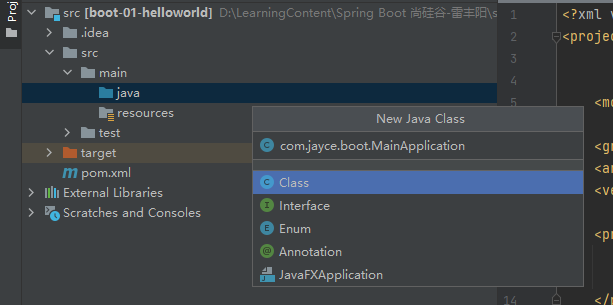
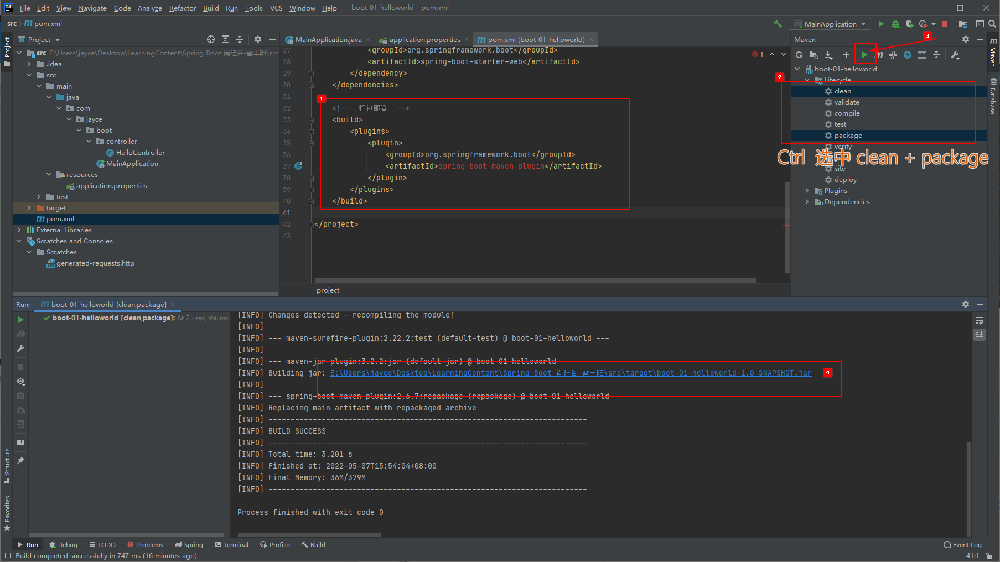

[toc]

## 1.系统要求

- Java8 +
- Maven 3.3 +

> ```bash
> # check java version
> $ java -version
> # check maven version and details, you can find it's config file path
> $ mvn -v
> ```

### 1.1 maven 设置

将下面配置粘贴到 E:\maven\apache-maven-3.8.1\conf\settings.xml 文件

```xml
<!--配置阿里云镜像,让下载依赖更快-->
<mirrors>
    <mirror>
        <id>nexus-aliyun</id>
        <mirrorOf>central</mirrorOf>
        <name>Nexus aliyun</name>
        <url>http://maven.aliyun.com/nexus/content/groups/public</url>
    </mirror>
</mirrors>

<!--用java1.8 进行编译，避免不必要的问题-->
<profiles>
    <profile>
        <id>jdk-1.8</id>
        <activation>
            <activeByDefault>true</activeByDefault>
            <jdk>1.8</jdk>
        </activation>
        <properties>
            <maven.compiler.source>1.8</maven.compiler.source>
            <maven.compiler.target>1.8</maven.compiler.target>
            <maven.compiler.compilerVersion>1.8</maven.compiler.compilerVersion>
        </properties>
    </profile>
</profiles>
```


## 2.HelloWorld

**需求：** 浏览器发送 hello 请求， 响应 "Hello, Spring Boot2."


以下教程，不是快速创建，是按照官方文档步骤来的： https://docs.spring.io/spring-boot/docs/current/reference/html/getting-started.html#getting-started.first-application

### 2.1 创建maven 工程


>  首次创建项目，要先检查maven 配置文件，和java 版本
>
> 
>
> 
>
> 
>
> 

### 2.1 引入依赖

https://docs.spring.io/spring-boot/docs/current/reference/html/getting-started.html#getting-started.first-application.pom


### 2.1 创建主程序




创建Controller

 

### 2.1 编写业务


未来，可能我们很多的方法(请求路由)的返回结果都是直接返回给浏览器，所以我们可以将`@ResponseBody` 这个注解提前到上一层类中，即`HelloController`


### 2.1 测试

直接 run main 方法就可以跑起来


### 2.1 简化配置


增加配置文件 src/main/resources/application.properties

例如修改端口：

```properties
server.port=8888
```

> 配置文档：https://docs.spring.io/spring-boot/docs/current/reference/html/application-properties.html#appendix.application-properties

### 2.1 简化部署

https://docs.spring.io/spring-boot/docs/current/reference/html/getting-started.html#getting-started.first-application.executable-jar

Spring Boot 可以通过一个插件依赖就直接将项目打包为Jar 包。 



