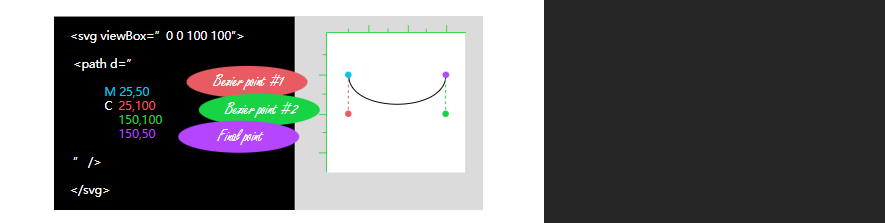
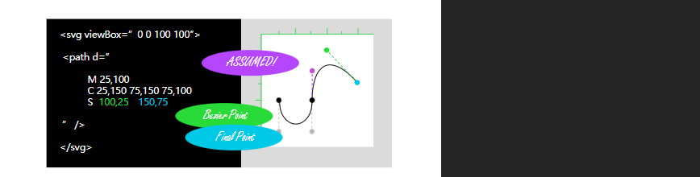
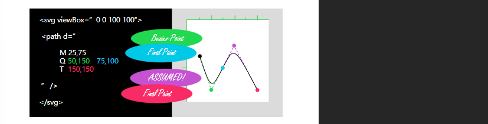
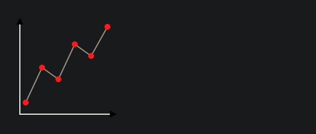

# Path

> https://css-tricks.com/svg-path-syntax-illustrated-guide/

SVG 中的 `<path>` 元素是最终的绘图元素。它可以绘制任何东西！据说在底层，所有其他绘图元素最终都使用 `< path >` 元素。路径元素需要一个属性来描述它绘制的内容：d 属性。它的值是一个独立的迷你语法。它可能看起来相当难以理解。它是一串数字和字母混合在一起的长字符串。

下面是一个中等复杂度的path:
```xml
<path d="M213.1,6.7c-32.4-14.4-73.7,0-88.1,30.6C110.6,4.9,67.5-9.5,36.9,6.7C2.8,22.9-13.4,62.4,13.5,110.9
  C33.3,145.1,67.5,170.3,125,217c59.3-46.7,93.5-71.9,111.5-106.1C263.4,64.2,247.2,22.9,213.1,6.7z"/>
```

我们可以将其进行拆分格式化一下：
```xml
<path d="
  M 213.1,6.7
  c -32.4-14.4-73.7,0-88.1,30.6
  C 110.6,4.9,67.5-9.5,36.9,6.7
  C 2.8,22.9-13.4,62.4,13.5,110.9
  C 33.3,145.1,67.5,170.3,125,217
  c 59.3-46.7,93.5-71.9,111.5-106.1
  C 263.4,64.2,247.2,22.9,213.1,6.7
  z" />
```

这些字母是 **命令**， 这些数字是**传入**这些命令**的值**。**所有的逗号都可以是缺省的(他们可以是空格)**

例如，第一个命令是 `M`, `M` 的意思是，拿起笔，移动到位置 `213.1, 6.7`, 但是不绘制任何东西。 仅仅移动画笔。 `M` 只是多种命令中的其中一个， 大致有18个不同分命令。 

很多但不是全部，都是成对的， 分别有 大写 和 小写 版本，大写版本是 **absolute** 版本，小写版本是 `relative` 版本。让我们以 `M` 命令进一步说明：

- `M 100,100` 的意思是 “拿起画笔，并移动到坐标 `100,100` 处”
- `m 100,100` 的意思是 “拿起画笔，并移动当前相对位置 向下向右分别100个单位的位置”


就像 `M` 和 `m` 命令一样，`L` 和 `l` 命令也需要两个数字：可以是绝对坐标或相对坐标。还有四个命令，它们本质上是线段命令的简化版本。**它们也可以画线段，但只需要一个值：水平或垂直方向。**当我们使用 `l 25,0` 时，我们可以使用 `h 25`，意思是 “从笔当前位置**向右**画 25 个单位。更简洁，我想是这样。它的大哥 `H`，如你所猜测的，意思是画到水平坐标 25 的位置。`V` 和 `v` 分别在垂直方向上**绝对和相对**移动，你肯定能猜到。

猜测以下在绘制什么？

```html
<svg class="icon  icon--plus" viewBox="0 0 5 5" xmlns="http://www.w3.org/2000/svg">
    <path d="M2 1 h1 v1 h1 v1 h-1 v1 h-1 v-1 h-1 v-1 h1 z" />
</svg>
```

<svg width="200" class="icon  icon--plus" viewBox="0 0 5 5" xmlns="http://www.w3.org/2000/svg">
    <path d="M2 1 h1 v1 h1 v1 h-1 v1 h-1 v-1 h-1 v-1 h1 z" />
</svg>

最后一个 `z` (或者 `Z` 也一样)，的意思是封闭路径。 

### 贝塞尔曲线

path 中的曲线使用 贝塞尔曲线来表示的， 一个贝塞尔曲线长这样：


path 中与之对应的命令是 `c/C`, `C` 命名需要三个点， 前两个个是两个贝塞尔曲线 handles, 最后一个点是曲线的终点。 下面是一个图示：



S（或 s）命令和 C 命令是好朋友，因为它只需要两个点，它假设第一个贝塞尔点是上一个 S 或 C 命令中最后一个贝塞尔点的镜像。



Q 命令是比较简单的命令之一，只需要两个点。它所需的贝塞尔点是一个 “二次” 曲线控制点。就好像起始点和结束点共享一个控制手柄的末端点。

我们也可以顺便介绍一下 T 命令。它和 Q 命令是一对好朋友，就像 S 命令和 C 命令一样。当 T 在 Q 命令之后出现时，控制点被假设为是前一个控制点的镜像，所以你只需要提供最终的点。



A 命令可能是最复杂的。或者至少需要最多的数据。您需要提供定义椭圆的宽度、高度和旋转方式的信息，以及终点。然后还需要提供关于您希望路径沿着该椭圆采取的路径的一些更多信息。根据 MDN 的说明：

对于路径要环绕的两个椭圆和两条不同的路径，共有四条可能的路径。第一个参数是大弧标志 (large-arc-flag)。它简单地确定弧是否应大于或小于 180 度；最终，该标志确定了弧将沿着给定圆周的哪个方向移动。第二个参数是扫描标志 (sweep-flag)。它确定弧是否应从负角度或正角度开始移动，从而基本上选择要绕行的两个圆中的哪一个。

Joni Trythall 在她的 SVG 路径文章中对 A 命令进行了很清晰的解释的图解。


可以借助这个工具以查看path路径：https://svg-path-visualizer.netlify.app/#M2%2C2%20L8%2C2%20L2%2C5%20L8%2C5%20L2%2C8%20L8%2C8


# 绘制Path和Marker


## 绘制path

<svg width="200" viewBox="0 0 10 10" fill="none" stroke="black" stroke-linecap="round">
    <path d="M2,5 C2,8 8,8 8,5"/>
</svg>

```html
<svg width="200" viewBox="0 0 10 10" fill="none" stroke="black" stroke-linecap="round">
    <path d="M2,5 C2,8 8,8 8,5"/>
</svg>
```


第一个点 M2.5 的含义是 “移动move到坐标点2，5”

第二个点 C 的含义是创建一个贝塞尔曲线， 起始点为 2.8， 后续是其他的点


路径 d 是可以被动画支持的


```html
<svg
    class="svgPath"
    width="200"
    viewBox="0 0 10 10"
    fill="none"
    stroke="black"
    stroke-linecap="round"
>
    <path d="M2,5 A 5 25 0 0 1 8 8" />
    <style>
        .svgPath path {
            animation: ani 1s infinite;
            transition: 0.3s;
        }
        .svgPath:hover path {
            d: path("M2,5 A 5 25 -15 0 1 8 8");
        }
        @keyframes ani {
            0% {
                d: path("M2,5 A 5 25 0 0 1 8 8");
            }
            50% {
                d: path("M2,5 A 5 25 -15 0 1 8 8");
            }
            100% {
                d: path("M2,5 A 5 25 0 0 1 8 8");
            }
        }
    </style>
</svg>
```


## 绘制Marker

        <svg>
            <defs>
                <marker
                    id="circle1"
                    markerWidth="8"
                    markerHeight="8"
                    refX="5"
                    refY="5"
                    orient="auto"
                >
                    <circle cx="5" cy="5" r="3" fill="black" />
                    <circle cx="5" cy="5" r="2" fill="lightgray" />
                    <path d="M 4,3.5 L 6.5,5 L 4,6.5 Z" fill="slategray" />
                </marker>
            </defs>
            <line
                x1="50"
                y1="100"
                x2="200"
                y2="50"
                stroke="black"
                stroke-width="5"
                marker-end="url(#circle1)"
            />
        </svg>


```html
        <svg>
            <defs>
                <marker
                    id="circle1"
                    markerWidth="8"
                    markerHeight="8"
                    refX="5"
                    refY="5"
                    orient="auto"
                >
                    <circle cx="5" cy="5" r="3" fill="black" />
                    <circle cx="5" cy="5" r="2" fill="lightgray" />
                    <path d="M 4,3.5 L 6.5,5 L 4,6.5 Z" fill="slategray" />
                </marker>
            </defs>
            <line
                x1="50"
                y1="120"
                x2="250"
                y2="50"
                stroke="black"
                stroke-width="5"
                marker-end="url(#circle1)"
            />
        </svg>
```

`<defs>` 元素不会立即渲染， 但是会定义一个以后可被重用的对象，可与理解为定义的模板。

我们创建了一个 `<marker>` 元素， 并且给其指定了一个id 为 `circle1`, 通过 `markerWidth`, `markerHeight`为 `marker` 定义了视口大小 viewport size。然后给 marker 内部绘制了两个套在一起的圆，圆中心有一个箭头。 

然后绘制了一条线，通过  `marker-end` 属性，将marker 附着在 line 的结尾。 

同样的，还可以使用 `marker-start`


        <svg>
            <defs>
                <marker
                    id="circle1"
                    markerWidth="8"
                    markerHeight="8"
                    refX="5"
                    refY="5"
                    orient="auto"
                >
                    <circle cx="5" cy="5" r="3" fill="black" />
                    <circle cx="5" cy="5" r="2" fill="lightgray" />
                    <path d="M 4,3.5 L 6.5,5 L 4,6.5 Z" fill="slategray" />
                </marker>
            </defs>
            <line
                x1="50"
                y1="100"
                x2="200"
                y2="50"
                stroke="black"
                stroke-width="5"
                marker-end="url(#circle1)"
                marker-start="url(#circle1)"
            />
        </svg>


类似的属性还有：

-  `marker-mid` 在线段的每个转折点 附着 目标marker


借助这么个特性，可以实现这样的效果：

<svg width="200" viewBox="0 0 100 100" xmlns="http://www.w3.org/2000/svg">
  <defs>
    <marker
      id="arrow"
      viewBox="0 0 10 10"
      refX="5"
      refY="5"
      markerWidth="6"
      markerHeight="6"
      orient="auto-start-reverse">
      <path d="M 0 0 L 10 5 L 0 10 z" />
    </marker>
    <marker
      id="dot"
      viewBox="0 0 10 10"
      refX="5"
      refY="5"
      markerWidth="5"
      markerHeight="5">
      <circle cx="5" cy="5" r="5" fill="red" />
    </marker>
  </defs>
  <polyline
    points="10,10 10,90 90,90"
    fill="none"
    stroke="black"
    marker-start="url(#arrow)"
    marker-end="url(#arrow)" />
  <polyline
    points="15,80 29,50 43,60 57,30 71,40 85,15"
    fill="none"
    stroke="grey"
    marker-start="url(#dot)"
    marker-mid="url(#dot)"
    marker-end="url(#dot)" />
</svg>



> https://developer.mozilla.org/en-US/docs/Web/SVG/Element/marker