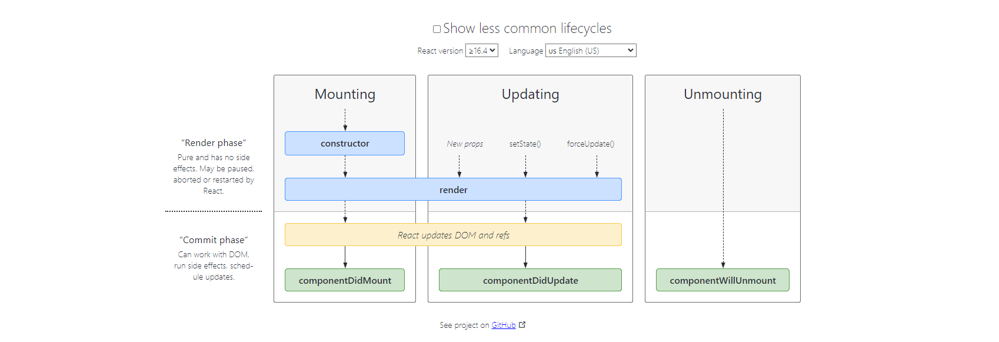

后面的几节课将会学习 函数式组件(functional components) ，以及如何用 函数式组件去重写写我们的程序。

先提一下，函数式组件，利用 hooks 来复制非常相似的行为。

> I want to mention that functional components utilize hooks in order to replicate a very similar behavior

了解类和函数式组件很重要，因为不同的公司编写风格都会不同， 有些人会用 带有 hooks 的functional components, 有些人用 class components， 而大部分人会混合着写。 只有你两种都熟练，才能快速融入团队。 

**我们现在依赖于我们的类组件中的很多生命周期 ，我们需要了解 函数式组件如何替换它们。** 因此，为了理解这一点，我们需要正确的理解我们的所有的生命周期。 

> https://projects.wojtekmaj.pl/react-lifecycle-methods-diagram

