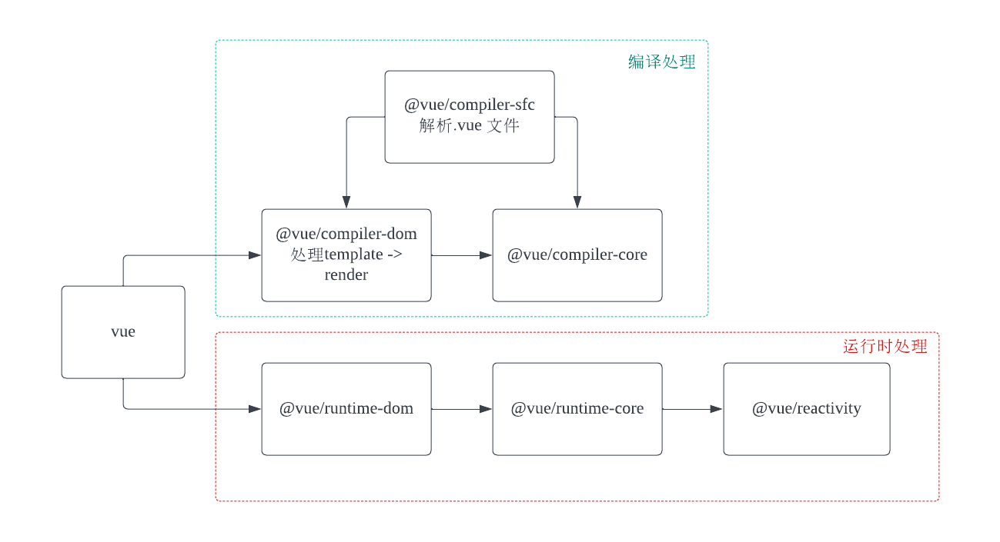

## 核心源码包关系

packages:



vue 和核心源码可以划分为两大类：

-   编译处理
-   运行处理

### @vue/compiler-sfc

@vue/compiler-sfc 用于编译 单文件组件， 它的执行依赖于 @vue/compiler-dom + @vue/compiler-core。 

我们可以通过 rollup 尝试将一个`.vue` 文件转译:

```bash
.
├── App.vue
├── lib
├── node_modules
├── package.json
├── pnpm-lock.yaml
└── rollup.config.js
```

```js
// rollup.config.js
import vue from "rollup-plugin-vue";
export default {
	input: "./App.vue",
	plugins:[vue()],
	output:{
		name:'vue',
		format:'es',
		file:'lib/mini-vue.esm.js'
	}
}
```

```json
// package.json
{
  "name": "rollup-vue",
  "version": "1.0.0",
  "description": "",
  "main": "rollup.config.js",
  "type":"module",
  "scripts": {
    "test": "echo \"Error: no test specified\" && exit 1",
    "build":"rollup -c"
  },
  "keywords": [],
  "author": "",
  "license": "ISC",
  "dependencies": {
    "rollup": "^4.18.0",
    "rollup-plugin-vue": "^6.0.0"
  }
}
```

```js
// mini-vue.esm.js
import { openBlock, createElementBlock } from 'vue';

var script = {
    setup(){
        return {}
    }
};

function render(_ctx, _cache, $props, $setup, $data, $options) {
  return (openBlock(), createElementBlock("div", null, "app"))
}

script.render = render;
script.__file = "App.vue";

export { script as default };

```

@vue/compiler-sfc 将会处理单文件组件，分别解析 `.vue` 文件中的 template, script, 和 style 部分 。 其中 template 部分将会交由 @vue/compiler-dom 处理。  它将会把模板字符串转换为 render 函数。 你也可以在 vue 的 [palyground](https://play.vuejs.org/#eNp9kUFLwzAUx7/KM5cqzBXR0+gGKgP1oKKCl1xG99ZlpklIXuag9Lv7krK5w9it7//7v/SXthP3zo23EcVEVKH2yhEEpOhm0qjWWU/QgccV9LDytoWCq4U00tTWBII2NDBN/LJ4Qq0tfFuvlxfFlTRVORzHB/FA2Dq9IOQJoFrfzLouL/d9VfKUU2VcJNhet3aJeioFcymgZFiVR/tiJCjw61eqGW+CNWzepX0pats6pdG/OVKsJ8UEMklswXa/LzkjH3G0z+s11j8n8k3YpUyKd48B/RalODBa+AZpwPPPV9zx8wGyfdTcPgM/MFgdk+NQe4hmydpHvWz7nL+/Ms1XmO8ITdhfKommZp/7UvA/eTxz9X/d2/Fd3pOmF/0fEx+nNQ==) 中看到类似的转换效果。 

render 函数中，将会返回由 `createElementVNode` 方法创建的虚拟dom。 


### 手写 render 函数

在vue 中，我们可以通过 `h` 函数直接手写render 函数：

vue3 中，optional 语法中，可以直接定义一个render方法：

```vue
<script>
import { h } from 'vue'
export default {
  render(){
    return h('div',[
      h('h1', 'Heading Level 1'),
      h('h2', 'Heading Level 1'),
      h('h3', 'Heading Level 1'),
    ])
  }
}
</script>
```

composition写法中， 需要在 setup 中返回一个 render 函数：

```vue
<script>
import { h } from 'vue'
export default {
  setup() {
    // return ()=> "hello"
    return ()=> h('div', [
      h('h1', 'Heading Level 1'),
      h('h2', 'Heading Level 1'),
      h('h3', 'Heading Level 1'),
    ])
  }
}
</script>


```


注意，在 vue3 的 `<script setup>` 中，如果你需要手写 render 函数，可以单独在一个 js 文件中导出这个render 函数，然后在父组件中通过引入该render 函数，并作为 子组件使用。

 如果是在一个单文件组件中，用法则类似如下：

```vue
<script setup>
import { h, ref } from 'vue'

const msg = ref('Hello World!')
const render = ()=>{
  return h('div',[
    h('h1', 'Heading Level 1'),
    h('h2', 'Heading Level 1'),
    h('h3', 'Heading Level 1'),
  ])
}
</script>

<template>
  <render/>
</template>

```

### defineComponent 方法

既然可以直接手写render 函数来定义组件，那为什么还有 `defineComponent` 这个API呢？

尽管你可以直接手写 `render` 函数来定义组件，但 `defineComponent` 提供了更好的类型支持、代码可读性和维护性，这对 TS 的支持更好。它是一个更高层次的抽象，使得在 Vue 3 项目中定义组件更加简洁和一致。

```vue
import { defineComponent } from 'vue'

export default defineComponent({
  props: {
    message: {
      type: String,
      required: true
    }
  },
  render() {
    return h('div', this.message)
  }
})
```
