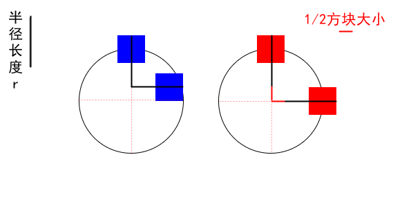
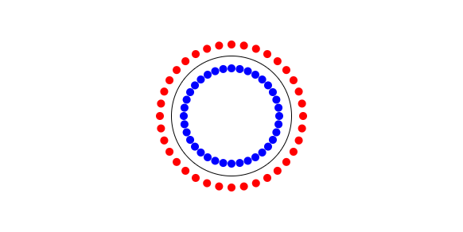
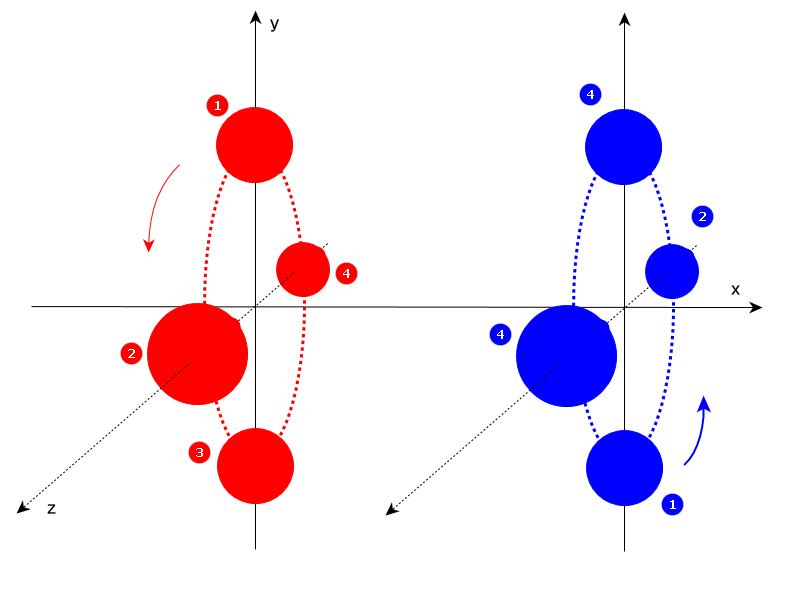
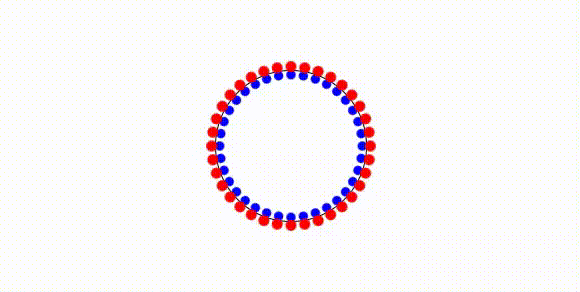
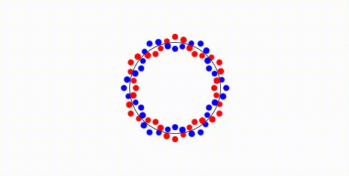
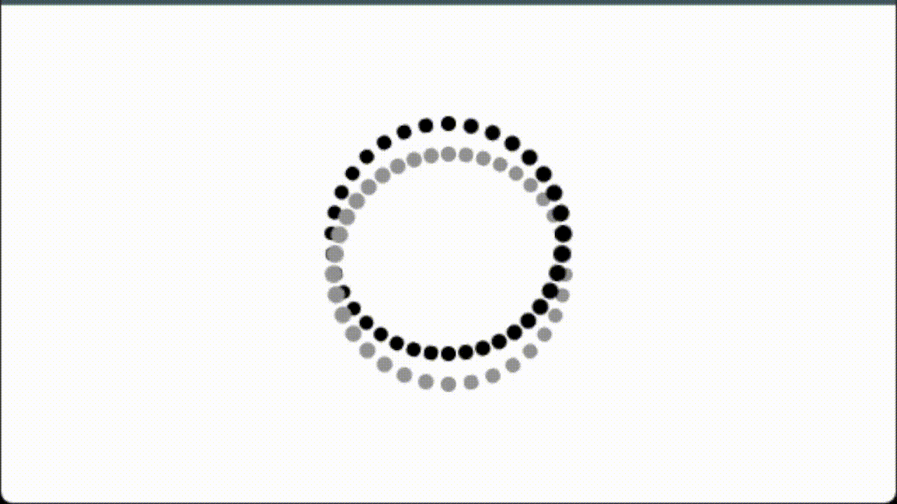
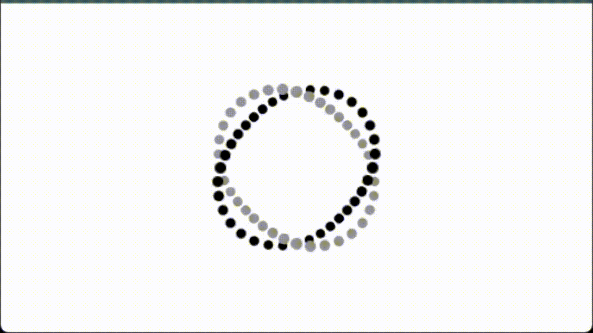
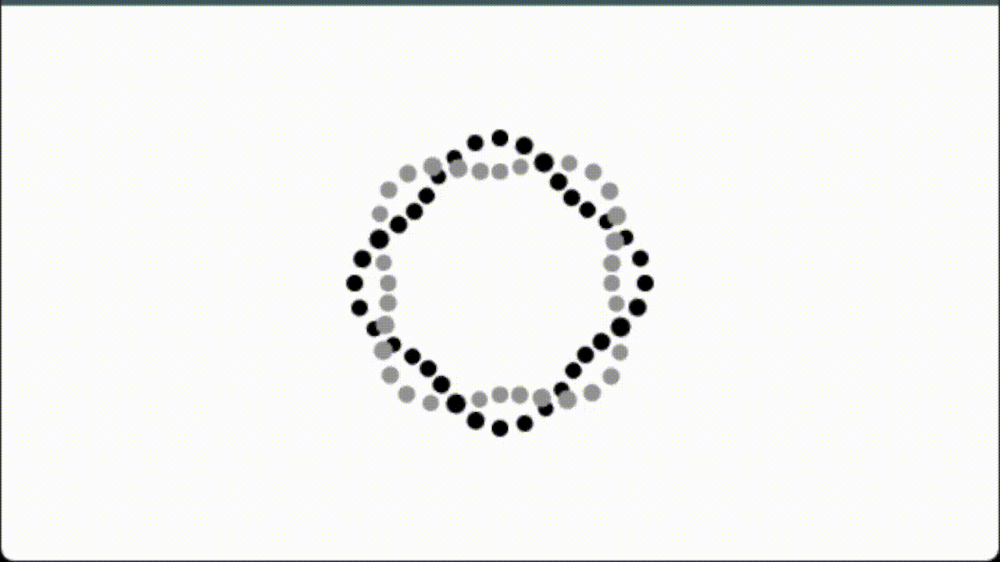
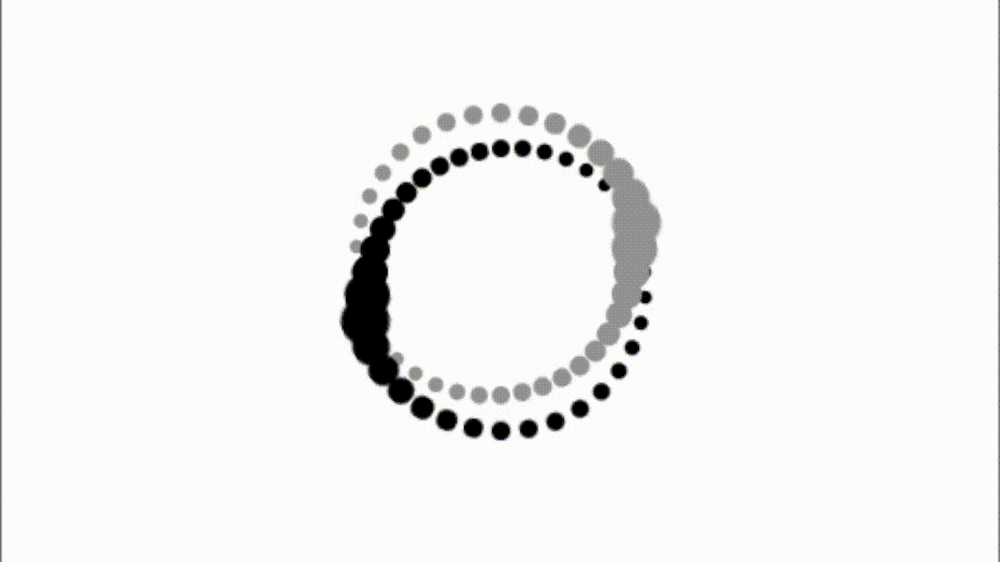

# 相间小球loading动画效果


> [link](https://jaycethanks.github.io/demos/CssTrick/circleLoading/dist/)

## 1. 基础布局


```html
<body>
    <div class="container">
      <div class="dot"></div>
      <div class="dot"></div>
      <div class="dot"></div>
        ......
        ..x36个.
        ......
      <div class="dot"></div>
      <div class="dot"></div>
      <div class="dot"></div>
    </div>
  </body>
```

```scss
$ballSize:10px;
$ballColor1:blue;
$ballColor2:red;
$containerSize:150px;

body {
  height: 100vh;
  width: 100vw;
  display: flex;
  justify-content: center;
  align-items: center;
  .container {
    position: relative;
    width: $containerSize;
    height: $containerSize;
    border-radius: 100%;
    border: 1px solid;
    .dot{
      position: absolute;
      top: 0;
      left: 50%;
      margin-left: -$ballSize/2;
      margin-top: -$ballSize/2;
      width: $ballSize;
      height: $ballSize;
      background-color: $ballColor2;
    }
  }
}
```


## 2. 问题1： 如何让红色的小方块围绕圆绕一圈均匀排布？

第一个小球围绕中心点旋转0°(不旋转) ， 第二个小球360°/36(个数) = 10°，第三个小球20°，依次类推

可以写几个尝试一下，看看什么效果：

```diff
body {
  .....
  .container {
    ......
    .dot{
      ......
+      &:nth-child(1){
+        transform: rotate(0deg);
+      }
+      &:nth-child(2){
+        transform: rotate(10deg);
+      }
+      &:nth-child(3){
+        transform: rotate(20deg);
+      }
+      &:nth-child(4){
+        transform: rotate(30deg);
+      }
    }
  }
}
```


不难发现， 每个方块都是按照自己的中心点旋转的， 这也是默认的旋转中心。 我们知道，我们可以通过`transform-origin`这个属性修改元素的旋转中心， 那么对于现在的情况，我们应该设定为圆心点。那么实际的 `transform-origin` 值应该是什么呢？

在横向，应该是居中的，也就是 `center`,  纵向应该是圆的半径 + 1/2方块大小, 也就是

```diff
body {
  .....
  .container {
    ......
    .dot{
      ......
+      transform-origin: center $containerSize/2 + $ballSize/2;
      ......
    }
  }
}
```

为什么要 `+ $ballSize/2` ? 下面用一张图加以说明：



现在，我们可以得到如下结果：


为了让这个过程更加简洁，我们可以利用 scss 的函数实现：

```diff
body {
  .....
  .container {
    ......
    .dot{
      ......
+      $n: 36;//方块的数量
+      $deg: 360deg / $n;//每个方块的角度
+      @for $i from 1 through 36 {
+        &:nth-child(#{$i}){
+          transform: rotate($deg * ($i - 1));
+        }
+      }
      ......
    }
  }
}
```


## 2. 问题2： 如何实现每一对小球？

我们可以利用伪元素实现每一对小球：

```diff
body {
  .....
  .container {
    ......
    .dot{
      ......
+        $gap: 15px;
+        &::before,&::after{
+          content: "";
+          position: absolute;
+          width: 100%;//尺寸撑满父元素
+          height: 100%;
+        }
+        &::after{
+          top:$gap;
+          background-color: $ballColor1;
+        }
+        &::before{
+          top:-$gap;
+          background-color: $ballColor2;
+        }
+      }
      ......
    }
  }
}
```

我们可以得到如下效果：


隐藏父元素, 并让方块变作小球：

```diff
body {
  .....
  .container {
    ......
    .dot{
      ......
-      background-color: $ballColor2;
      ......
+      &::before,&::after{
+        border-radius: 100%;
+      }
      ......
    }      
    }
  }
}
```



## 3. 问题3：如何动起来？

我们先针对某一对小球的运动来进行分析， 这里，以最顶端那对小球。 它们的运动轨迹大致如下图：



小球运动一周，有四个关键帧，

分别是 y 轴上下，z轴前后， 我们可以尝试写一个动画来尝试使运动小球。

我们以红色小球为例，分析一下每个关键帧， 

- 第一个关键帧，小球原位不动
- 第二个关键帧，小球向下，向前 移动一个身位
- 第三个关键帧，小球继续向下运动，此时相对原位置， 小球向下移动了两个身位
- 第四个关键帧，相对原位置，小球向后移动了一个身位，向下移动了一个身位

所以小球的运动不是在平面上发生的，我们在写动画的时候就需要用到 `translate3d` 这个属性， 并且，应该给父容器设定透视效果。 

如下：

```diff
body {
  .....
  .container {
    ......
    .dot{
      ......
+      perspective: 75px;
+      transform-style: preserve-3d;
+      &::before {
+        top: -$gap;
+        background-color: $ballColor2;
+        animation: before-ball-move 2s linear infinite;
+        @keyframes before-ball-move {
+          0% {
+            animation-timing-function: ease-in;
+          }
+          25% {
+            animation-timing-function: ease-out;
+            transform: translate3d(0, 100%, $ballSize);
+          }
+          50% {
+            animation-timing-function: ease-in;
+            transform: translate3d(0, 200%, 0);
+          }
+          75% {
+            animation-timing-function: ease-out;
+            transform: translate3d(0, 100%, -$ballSize);
+          }
+        }
      ......
    }      
    }
  }
}
```


> 说明：
>
> 1. `100%` 和 `$ballSize ` 是怎么回事? 前面描述小球的运动过程中，都是用 “一个身位” 这个描述词，实际上， 身位只是表述小球运动的步长，可以是任何单位， 这里的`$ballSize` 是同样的意思， 两者其实可以取一个值， 如果希望小球在Z轴运动的时候，体积大小变化更加明显，可以用更大的值，而不用 `$ballSize`
> 2. `animation-time-function` 的作用， 因为小球在每两个关键帧之间的运动其实是不一样的， 如果用相同的运动函数， 动画效果不够自然丝滑。

依照同样的原理，我们可以表述蓝球的运动：

```diff
body {
  .....
  .container {
    ......
    .dot{
      ......
+      &::after {
+        top: $gap;
+        background-color: $ballColor1;
+        animation: after-ball-move 2s linear infinite;
+        @keyframes after-ball-move {
+          0% {
+            animation-timing-function: ease-in;
+          }
+          25% {
+            animation-timing-function: ease-out;
+            transform: translate3d(0, -100%, -$ballSize);
+            
+          }
+          50% {
+            animation-timing-function: ease-in;
+            transform: translate3d(0, -200%, 0);
+          }
+          75% {
+            animation-timing-function: ease-out;
+            transform: translate3d(0, -100%, $ballSize);
+          }
+        }
+      }
      ......
    }      
    }
  }
}
```

这样，我们可以得到如下的动画效果：




## 4. 问题4：和目标动画还有差距，不是缠绕动画的

这个问题只要给每对小球的动画，加上delay，就可以解决了。 

```diff
body {
  .....
  .container {
    ......
    .dot{
      ......
      @for $i from 1 through 36 {
        &:nth-child(#{$i}) {
          transform: rotate($deg * ($i - 1));
          &::before,
          &::after {
+            animation-delay: $duration/$n * ($i - 1);
          }
        }
      }
      ......
    }      
    }
  }
}
```


> 注意，`$duration` 是动画时长，应该把之前写的 2s 常量动画时长替换为 `$duration`.

好像和我们期望的效果不太，一样？ 这是因为delay太小了， 我们这里加上一个6倍试试：

```diff
body {
  .....
  .container {
    ......
    .dot{
      ......
      @for $i from 1 through 36 {
        &:nth-child(#{$i}) {
          transform: rotate($deg * ($i - 1));
          &::before,
          &::after {
-            animation-delay: $duration/$n * ($i - 1);
+            animation-delay: $duration/$n * ($i - 1) * 6;
          }
        }
      }
      ......
    }      
    }
  }
}
```


这次的效果似乎还可以， 不过每次需要等很久。**为了解决这个问题，我们可以将delay 设定为负值**。

```diff
body {
  .....
  .container {
    ......
    .dot{
      ......
      @for $i from 1 through 36 {
        &:nth-child(#{$i}) {
          transform: rotate($deg * ($i - 1));
          &::before,
          &::after {
-            animation-delay: $duration/$n * ($i - 1) * 6;
+            animation-delay: -$duration/$n * ($i - 1) * 6;
          }
        }
      }
      ......
    }      
    }
  }
}
```



到这里，这个效果就算实现了，完整的scss代码如下：
```scss
$ballSize: 10px;
$ballColor1: blue;
$ballColor2: red;
$containerSize: 150px;
$duration: 2s;
body {
  height: 100vh;
  width: 100vw;
  display: flex;
  gap: 50px;
  justify-content: center;
  align-items: center;
  .container {
    position: relative;
    width: $containerSize;
    height: $containerSize;
    border-radius: 100%;
    border: 1px solid;
    .dot {
      position: absolute;
      top: 0;
      left: 50%;
      margin-left: -$ballSize/2;
      margin-top: -$ballSize/2;
      width: $ballSize;
      height: $ballSize;
      transform-origin: center $containerSize/2 + $ballSize/2;
      $n: 36; //方块的数量
      $deg: 360deg / $n; //每个方块的角度
      @for $i from 1 through 36 {
        &:nth-child(#{$i}) {
          transform: rotate($deg * ($i - 1));
          &::before,
          &::after {
            animation-delay: -$duration/$n * ($i - 1) * 6;
          }
        }
      }
      perspective: 75px;
      transform-style: preserve-3d;
      $gap: 100%;
      &::before,
      &::after {
        content: "";
        position: absolute;
        width: 100%; //尺寸撑满父元素
        height: 100%;
        border-radius: 100%;
      }
      &::after {
        top: $gap;
        background-color: $ballColor1;
        animation: after-ball-move $duration linear infinite;
      }
      &::before {
        top: -$gap;
        background-color: $ballColor2;
        animation: before-ball-move $duration linear infinite;
      }
    }
  }
}
@keyframes before-ball-move {
  0% {
    animation-timing-function: ease-in;
  }
  25% {
    animation-timing-function: ease-out;
    transform: translate3d(0, 100%, $ballSize);
  }
  50% {
    animation-timing-function: ease-in;
    transform: translate3d(0, 200%, 0);
  }
  75% {
    animation-timing-function: ease-out;
    transform: translate3d(0, 100%, -$ballSize);
  }
}

@keyframes after-ball-move {
  0% {
    animation-timing-function: ease-in;
  }
  25% {
    animation-timing-function: ease-out;
    transform: translate3d(0, -100%, -$ballSize);
  }
  50% {
    animation-timing-function: ease-in;
    transform: translate3d(0, -200%, 0);
  }
  75% {
    animation-timing-function: ease-out;
    transform: translate3d(0, -100%, $ballSize);
  }
}
// rotate3d(x, y, z, a)

```


## 5. 更多

### 不同的delay倍率系数，效果也会有所不同

1倍

```scss
 animation-delay: -$duration/$n * ($i - 1) * 1;
```



2倍

```scss
animation-delay: -$duration/$n * ($i - 1) * 2;

```



3倍

```scss
animation-delay: -$duration/$n * ($i - 1) * 3;
```


4倍

```scss
animation-delay: -$duration/$n * ($i - 1) * 4;
```




### 可以放大Z轴方向远近变化效果

```diff
......
+ $deep:2;
@keyframes before-ball-move {
  0% {
    animation-timing-function: ease-in;
  }
  25% {
    animation-timing-function: ease-out;
-    transform: translate3d(0, 100%, $ballSize);
+    transform: translate3d(0, 100%, $ballSize * $deep);
  }
  50% {
    animation-timing-function: ease-in;
    transform: translate3d(0, 200%, 0);
  }
  75% {
    animation-timing-function: ease-out;
-    transform: translate3d(0, 100%, -$ballSize);
+    transform: translate3d(0, 100%, -$ballSize * $deep);
  }
}

@keyframes after-ball-move {
  0% {
    animation-timing-function: ease-in;
  }
  25% {
    animation-timing-function: ease-out;
-    transform: translate3d(0, -100%, -$ballSize);
+    transform: translate3d(0, -100%, -$ballSize * $deep);
  }
  50% {
    animation-timing-function: ease-in;
    transform: translate3d(0, -200%, 0);
  }
  75% {
    animation-timing-function: ease-out;
-    transform: translate3d(0, -100%, $ballSize);
+    transform: translate3d(0, -100%, $ballSize * $deep);
  }
}
......
```

通过调整 `$deep` 值，就可以出现各种效果



> $deep:4 , delay系数为1


变动后的完整代码如下：
```scss
$ballSize: 10px;
$ballColor1: rgb(0, 0, 0);
$ballColor2: rgb(147, 147, 147);
$containerSize: 150px;
$duration: 2s;
body {
  height: 100vh;
  width: 100vw;
  display: flex;
  gap: 50px;
  justify-content: center;
  align-items: center;
  .container {
    position: relative;
    width: $containerSize;
    height: $containerSize;
    border-radius: 100%;
    .dot {
      position: absolute;
      top: 0;
      left: 50%;
      margin-left: -$ballSize/2;
      margin-top: -$ballSize/2;
      width: $ballSize;
      height: $ballSize;
      transform-origin: center $containerSize/2 + $ballSize/2;
      $n: 36; //方块的数量
      $deg: 360deg / $n; //每个方块的角度
      @for $i from 1 through 36 {
        &:nth-child(#{$i}) {
          transform: rotate($deg * ($i - 1));
          &::before,
          &::after {
            animation-delay: -$duration/$n * ($i - 1) * 6;
          }
        }
      }

      perspective: 75px;
      transform-style: preserve-3d;

      $gap: 100%;
      &::before,
      &::after {
        content: "";
        position: absolute;
        width: 100%; //尺寸撑满父元素
        height: 100%;
        border-radius: 100%;
      }
      &::after {
        top: $gap;
        background-color: $ballColor1;
        animation: after-ball-move $duration linear infinite;
      }
      &::before {
        top: -$gap;
        background-color: $ballColor2;
        animation: before-ball-move $duration linear infinite;
      }
    }
  }
}

$deep:2;
@keyframes before-ball-move {
  0% {
    animation-timing-function: ease-in;
  }
  25% {
    animation-timing-function: ease-out;
    transform: translate3d(0, 100%, $ballSize * $deep);
  }
  50% {
    animation-timing-function: ease-in;
    transform: translate3d(0, 200%, 0);
  }
  75% {
    animation-timing-function: ease-out;
    transform: translate3d(0, 100%, -$ballSize * $deep);
  }
}

@keyframes after-ball-move {
  0% {
    animation-timing-function: ease-in;
  }
  25% {
    animation-timing-function: ease-out;
    transform: translate3d(0, -100%, -$ballSize * $deep);
  }
  50% {
    animation-timing-function: ease-in;
    transform: translate3d(0, -200%, 0);
  }
  75% {
    animation-timing-function: ease-out;
    transform: translate3d(0, -100%, $ballSize * $deep);
  }
}
// rotate3d(x, y, z, a)

```

