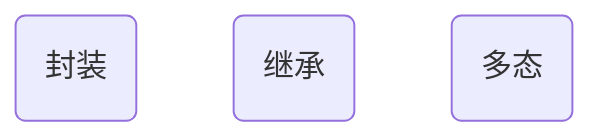

[toc]

## 1. 初识面向对象

**面向过程 & 面向对象：**

- 面向过程思想：

  1. 步骤清晰简单， 第一步做什么，第二部做什么...
  2. 面对过程适合处理一些较为简单的问题

- 面向对象思想

  1. 物以类聚，分类的思维模式，思考问题首先会解决问题需要哪些分类，然后对这些分类进行单独思考。最后，才对某个分类下的细节进行面向过程的思索。 
  2. 面向对象适合处理复杂的问题，适合处理需要多人协作的问题。 

  > 面向过程，面向对象都是编程思想， 对于描述复杂的事物，为了从宏观上把握，从整体上合理分析，我们需要使用面向对象的思路来分析整个系统。但是，具体到微观操作，任然需要面向过程的思路去处理。 


## 2. 什么是面向对象？

- 面向对象编程（Object-Oriented Programming, OOP）
- 面向对象编程的本质就是：<span style="color:red">**以类的方式组织代码，以对象的形式封装数据**</span>

**类与对象：**

1. 从认识论的角度考虑，是先有对象后有类。 对象，是具体的事物。 <span style="color:red">类，是对对象的抽象。 </span>
2. 从代码运行的角度考虑， 是现有类后有对象。  <span style="color:red">类，是对象的模板。</span>

```mermaid
graph LR
	A((对象))
	B(类)
	A -..抽象..-> B
	A -..模板..-> B
```


## 3. 面向对象的三大特性




## 5. 抽象类和接口


## 6.内部类以及OOP实战