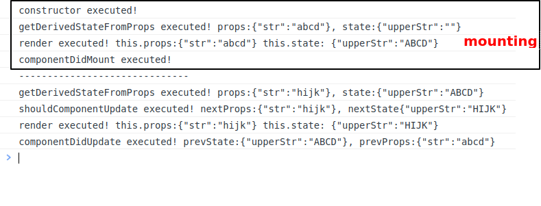

在 React 中，每个组件有三个主要的生命周期，分别是

- Mounting
- Updating
- Unmounting

[toc]

## 1. Mounting

**渲染，或者将组件挂载到 DOM**  的过程叫做 mounting

在 mounting 期间，以下是一个React 组件内置的一些方法的执行顺序:

1. `constructor()`
2. `static getDerivedStateFromProps()`
3. `render()`
4. `componentDidMount()`

```jsx
import { Component } from "react";
class MountingStage extends Component {
  constructor(props) {
    super(props);
    console.log("I am the constructor and I will be the first to run.");
    this.state = {
      firstName: "",
    };
  }

  static getDerivedStateFromProps(props, state) {
    console.log(
      "I am getDerviedStateFromProps and I will be the second to run.",
    );
    return null;
  }

  componentDidMount() {
    console.log("I am componentDidMount and I will be last to run.");
  }
  render() {
    console.log("I am render and I will be the third to run");
    return (
      <div className='wrapper'>
        <h1>React Component Life Cycle</h1>
      </div>
    );
  }
}

export default MountingStage;
```


### 1.1 getDerivedStateFromProps()

在 constructor 之后，在 render 之前执行。 

这个方法，接收 props 和 state 两个参数。 最后返回一个 处理后的 state

此后在 render 中去访问 `this.state` ，就是`getDerivedStateFromProps()`return 的 state 对象。 

我们可以在这里面作一系列的处理。 

**app.js**

```jsx
import ReactComponentLifeCycle from "./pages/ReactComponentLifeCycle.page";
import "./App.css";

function App() {
  return (
    <div className='app-wrapper'>
      <ReactComponentLifeCycle appProps='hello react!' />
    </div>
  );
}

export default App;
```

**solutions/src/pages/ReactComponentLifeCycle.page.jsx**

```jsx
import { Component } from "react";

class ReactComponentLifeCycle extends Component {
  constructor(props) {
    super(props);
    this.state = {
      firstName: "john",
    };
  }
  static getDerivedStateFromProps(props, state) {
    console.log(props.appProps); //hello react!
    console.log(state.firstName); //john
    return {
      firstName: state.firstName.toUpperCase(),
      appProps: props.appProps.toUpperCase(),
    };
  }
  componentDidMount() {}
  render() {
    console.log(this.state); //{firstName: 'JOHN', appProps: 'HELLO REACT!'}
    return (
      <div className='wrapper'>
        <h1>React Component Life Cycle</h1>
        {this.state.firstName}
        <br />
        {this.state.appProps}
      </div>
    );
  }
}

export default ReactComponentLifeCycle;

```


### 1.2 Render

`render` 方法是一个 class-based component 的 必须指定的方法，它最终会返回 JSX 元素。

render 方法，在 props 或者 state 发生变化时，会自动重新执行。

**不要在render 中去 set State **


### 1.3 ComponentDidMount

在 render之后执行。  在这里，我们常常去调用 API 或者设定 定时器等。


## 2. Updating

在组件挂载到 DOM 以后，组件会在 props 或者 state 发生改变以后，发生更新。 

当一个组件被重新渲染的时候 （re-render）, 有以下方法的执行顺序：

1. `static getDerivedStateFromProps()`
2. `shouldComponentUpdate()`
3. `render()`
4. `getSnapshotBeforeUpdate()`
5. `componentDitUpdate()`


### 2.1 getDerivedStateFromProps

getDerivedStateFromProps 是玛更新过程的第一个执行的方法

### 2.2 shouldComponentUpdate

该方法是一个内置方法，它返回一个布尔值，仅当该方法返回 `true` ，更新过程才会继续，否则，终止。

### 2.3 render

和上面说的一样，state 或者  props 发生变动，就会触发 re-render

### 2.4 componentDidUpdate

该生命周期方法接收了两个参数，` componentDidUpdate(prevProps, prevState)`, 


以下，为了作一个示例实验，我们设计一个嵌套组件。分别是：

**solutions/src/components/Father.component.jsx**

**solutions/src/components/Child.component.jsx**

**Father** 

```jsx
import { Component } from "react";
import Child from "./Child.component";
class Father extends Component {
  constructor(props) {
    super(props);
    this.state = {
      str: "abcd",
    };
  }
  render() {
    return (
      <div className='wrapper'>
        <Child str={this.state.str} />
      </div>
    );
  }
  componentDidMount() {
    setTimeout(() => {
      this.setState({
        str: "hijk",
      });
    }, 2000);
  }
}
export default Father;
```

**Child**

```jsx
import { Component } from "react";
class Child extends Component {
  constructor(props) {
    console.log("constructor executed!");
    super(props);
    this.state = {
      upperStr: "",
    };
  }

  static getDerivedStateFromProps(props, state) {
    console.log(
      `getDerivedStateFromProps executed! props:${JSON.stringify(
        props,
      )}, state:${JSON.stringify(state)}`,
    );
    return { upperStr: props.str.toUpperCase() };
  }
  shouldComponentUpdate(nextProps, nextState) {
    console.log(
      `shouldComponentUpdate executed! nextProps:${JSON.stringify(
        nextProps,
      )}, nextState${JSON.stringify(nextProps)}`,
    );
    // console.log(nextProps, nextState);
    return true;
  }
  render() {
    console.log(
      `render executed! this.props:${JSON.stringify(
        this.props,
      )} this.state: ${JSON.stringify(this.state)}`,
    );
    return (
      <div className='wrapper'>
        <h2>Prop: {this.props.str}</h2>
        <h2>State:{this.state.upperStr}</h2>
      </div>
    );
  }
  componentDidUpdate(prevProps, prevState) {
    console.log(
      `componentDidUpdate executed! prevState:${JSON.stringify(
        prevState,
      )}, prevProps:${JSON.stringify(prevProps)}`,
    );
  }
  componentDidMount() {
    console.log("componentDidMount executed!");
    console.log("------------------------------");
  }
  componentWillUnmount() {
    console.log("componentWillUnmount executed!");
  }
}
export default Child;
```



首次挂载，生命周期函数的执行流程是: 

constructor => getDerivedStateFromProps => render => componentDidMount

props 或者 state 变更触发 更新的 生命周期函数的执行流程是：

getDerivedStateFromProps => shouldComponentUpdate => render => componentDidUpdate


## 3. Umounting

卸载是React 组件生命周期的最后一个过程， 当组件被卸载后，生命周期钩子函数：`componentWillUnmount` 将会触发。 

