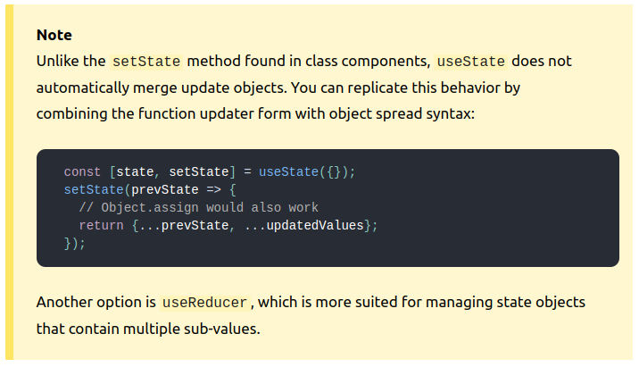

关于 useState ， 官网中，有这样一段提及：

https://reactjs.org/docs/hooks-reference.html#usestate




在 setState 的时候，你务必需要留意， 函数组件，在 props 或者 state 改变的时候，会从头到位执行一次。 **对于基本值类型， setState 都会触发 state 变化，**

但是对于复杂类型，需要特别注意。 

通常，我们通过 `Object.assign({},...prevState,...updatedValues)` 或者  `{...prevState,...updatedValues}` 去触发 state 的更新。

但是在使用的时候，你始终应该注意，是否每次设定的都是一个新的对象。

以下方式将不会触发更新：

```js
const [fields, setFields] = useState({})
...
setFields(Object.assign(...field,...{newf1:"xx",newf2:"xxx"}))
```

因为`Object.assign` 最后返回的值还是先前的 field 内存地址引用，是同一个变量， react 不会检测到更新。

可以通过一下示例体会问题所在：

```js
let b = {a:1}
let obj1 = Object.assign(b,{d:2})
let obj2 = {...b,...{d:2}}
console.log(obj1);//{ a: 1, d: 2 }
console.log(obj1===b);//true
console.log(obj2);//{ a: 1, d: 2 }
console.log(obj2 === b);//false
```

那么对于 `Object.assign` 写法建议这样去写：

```js
const [fields, setFields] = useState({})
...
setFields(Object.assign({},...field,...{newf1:"xx",newf2:"xxx"}))
```


为了避免不必要的问题，建议都使用 对象展开符的形式去书写。