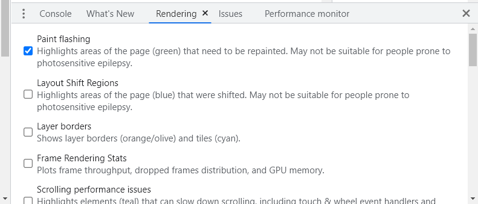

** App.js**

```diff
/* eslint-disable no-lone-blocks */
import { useState, useEffect } from "react";
import "./App.css";
import CardList from "./components/card-list/card-list.component";
import SearchBox from "./components/search-box/search-box.component";

{
  // class App extends Component {
  //   constructor() {
  //     super();
  //     this.state = {
  //       monsters: [],
  //       filteredMonsters: [],
  //     };
  //     this.handleChange = this.handleChange.bind(this);
  //   }
  //   componentDidMount() {
  //     fetch("http://jsonplaceholder.typicode.com/users")
  //       .then((response) => response.json())
  //       .then((users) =>
  //         this.setState(
  //           () => {
  //             return { monsters: users, filteredMonsters: users };
  //           },
  //           () => {
  //             console.log(this.state);
  //           },
  //         ),
  //       );
  //   }
  //   handleChange(event) {
  //     const monsters = this.state.monsters;
  //     let value = event.target.value.toLocaleLowerCase();
  //     const filterRes = monsters.filter((it) =>
  //       it.name.toLocaleLowerCase().includes(value),
  //     );
  //     this.setState({ filteredMonsters: filterRes });
  //   }
  //   render() {
  //     const { filteredMonsters } = this.state;
  //     const { handleChange } = this;
  //     return (
  //       <div className='App'>
  //         <h1 className='app-title'>Monsters Rolodex</h1>
  //         <SearchBox
  //           handleChange={handleChange}
  //           placeholder='search monster'
  //           className='monster-search-box'
  //         />
  //         <CardList filteredMonsters={filteredMonsters} />
  //       </div>
  //     );
  //   }
  // }
}

function App() {
  console.log("Function App 执行了", "--line58");
  /**
   * 传递给 useState 的是初始值，在这个组件中，filteredMonsters 就是空数组
   */
  const [filteredMonsters, setFilteredMonsters] = useState([]); // userState 返回一个包含两个值的数组 [value, setValue]]

  const [monsters, setMonsters] = useState([]);

+ const [title, setTitle] = useState("Monsters Rolodex");

  useEffect(() => {
    console.log("userEffect callback 执行", "--line67");
    fetch("http://jsonplaceholder.typicode.com/users")
      .then((response) => response.json())
      .then((users) => {
        setFilteredMonsters(users);
        setMonsters(users);
      });
  }, []);

  const handleChange = (event) => {
    // const monsters = this.state.monsters;
    let value = event.target.value.toLocaleLowerCase();
    const filterRes = monsters.filter((it) =>
      it.name.toLocaleLowerCase().includes(value),
    );
    setFilteredMonsters(filterRes);
    // this.setState({ filteredMonsters: filterRes });
  };

+  const handleTitleChange = (event) => {
+    let value = event.target.value.toLocaleLowerCase();
+    setTitle(value);
+  };

  return (
    <div className='App'>
-      <h1 className='app-title'>Monsters Rolodex</h1>
+      <h1 className='app-title'>{title}</h1>
+      <SearchBox
+        handleChange={handleTitleChange}
+        placeholder='input title here'
+        className='monster-search-box'
+      />
+      <br />
      <SearchBox
        handleChange={handleChange}
        placeholder='search monster'
        className='monster-search-box'
      />
      <CardList filteredMonsters={filteredMonsters} />
    </div>
  );
}
export default App;
```

将Chrome 浏览器 devtools - Rendering - Painting flashing 勾选




屏幕中绿色的部分指的是重新绘制刷新的部分， 可以看到，在 title 输入框中， 输入字符时，页面仅关联的 Title 部分被更新了。 

