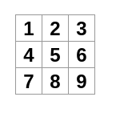

## Tutorial: Tic-Tac-Toe

在这个教程中,你将会创建一个井子棋小游戏. 该教程不要求你预备任何 React 知识, 在这个教程中你学到的技术将是你构建任何 React 应用的基础. 并且完全理解将会让你对 React 有一个深入的理解. 

> :notebook: 该教程为那些喜欢 **learn by doing** 以及想要快速创建可触及的东西的人群而设计的, 如果你更加倾向于按部就班的学习概念, 你可以从 [Describing the UI.](https://react.dev/learn/describing-the-ui) 这里开始.

该教程将会被划分为几个小节:

- [Setup for the tutorial](https://react.dev/learn/tutorial-tic-tac-toe#setup-for-the-tutorial)  将会给你一个开始这个教程的 起点
- [Overview](https://react.dev/learn/tutorial-tic-tac-toe#overview) 将会教你 React 的基础只是 : component, props, 以及 state
- [Completing the game](https://react.dev/learn/tutorial-tic-tac-toe#completing-the-game) 将会教你在 React 开发中,最为公共的技术.
- [Adding time travel](https://react.dev/learn/tutorial-tic-tac-toe#adding-time-travel) 将会让你对React的好处有深的见解

### 你在构建什么?

在这个教程中, 你将会构建一个交互式的井子棋游戏. 

你可以看到在完成后,它将会长什么样子:


### 本教程的 Setup

你可以直接 Fork 下面提供的[在线编辑器](https://codesandbox.io/s/ljg0t8?file=/App.js&utm_medium=sandpack)仓库, 然后可以开始编码了.

```jsx
// App.js
export default function Square() {
  return <button className="square">X</button>;
}

```

### Overview

现在你已经初始化了,让我们看看 React 的概览吧!

#### 检查 starter (初始化) 的代码

在 CodeSandbox 中,你将会看见三个主要的部分:


1. *Files* 部分,包含这一系列的文件像: `App.js`, `index.js`, `styles.css` 以及一个叫做 `public` 的文件夹.
2. *code editor* 部分, 也就是你看到你选中的文件的源代码的部分
3. *browser* 部分, 代码被渲染的部分.

`App.js` 文件应该在*Files* 部分被选中. 而*code editor*部分的文件内容应该如下:

```jsx
export default function Square() {
  return <button className="square">X</button>;
}
```

*browser* 展示的部分应该展示一个 "X" 如下:


#### Building the board

现在让我们回过头看看 `App.js`

```jsx
export default function Square() {
  return <button className="square">X</button>;
}
```

在 React 中, 一个组件就是一段可被复用的代码, 它表示了用户接口的一部分. 组件用于渲染, 管理, 以及更新你的应用中的元素. 

第一行代码定义了一个函数, 名为 `Square`, `export` 关键字使得在这个文件外部,这个函数也能够被访问.  `default` 关键告诉其他的文件, 当你引入这个文件的时候, 这个函数就是这个文件的主函数. 

第二行, return了一个按钮, `return` 关键字的意思是当这个函数被调用的时候,将会返回一个 按钮. `<button>` 是一个 JSX 元素, 一个 JSX 元素是 JavaScript 代码和 HTML 标签的一个组合, 它描述了你要展示的东西.

`className="squre"` 是一个按钮属性, 或者 *props* ,它告诉了 css 元素应该如何去对这个按钮应用样式.  `X` 是按钮内部的文本内容. `</button>` 闭合标签,则表示任何按钮内容都应该被放在`<button>...</button>` 内部.

**`styles.css`**

这个文件文件为你的 React 应用定义了样式

**`index.js`**

```js
import React, { StrictMode } from "react";
import { createRoot } from "react-dom/client";
import "./styles.css";

import App from "./App";

const root = createRoot(document.getElementById("root"));
root.render(
  <StrictMode>
    <App />
  </StrictMode>
);
```

这个文件引入了 React 到你的项目中, 是的我们可以使用 React.

现在, 在 `App.js` 中,我们将 "X" 按钮拷贝到 9 个元素. 注意, React 组件只能够 return 一个代码块, 而并不能 return 多个. 所以你需要将这 9 个元素包裹起来:

```jsx
export default function Square() {
  return (
    <>
      <button className="square">X</button>
      <button className="square">X</button>
      <button className="square">X</button>
      <button className="square">X</button>
      <button className="square">X</button>
      <button className="square">X</button>
      <button className="square">X</button>
      <button className="square">X</button>
      <button className="square">X</button>
    </>
  );
}
```

现在, 页面上展示了 9 个 "X" 按钮


但是, 我们需要构建一个井字棋 游戏, 所以我们需要将它做成 三行三列, 为了达到这个目的, 我们将这些元素划分一下,会比较方便:

```jsx
export default function Square() {
  return (
    <>
      <div className="board-row">
        <button className="square">1</button>
        <button className="square">2</button>
        <button className="square">3</button>
      </div>
      <div className="board-row">
        <button className="square">4</button>
        <button className="square">5</button>
        <button className="square">6</button>
      </div>
      <div className="board-row">
        <button className="square">7</button>
        <button className="square">8</button>
        <button className="square">9</button>
      </div>
    </>
  );
}
```



现在有个问题,就是你的组件名为 `Square` , 但是它实际上,不再是一个 square 了, 所以我们修改一下名字为 `Board`:

```jsx
export default function Board() {
  //...
}
```

现在它是这样的:
```jsx
export default function Board() {
  return (
    <>
      <div className="board-row">
        <button className="square">1</button>
        <button className="square">2</button>
        <button className="square">3</button>
      </div>
      <div className="board-row">
        <button className="square">4</button>
        <button className="square">5</button>
        <button className="square">6</button>
      </div>
      <div className="board-row">
        <button className="square">7</button>
        <button className="square">8</button>
        <button className="square">9</button>
      </div>
    </>
  );
}
```


#### 通过 props 传递数据

下一步, 我们想要当用户点击一个方块的时候, 修改这个方块中的值,从 空 到 "X",

为了达到复用的目的, 我们需要将这些 square 抽离为一个单独的组件. 

```jsx
function Square() {
  return <button className="square">1</button>;
}

export default function Board() {
  return (
    <>
      <div className="board-row">
        <Square />
        <Square />
        <Square />
      </div>
      <div className="board-row">
        <Square />
        <Square />
        <Square />
      </div>
      <div className="board-row">
        <Square />
        <Square />
        <Square />
      </div>
    </>
  );
}
```

现在, 我们实现了  Square 的抽离, 但是, 所有的方块现在都是 "1", 我们需要使用 props, 來传值, 使得每个 Square 的值可以得到控制:

```jsx
function Square({ value }) {
  return <button className="square">{ value }</button>;
}

export default function Board() {
  return (
    <>
      <div className="board-row">
        <Square value="1"/>
        <Square value="2"/>
        <Square value="3"/>
      </div>
      <div className="board-row">
        <Square value="4"/>
        <Square value="5"/>
        <Square value="6"/>
      </div>
      <div className="board-row">
        <Square value="7"/>
        <Square value="8"/>
        <Square value="9"/>
      </div>
    </>
  );
}
```


#### 做一个可交互的组件

让我们实现, 当你点击某个Square的时候, 将其内容设定为  "X"  .

**在Square 内**定义一个函数名为 `handleClick`, 然后,添加通过 `onClick` prop 将这个事件绑定到 Square.

```jsx
function Square({ value }) {
  function handleClick() {
    console.log("clicked!");
  }
  return (
    <button onClick={handleClick} className="square">
      {value}
    </button>
  );
}
```

现在,当你点击一个 Square 的时候, 控制台将会打印 "clicked!"

在下一步中, 你想要 Squate 组件能够记住它是否被点击了, 然后填充 "X", 要 "记住" 东西, 组件需要使用 state .

React 提供了一个特殊的函数, 叫做`useState`, 你可以在你的组件中调用它, 让他 "记住" 东西.  让我在 state 存储当前 Square 的值,并在 Square 点击的时候去改变它.

在文件的顶部 import `useState` , 从`Square` 组件移除`value` 这个prop, 替而代之, 在 `Square` 的顶部添加新行, 去调用 `useState`:

```jsx
import { useState } from 'react';

function Square() {
  const [value, setValue] = useState(null);

  function handleClick() {
    //...
```

`value` 保存了 value, 并且 `setValue` 可以被调用以修改这个 value. 传递给 `useState` 的 `null` 用于这个state 变量的初始值.

因为 `Square` 组件不再接受props, 你需要移除 所有的 Square 组件上的 `value` prop:

```jsx
import { useState } from "react";
function Square() {
  const [value, setValue] = useState(null);
  function handleClick() {
    console.log("clicked!");
  }
  return (
    <button onClick={handleClick} className="square">
      {value}
    </button>
  );
}

export default function Board() {
  return (
    <>
      <div className="board-row">
        <Square />
        <Square />
        <Square />
      </div>
      <div className="board-row">
        <Square />
        <Square />
        <Square />
      </div>
      <div className="board-row">
        <Square />
        <Square />
        <Square />
      </div>
    </>
  );
}
```

现在我们要实现,当点击 `Square` 的时候, 将其展示为 "X", 我们需要在 `handleClick  ` 中去处理:

```jsx
function handleClick() {
    setValue("X");
}
```

现在每个 Square 都有它自己的 state, 每个 Square 中的 `value` 都是独立于其他 Square 的,不会相互影响. 当你在一个组件中调用 `set` 函数的时候, React 也将会自动的更新的它内部的子组件. 

在你修改你的代码之后,整体看来应该是这样的:

```jsx
import { useState } from 'react';

function Square() {
  const [value, setValue] = useState(null);

  function handleClick() {
    setValue('X');
  }

  return (
    <button
      className="square"
      onClick={handleClick}
    >
      {value}
    </button>
  );
}

export default function Board() {
  return (
    <>
      <div className="board-row">
        <Square />
        <Square />
        <Square />
      </div>
      <div className="board-row">
        <Square />
        <Square />
        <Square />
      </div>
      <div className="board-row">
        <Square />
        <Square />
        <Square />
      </div>
    </>
  );
}
```


#### React 开发者工具

React 开发者工具允许你检查你的 React 组件的 props 以及 state, 你可以在CodeSandbox 的 *browser* 部分的底部看到 React DecTools


### 完成这个游戏

现在为止, 你已经拥有了构建你的井字棋游戏的所有基础块, 要完成一个完整的游戏, 你需要选择性的替换 board 上的 "X" 和 "O", 并且你需要有一个方式去检测谁是赢家. 

#### 提升状态 (Lifting state up)

目前, 每个 `Square` 组件维护了这个游戏的部分状态. 检测井字棋的赢家, 这个 `Board` 需要知道这9个 `Square` 组件的所有状态. 

你要如何实现呢 ? 首先,你可能猜测 `Board` 需要去 "ask" 每个 `Square` 的 state, 尽管这种方式在React中,技术上是可行的,  但是我们并不鼓励这么做, 因为这样的代码将会变得难以理解. 并且容易产生bug, 难以重构.

最佳的方案是将这个游戏的状态存储在父级 `Board` 组件, 而不是每一个 `Square` 组件, 这个 `Board` 组件通过prop会告诉每一个 `Square` 展示什么东西. 就像你给每个一Square 传递的数字一样.

**要从每个子组件收集数据, 或者让两个子组件相互通信, 那么就要在他们的共同父组件中去声明这个共享的状态. 这个父组件又可以通过 props 将这个状态传递到子组件.** 
**这样一来, 我们就能够让所有子组件的状态和父组件的状态,子组件之间的状态保持同步.**

将 state 提升至父组件在重构 React 组件的时候是很平常的事情. 

让我们借此机会试一试, 编辑 `Board` 组件,声明一个名为`squares` 的变量, 初始化为一个数组, 这个数组有9个元素,都初始化为null.

```jsx
// ...
export default function Board() {
  const [squares, setSquares] = useState(Array(9).fill(null));
  return (
    // ...
  );
}
```

现在你的 `Board` 组件需要将 `value` prop down 到每一个 `Square` :

```jsx
export default function Board() {
  const [squares, setSquares] = useState(Array(9).fill(null));
  return (
    <>
      <div className="board-row">
        <Square value={squares[0]} />
        <Square value={squares[1]} />
        <Square value={squares[2]} />
      </div>
      <div className="board-row">
        <Square value={squares[3]} />
        <Square value={squares[4]} />
        <Square value={squares[5]} />
      </div>
      <div className="board-row">
        <Square value={squares[6]} />
        <Square value={squares[7]} />
        <Square value={squares[8]} />
      </div>
    </>
  );
}
```

紧接着, 你需要编辑 `Square` 组件去接收来自 Board 组件的 `value` prop. 这将会要求移除 Square 自己对 value 的状态追踪, 以及 按钮的 `onClick` prop:
```jsx
import { useState } from "react";

function Square({ value, onSquareClick }) {
  return (
    <button className="square" onClick={onSquareClick}>
      {value}
    </button>
  );
}

export default function Board() {
  const [squares, setSquares] = useState(Array(9).fill(null));
  function handleClick() {
    const nextSquares = squares.slice();
    nextSquares[0] = "X";
    setSquares(nextSquares);
  }
  return (
    <>
      <div className="board-row">
        <Square value={squares[0]} onSquareClick={handleClick} />
        <Square value={squares[1]} onSquareClick={handleClick} />
        <Square value={squares[2]} onSquareClick={handleClick} />
      </div>
      <div className="board-row">
        <Square value={squares[3]} onSquareClick={handleClick} />
        <Square value={squares[4]} onSquareClick={handleClick} />
        <Square value={squares[5]} onSquareClick={handleClick} />
      </div>
      <div className="board-row">
        <Square value={squares[6]} onSquareClick={handleClick} />
        <Square value={squares[7]} onSquareClick={handleClick} />
        <Square value={squares[8]} onSquareClick={handleClick} />
      </div>
    </>
  );
}
```

`handleClick` 函数中,使用了 JavaScript 的 `slice()` 数组方法 创建了一份 `squares` 数组的拷贝(@jayce:浅拷贝)(`nextSquares`), 然后,`handleClick()` 更新了 `nextSquares` 数组,将索引值为`[0]` 的元素更改为了 "X".

通过调用 `setSquares` 函数, 使得 React 知道组件的状态发生了改变, 这将会触发所有使用了 `squares` 状态的组件(`Board`) 以及它的子组件(`Square`) 发生重新渲染,即 re-render.


现在你可以添加 "X"到board......, 但是只有第一个 Square 才会更新. 这是因为你的 `handleClick`函数是硬编码的,只会更新第一个元素. 让我们更新一下 `handleClick` 函数,让它能够更新任意的 square, 添加一个参数 `i` 到 `handleClick` 函数, 同时在 `onSquareClick` 函数中,传入当前 Square 的索引值, 这样就能够知道是哪一个square 被点击了. 

```jsx
export default function Board() {
  const [squares, setSquares] = useState(Array(9).fill(null));
  function handleClick(i) {
    const nextSquares = squares.slice();
    nextSquares[i] = "X";
    setSquares(nextSquares);
  }
...    
```

```jsx
<Square value={squares[0]} onSquareClick={handleClick(0)} />
```

**但是, 你会发现这样行不通,  为什么呢? 因为当 `handleClick(0)` 被调用的时候, 它会触发 board 组件 re-render, 而因为onClick 事件被赋值为 handleClick(0)，这意味着每次渲染时都会调用 handleClick 函数, 所以会导致无限循环 re-render.** 

为什么这个问题之前没有发生呢 ?

这是因为, 在之前, 我们是这样去传入 `onSquareClick` 的 ``onSquareClick={handleClick}`, 你传入的是一个函数定义作为 prop, 并没有调用它. 但是现在你将其定义为 `handleClick(0)`, 将会直接调用这个handle 函数. 

为了解决这个问题, 我们需要想办法传入一个函数, 而不是直接调用:

```jsx
export default function Board() {
  // ...
  return (
    <>
      <div className="board-row">
        <Square value={squares[0]} onSquareClick={() => handleClick(0)} />
        // ...
  );
}
```

现在整体代码看起来是这样的 :

```jsx
import { useState } from "react";

function Square({ value, onSquareClick }) {
  return (
    <button className="square" onClick={onSquareClick}>
      {value}
    </button>
  );
}

export default function Board() {
  const [squares, setSquares] = useState(Array(9).fill(null));
  function handleClick(i) {
    const nextSquares = squares.slice();
    nextSquares[i] = "X";
    setSquares(nextSquares);
  }
  return (
    <>
      <div className="board-row">
        <Square value={squares[0]} onSquareClick={() => handleClick(0)} />
        <Square value={squares[1]} onSquareClick={() => handleClick(1)} />
        <Square value={squares[2]} onSquareClick={() => handleClick(2)} />
      </div>
      <div className="board-row">
        <Square value={squares[3]} onSquareClick={() => handleClick(3)} />
        <Square value={squares[4]} onSquareClick={() => handleClick(4)} />
        <Square value={squares[5]} onSquareClick={() => handleClick(5)} />
      </div>
      <div className="board-row">
        <Square value={squares[6]} onSquareClick={() => handleClick(6)} />
        <Square value={squares[7]} onSquareClick={() => handleClick(7)} />
        <Square value={squares[8]} onSquareClick={() => handleClick(8)} />
      </div>
    </>
  );
}
```


现在, 你的 状态 handleing 是在 `Board` 组件中, 父级`Board` 组件传递 props 到子组件 `Square` ,因此他们可以被正确的展示. 当点击square 的时候, 子组件`Square` 组件现在会要求 父组件 `Board`	去更新board的状态. 当 `Board` 的状态发生改变时, `Board` 组件以及每个子组件 `Square` 都会自动的 re-render, 将所有的 squares 的状态保留在 `Board` 组件中,有利于在未来我们去检测谁是赢家. 

让我们回顾一下当用户点击了 board 最左上角的 square 时发生了什么:

1. 点击时, `button` 将会触发从 `Square` 接收到他的 `onClick` prop. 而 `Square`的这个 prop 又来自 `Board` 组件的 `onSquareClick` prop. 这个prop 是直接在 `Board` 组件中用 JSX 定义的, 它携带参数 `0` 调用了 `handleClick` 方法.
2. `handleClick` 使用参数(`0`) 去更新 `squares`的第一个元素,从 `null` 到 `X`.
3. `Board` 组件中的 `squares` 状态发生更新. 所以 `Board` 和它所有的子组件都会发生 re-render. 

#### 为什么 不变性(immutability) 是很重要的

注意, 在 `handleClick` 中, 你调用`.slice()`去创建了一份 `squares` 数组的拷贝, 而不是直接修改即存的数组. 要解释为什么,我们需要讨论不变性, 以及为什么不变性是非常重要去学习的. 

**要修改数据, 通常有两种方式. 第一种方式就是通过直接修改 data'value 去达到 *mutate* (修改) data 的目的. 另一种方式,就是用一份携带了变动的拷贝值去替换 data. 简单的说前者修改了原始值, 后者没有修改原始值.**

**通常来说,后者方式会带来一些好处.** 

**不变性使得一些复杂的特性更加容易去实现, 在本教程的后面, 你会实现一个 "time traval" 时间旅行的特性 , 以便你回观整个游戏的历史, 以及实现 "撤销" 操作.** 

**不变性还有另一个好处. 默认的, 所有的子组件在父组件的 state 发生更新的时候都会自动 re-render. 即便有些子组件并没有因这个 state 的更新产生变化.  有些时候考虑到性能因素,你可能不希望这些不关联到父组件state更新的子组件发生无效的re-render. 不变性使得组件比较他们的数据发生改变变得很容易. 你可以在 [the `memo` API reference](https://react.dev/reference/react/memo) 中学习到 React 如何渲染何时 re-render 一个组件.**


#### 实现轮流游戏

现在是时候去修复一个大问题: "O" 目前无法被标记在 board. 

你将会把第一步默认设为 "X", 让我们通过向Board组件添加另一个状态片段来跟踪这一点.

```jsx
function Board() {
  const [xIsNext, setXIsNext] = useState(true);
  const [squares, setSquares] = useState(Array(9).fill(null));

  // ...
}
```

每一次一个玩家点击后, `xIsNext`将会被检测一下, 谁走下一步棋, 并且游戏的状态将会被存储. 会在 `Board` 的 `handleClick` 函数中去取反 `xIsNext` 值:

```jsx
export default function Board() {
  const [xIsNext, setXIsNext] = useState(true);
  const [squares, setSquares] = useState(Array(9).fill(null));

  function handleClick(i) {
    const nextSquares = squares.slice();
    if (xIsNext) {
      nextSquares[i] = "X";
    } else {
      nextSquares[i] = "O";
    }
    setSquares(nextSquares);
    setXIsNext(!xIsNext);
  }

  return (
    //...
  );
}
```

现在,当你点击不同的空白区域是, "X", "O" 将会被轮换着插入, 但是也会有一个问题, 就是当你点击一个已经被填充的 square, 它的值也会被替换掉


所以, 我们应当在 square 中已经存在填充值的时候,不要继续操作了. 

```jsx
function handleClick(i) {
  if (squares[i]) {
    return;
  }
  const nextSquares = squares.slice();
  //...
}
```


#### 检测赢家

现在你需要告知玩家,当产生赢家的时候, 就没有继续轮了. 要做到这点, 你需要添加一个帮助函数叫做 `calculateWinner` 

```jsx
export default function Board() {
  //...
}

function calculateWinner(squares) {
  const lines = [
    [0, 1, 2],
    [3, 4, 5],
    [6, 7, 8],
    [0, 3, 6],
    [1, 4, 7],
    [2, 5, 8],
    [0, 4, 8],
    [2, 4, 6]
  ];
  for (let i = 0; i < lines.length; i++) {
    const [a, b, c] = lines[i];
    if (squares[a] && squares[a] === squares[b] && squares[a] === squares[c]) {
      return squares[a];
    }
  }
  return null;
}
```

> 这个函数中定义了每一种赢法的可能情况, 当玩家每次下完子后, 就检查一下,当前玩家的落子中是否存在赢了. 

```jsx
function handleClick(i) {
  if (squares[i] || calculateWinner(squares)) {
    return;
  }
  const nextSquares = squares.slice();
  //...
}
```

```jsx
export default function Board() {
  // ...
  const winner = calculateWinner(squares);
  let status;
  if (winner) {
    status = "Winner: " + winner;
  } else {
    status = "Next player: " + (xIsNext ? "X" : "O");
  }

  return (
    <>
      <div className="status">{status}</div>
      <div className="board-row">
        // ...
  )
}
```

目前,这个游戏的基本功能就实现了. 所有的代码看起来是这样 :

```jsx
import { useState } from "react";

function Square({ value, onSquareClick }) {
  return (
    <button className="square" onClick={onSquareClick}>
      {value}
    </button>
  );
}

export default function Board() {
  const [xIsNext, setXIsNext] = useState(true);
  const [squares, setSquares] = useState(Array(9).fill(null));
  function handleClick(i) {
    if (squares[i] || calculateWinner(squares)) return;
    const nextSquares = squares.slice();
    if (xIsNext) {
      nextSquares[i] = "X";
    } else {
      nextSquares[i] = "O";
    }
    setSquares(nextSquares);
    setXIsNext(!xIsNext);
  }

  const winner = calculateWinner(squares);
  let status;
  if(winner){
    status = "Winner: " + winner;
  }else{
    status = "Next player: " + (xIsNext ? "X" : "O")
  }
  return (
    <>
    <div>{status}</div>
      <div className="board-row">
        <Square value={squares[0]} onSquareClick={() => handleClick(0)} />
        <Square value={squares[1]} onSquareClick={() => handleClick(1)} />
        <Square value={squares[2]} onSquareClick={() => handleClick(2)} />
      </div>
      <div className="board-row">
        <Square value={squares[3]} onSquareClick={() => handleClick(3)} />
        <Square value={squares[4]} onSquareClick={() => handleClick(4)} />
        <Square value={squares[5]} onSquareClick={() => handleClick(5)} />
      </div>
      <div className="board-row">
        <Square value={squares[6]} onSquareClick={() => handleClick(6)} />
        <Square value={squares[7]} onSquareClick={() => handleClick(7)} />
        <Square value={squares[8]} onSquareClick={() => handleClick(8)} />
      </div>
    </>
  )
}
function calculateWinner(squares) {
  const lines = [
    [0, 1, 2],
    [3, 4, 5],
    [6, 7, 8],
    [0, 3, 6],
    [1, 4, 7],
    [2, 5, 8],
    [0, 4, 8],
    [2, 4, 6]
  ];
  for (let i = 0; i < lines.length; i++) {
    const [a, b, c] = lines[i];
    if (squares[a] && squares[a] === squares[b] && squares[a] === squares[c]) {
      return squares[a];
    }
  }
  return null;
}
```