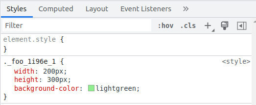

在 vite.config.js 中，我们通过 css 属性去控制整个 vite 对于 css 的处理行为。

以之前的示例 vite.config.js 为基础：

```js
// vite.config.js
import baseConfig from './config/vite.base.config.js';
import devConfig from './config/vite.dev.config.js';
import prodConfig from './config/vite.prod.config.js';

import { defineConfig } from 'vite';
const envResolver = {
  build: () => {
    console.log('\x1b[31m%s\x1b[0m', 'env:production');
    return Object.assign(baseConfig, prodConfig);
  },
  serve: () => {
    console.log('\x1b[36m%s\x1b[0m', 'env:development');
    return Object.assign(baseConfig, devConfig);
  },
};

export default defineConfig(({ command }) => {
  return envResolver[command]();
});
```

```js
// config/vite.base.config.js
import { defineConfig } from 'vite';

export default defineConfig({
  optimizeDeps: {
    exclude: ['node_modules'],
  },
});
```


## 1. css.modules

css.modules 用于配置 css 模块化的一些行为：

我们通过 css 对vite 处理css 的默认行为进行覆盖或者扩展配置;

```js
// config/vite.base.config.js
import { defineConfig } from 'vite';

export default defineConfig({
  css: {
    // 对 css 的行为进行配置
    modules: {
      // 对css模块化的默认行为进行覆盖
    },
  },
  optimizeDeps: {
    exclude: ['node_modules'],
  },
});
```

### 1.1 css.modules.localsConvention

可选配置：`"camelCase"| "camelCaseOnly"|"dashes"|"dashesOnly"` （`dashes` 为vite 默认配置）

> css 规范中我们通常用 不会使用 驼峰去命名类名， 但是在 js 的规范中，我们却通常使用驼峰命名变量名。 
>
> 也就是在 css 中，我们通常取这样的类名：".foo-box", 而不是 “.fooBox"。在上一节中，我们了解了 vite 中对css模块化的处理：
>
> > 示例中，我们通过纯 Vallila JS实现的类名手动绑定操作，但是在vue 项目中，vite 会帮我们做这一层转换，不需要手动去绑定类名。
>
> ```diff
> - import './compa.css';
> + import compCss from './compa.module.css';
> const foo = document.createElement('div');
> - foo.className = 'foo';
> + foo.className = compCss['foo'];
> ```
>
> 我们不再直接去赋值静态类名，而是先交由 vite 的postcss 内置模块去转换一道类名，然后绑定。 

这个用以配置 模块化 css 的映射key的命名规则，以上一节示例来说，假如我们的类名不是简单的 “foo”,

而是 “foo-box", 这时候，如果不配置这个 localsConvention， 那么样式模块的默认导出对象将会是：

`{foo-box: '_foo-box_ss73n_1'}`

这样，你在引用这个 value 的时候，访问对象就必须这样去访问：

**<span style="color:yellow">再说一次: 一般来说，如果你不需要手动去绑定类名，实际上一般不用关注。 </span>**

```js
import compCss from './compa.module.css';
const foo = document.createElement('div');
foo.className = compCss['foo-box'];// 看这里
document.body.appendChild(foo);
```

而不能使用 `dot` 操作符去访问。 

通过配置该选项为 驼峰， 

```js
...
  css: {
    // 对 css 的行为进行配置
    modules: {
      // 对css模块化的默认行为进行覆盖
        localsConvention:"camelCase"
    },
  },
...
```

默认导出的映射对象将会新增一个驼峰写法的key：

`{foo-box: '_foo-box_ss73n_1', fooBox: '_foo-box_ss73n_1'}`

如果设定为 “camelCaseOnly”, 那么就仅会导出驼峰写法的key:

`{fooBox: '_foo-box_ss73n_1'}`

这样一来，你就可以通过 `dot` 操作符去访问类名映射对象了：
```js
import compCss from './compa.module.css';
const foo = document.createElement('div');
foo.className = compCss.fooBox;// 看这里
document.body.appendChild(foo);
```


### 1.2 css.modules.scopeBehaviour

配置当前的模块化行为是模块化还是全局化 

> 实际上，就是配置`.module.css` 是否开启样式模块化， 默认是 "local" 也就是对应开启。 如果你设定为了 “global", 那么模块化将会失效。 这个配置一般没什么用，不会动他。


### 1.3 css.modules.generateScopedName

```js
...
css:{
    modules:{
 	   generateScopedName: "[name]__[local]___[hash:base64:5]",        
    }
}
...
```

生成名字的规则

> 配置规则：
>
> https://www.npmjs.com/package/postcss-modules - Generating scoped names
> https://github.com/webpack/loader-utils#interpolatename

generateScopedName 除了可以配置为一个字符串，还能够是一个函数， 但是返回字符串即可：

```js
generateScopedName:(name,filename,css)=>{
    name -> css 文件中的类名
    filename -> 当前css文件的绝对路径
    css -> 当前类名所对应的样式
    return `${name}_${Math.random().toString(36),substr(3,8)}`
}
```


### 1.4 css.modules.hashPrefix

生成的 hash 字符串的前缀字符串

### 1.5 css.modules.globalModulePaths

`Array<PathString>`

指定不需要参与到 css 模块化的路径

> 这个配置规则本身是很边界的，一般不需要模块话的css 文件，不要命名为 ".module.css" 结尾即可， 这里的配置允许你指定一个 ".module.css" 结尾的文件， 使其不参与模块化编译。


## 2. css.preprocessorOptions

主要是用于配置 css 预处理的一些全局参数

> https://cn.vitejs.dev/config/shared-options.html#css-preprocessoroptions

```js
...
css: {
    preprocessorOptions: {
		less:{
            
        }
    }
}
...
```

当你引入了css预处理器，如 `npm i less`; 你就能使用其对应的一个编译命令， 如 `lessc`, 对于一个 `.less` 文件，我们可以通过命令行去给进行编译转换，像这样：

```bash
$ npm run lessc test.less
```

css 预处理器编译工具通常支持很多的选项，如：

```bash
$ npm run lessc --math="always"
```

也可以通过配置文件去指定这些参数，在vite 中，你就可以这样配置：

```js
...
css: {
    preprocessorOptions: {
		less:{
            math: 'always'
        }
    }
}
...
```


## 3. css.devSourcemap

用以配置是否开启css 的 sourcemap

如果未开启，将是这样的：



开启后：


