[toc]

### 1. SpringBoot 特点

#### 1.1 依赖管理

- 父项目做依赖管理

  ```xml
  <parent>
      <groupId>org.springframework.boot</groupId>
      <artifactId>spring-boot-starter-parent</artifactId>
      <version>2.6.7</version>
  </parent>
  ```

  父项目一般都是用来做依赖管理的，主要子项目继承父项目，子项目写依赖，就不需要版本号了。 这实际上是因为，每个parent项目版本下，Spring Boot 已经帮我们配置了大部分我们可能会用到的依赖的版本号。

  

- 开发导入 starter 场景启动器

  1. 见到很多 `spring-boot-starter-*` : * 就是某种场景

  2. 只要引入starter, 这个场景的所有常规需要的依赖都自动引入

  3. SpringBoot starter 相关介绍以及所有支持场景 ： https://docs.spring.io/spring-boot/docs/current/reference/html/using.html#using.build-systems.starters

  4. 见到`*-spring-boot-starter` : 通常是第三方为我们提供的简化开发的场景启动器。

  5. 我们通过以下方式可以看到项目的依赖图：

     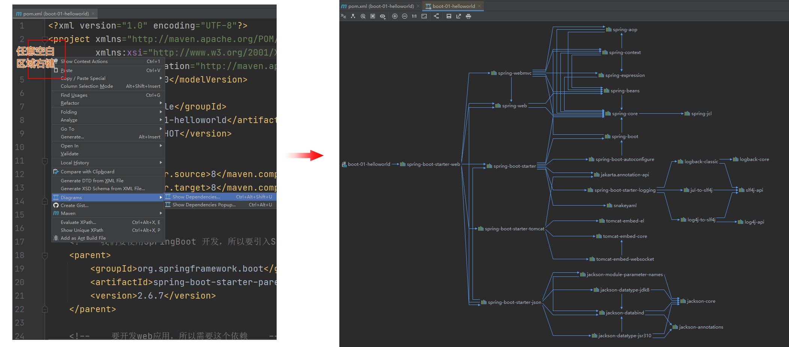

      Spring Boot 中所有场景启动器最底层的依赖是：

     ```xml
     <dependency>
         <groupId>org.springframework.boot</groupId>
         <artifactId>spring-boot-starter</artifactId>
         <version>2.6.7</version>
         <scope>compile</scope>
     </dependency>
     ```

- 无需关注版本号，自动版本号仲裁， 但也可以修改版本号

  一般来说，我们以后在引入依赖的时候，可以不用管版本号，需要自定义指定版本号，我们也可以做到。

  例如假如我们需要用到特定版本的mysql，

  可以在`<properties>` 标签中去指定：

  

  也可以，直接在`<dependency>` 标签下去指定：

  

  如果你不指定，就会被版本仲裁，Spring Boot 会自动为你指定合适的版本：

  

  

  > https://mvnrepository.com/artifact/mysql/mysql-connector-java 是mvn 仓库社区，类似npm

#### 1.2 自动配置 

Spring Boot 在我们引入 

```xml
<dependency>
    <groupId>org.springframework.boot</groupId>
    <artifactId>spring-boot-starter-web</artifactId>
</dependency>
```

> starter 叫做场景启动器，引入 spring-boot-starter-web的时候，就会引入所有web开发场景所需要的依赖，通过<kbd>Ctrl</kbd> + <kbd>Click</kbd> 点击 `spring-boot-starter-web` 就可以跳转到其 pom 文件，里面列出了所有相关依赖。 

帮我们做了很多自动配置。例如下方列举：

- 自动配好Tomcat

  - 引入Tomcat 依赖 + 配置Tomcat

- 自动配好Spring MVC

  - 引入SpringMVC全套组件

  - 自动配好 SpringMVC常用组件如：字符编码问题

    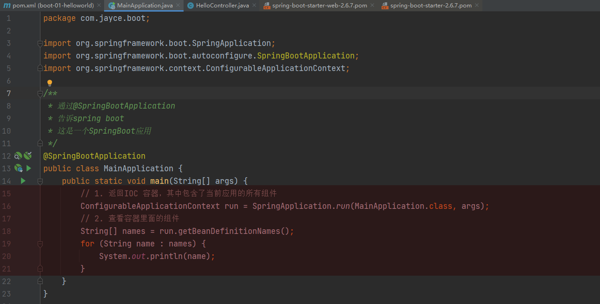

    > 像这样可以打印处当前应用所有的组件

- 默认的包结构

  我们没有自定义配置任何的包扫描规则，Spring Boot 都帮我们配置好了[默认的包扫描规则](https://docs.spring.io/spring-boot/docs/current/reference/html/using.html#using.structuring-your-code.using-the-default-package)

  主程序所在包以及下面所有子包下的组件都能被自动扫描到。

  想要改变扫描路径，可以通过`@SpringBootApplication(scanBasePackages="com.xxx")` 或者 `@ComponentScan 指定扫描路径`  实现。

- 各种配置拥有默认值

  - 默认配置最终都是映射到 MultipartProperties
  - 配置文件的信息最终会绑定在某个子类上，这个类会在容器中创建对象。

- 按需加载所有自动配置项目

  - 引入了哪些场景，这个场景的自动配置才会开启。 
  - SpringBoot所有的自动配置功能都在 `spring-boot-autoconfigure` 包里面

- ......


### 2. 容器功能

#### 2.1 组件添加

1. `@Configuration`

   1. 基本使用

      如何自定义组件？

      

      > 定义两个组件

      

      > 定义配置文件，以及定义组件
      >
      > 也可以在这里通过`@Bean("xxxx")`别名组件名

      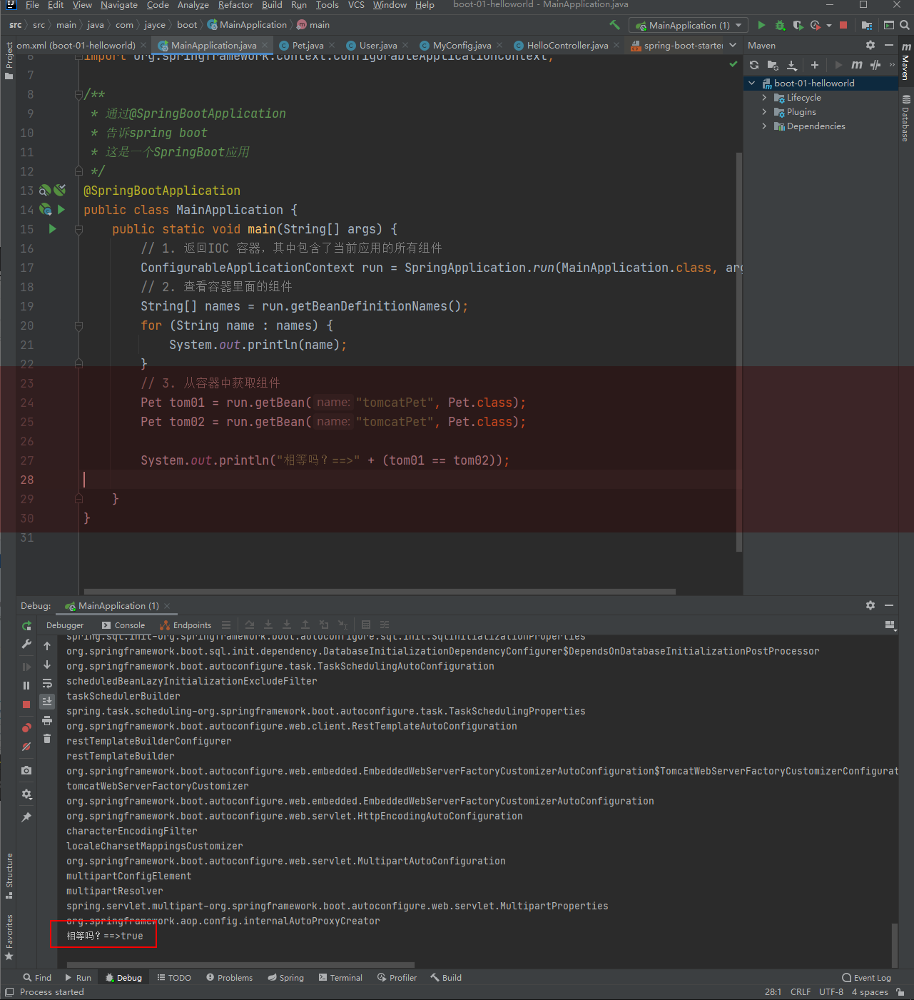

      > 验证，如何获取访问组件

      - `@Configuration` 标记的配置类中， 可以使用`@Bean` 标注在方法上给容器注册组件，默认也是单实例的。  

      - 且注意，通过`@Configuration` 标注的类本身也是一个组件。

        > 我们可以验证：
        >
        > 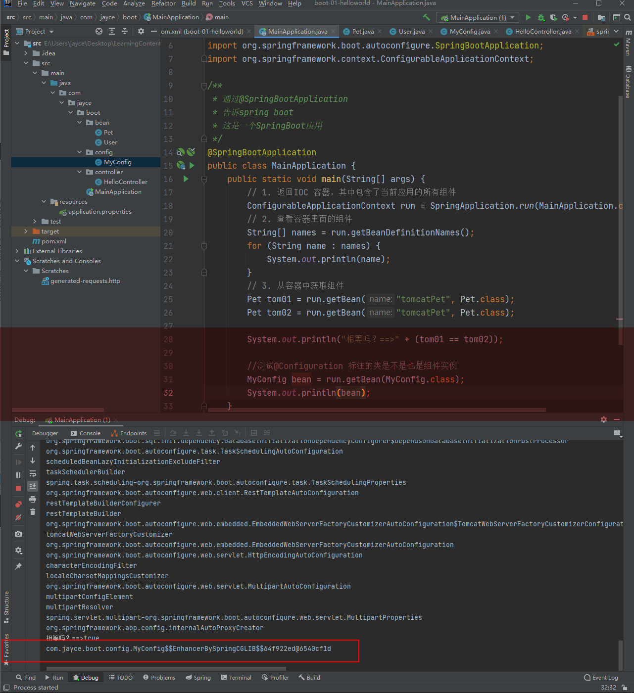
        >
        > 其输出，表明默认，它本身就是一个代理对象，这是由于下面将提到的`proxyBeanMethods` 默认值为 `true`

        

      

   2. Full 模式 和 Lite 模式 (这里有点模糊听的，暂时不深究，需要时请再次看对应视频内容[119_08_底层注解__Configuration详解]()。)

      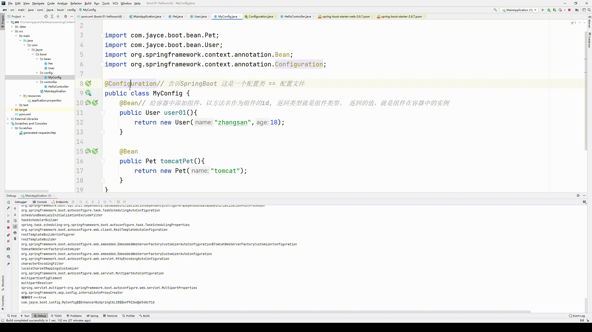

      SpringBoot 在Bean 子版本5.2 之后新增了一项特性 `proxyBeanMethods` —— 代理 bean 的方法，且默认为`true`.

      - Full(`proxyBeanMethods = true`)

        

        > 当`proxyBeanMethods` 值为`true` 时，外部无论对配置类中的这个组件注册方法调用多少次，获取的都是之前注册容器中的单实例对象。 
        >
        > `MyConfig bean = run.getBean(MyConfig.class);` 在 `proxyBeanMethods` 为 `true` 时，返回的是一个代理对象，此时：
        >
        > ```java
        > User user = bean.user01();
        > User user1 = bean.user01();
        > ```
        >
        > 都是代理对象调用方法，SpringBoot会去检查，这个组件是否在容器中存在，**保持组件单实例**

        

      - Lite(`proxyBeanMethods = false`)

        

        > 当`proxyBeanMethods` 值为`false` 时， `MyConfig bean = run.getBean(MyConfig.class);` 返回就不再是一个代理对象。
        >
        > 此时，每一次调用，都会产生一个新的对象。

      **Full 和 Lite 的引入，解决了组件依赖的问题**

      > 注解的意思是proxyBeanMethods配置类是用来指定@Bean注解标注的方法是否使用代理，默认是true使用代理，直接从IOC容器之中取得对象；如果设置为false,也就是不使用注解，每次调用@Bean标注的方法获取到的对象和IOC容器中的都不一样，是一个新的对象，所以我们可以将此属性设置为false来提高性能。—— https://blog.csdn.net/yaomingyang/article/details/108238121

      - 最佳实践
        - 配置 类组件之间无依赖关系用Lite模式加速容器启动过程，减少判断
        - 配置类组件之间有依赖关系，方法会被调用得到之前单实例组件，用Full 模式

2. `@Bean` 、`@Component` 、`@Controller`、 `@Service`、 `@Repository`

   前面说的使用`@Configuration` 结合 `@Bean` 注解来给容器中注册组件。 

   但是给容器中注册组件不仅仅只有这种方法， 也有以前的方法（Spring Framework ?）,例如：

   - `@Component` : 给类上标注这个注解，代表它是一个组件
   - `@Controller` : 代表是一个控制器组件 
   - `@Service` : 代表是一个业务逻辑组件
   - `@Repository` : 代表是一个数据库组件

3. `@ComponentScan` 、`@Import`

   - `@ComponentScan` ： 用以指定包扫描范围的

   - `@Import` :  给容器中导入一个组件

     - `@Import` 注解用在哪里 ？

       写在任何一个配置类里面，或者组件里面，都可以。

       `@Import` 要写在 容器中的 组件的类 上。这个类可以是配置类，可以是Controller，或者其他组件都行。 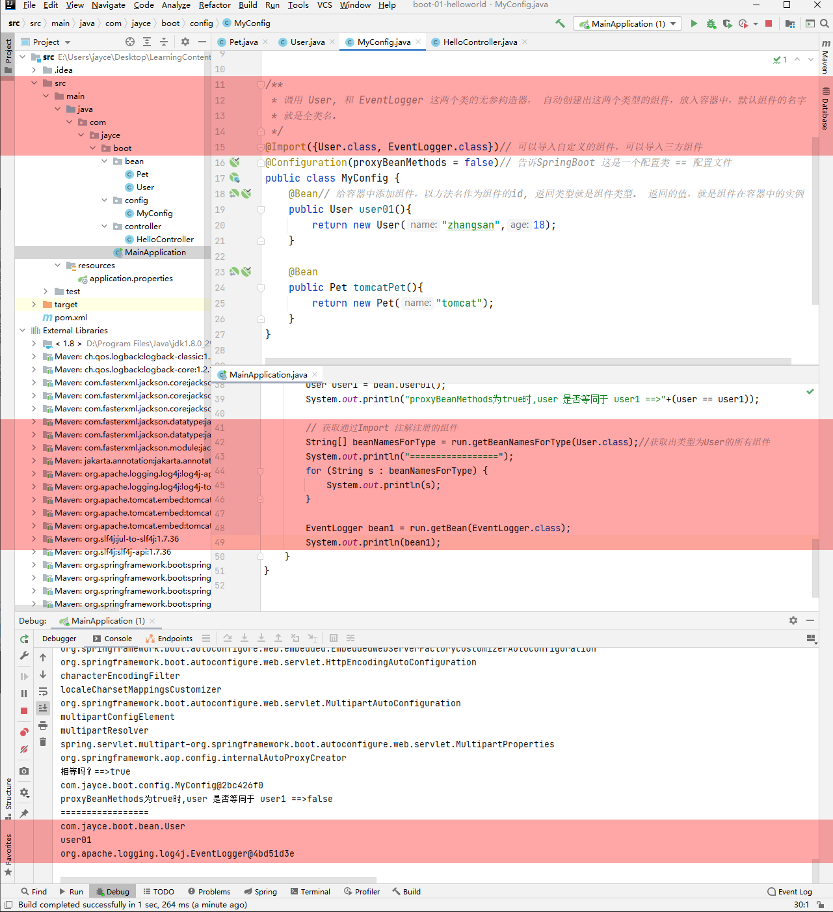

4. `@Conditional`

   条件装配： 满足 Conditional 指定的条件，则进行组件注册。 （可以理解为组件的条件注册）

   

   > `@Conditional` 是一个根注解

   

   `SpringApplication.run()` 返回的 `ConfigurableApplicationContext` 对象，有`containsBean(string name)` 可以用于判断当前容器中是否含有某个组件。

   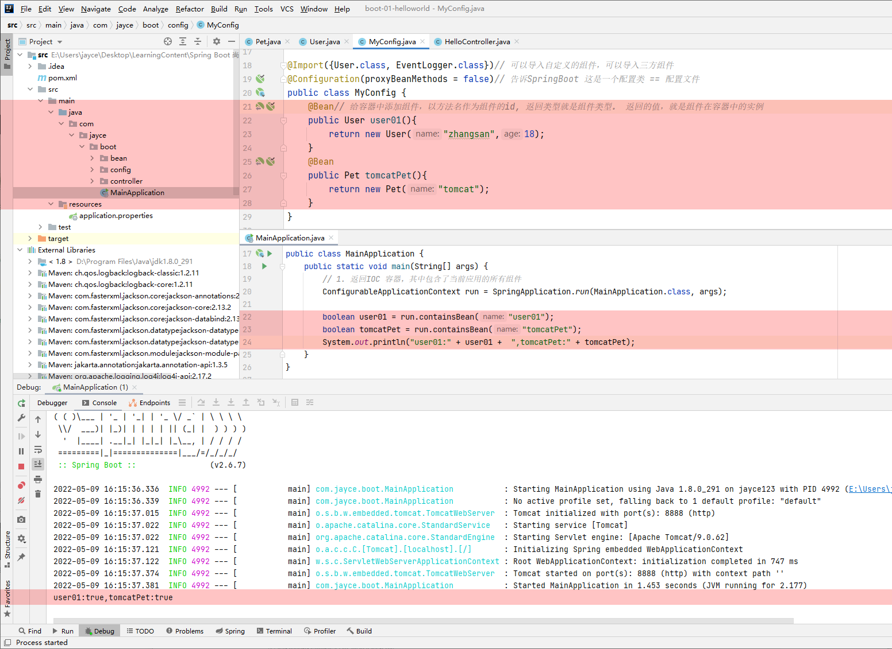

   现在，结合`@Conditional` 注解，我们希望实现，当且仅当 没有 `tomcatPet` 这个组件时，才会注册 `user01` 这个组件：

   


#### 2.2 原生配置文件引入

- `@ImportResource`

这个注解主要是做一些兼容性处理，用于将组件配置文件 beans.xml 整合导入：

示例：

> 新建beans.xml

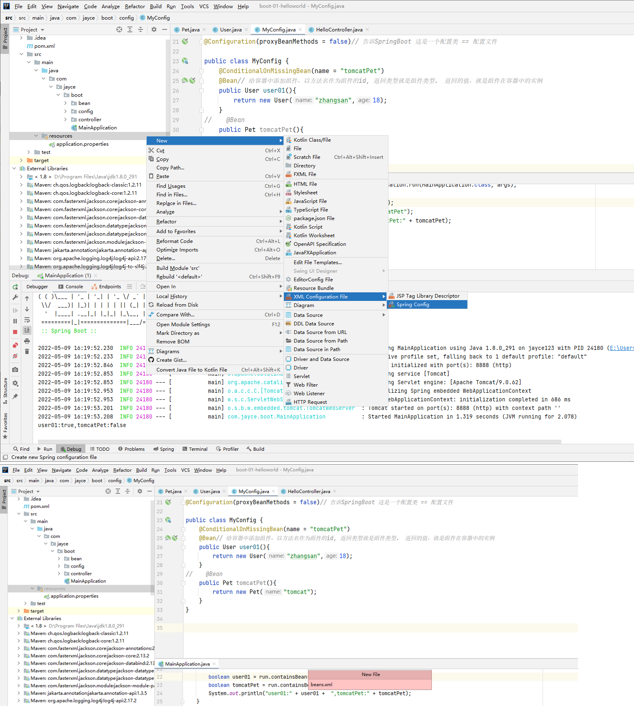

> 按传统方式创建组件


> 载入配置文件

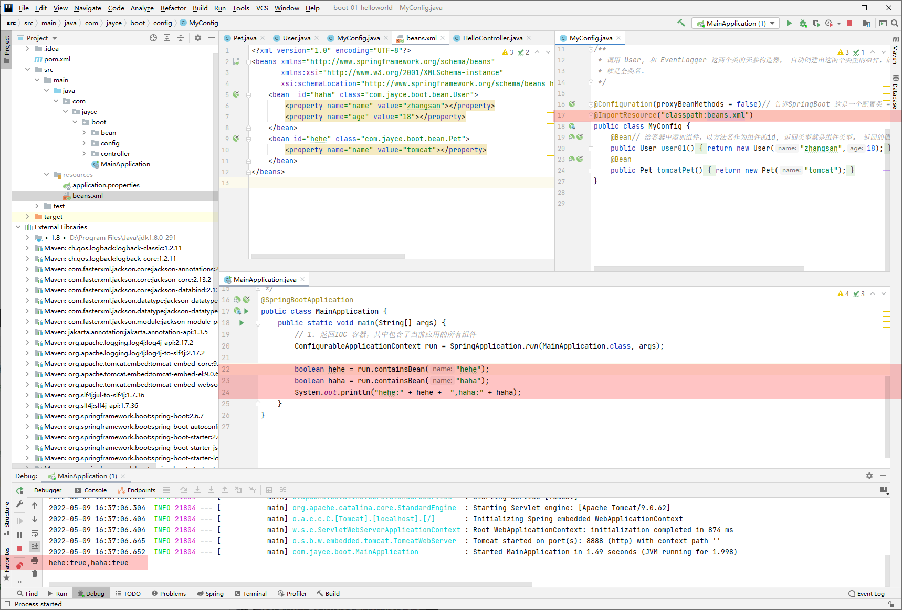


#### 2.3 配置绑定 (使`application.properties` 中的配置被应用)

配置绑定的作用，就是可以让`application.properties` 中的不同配置，能够被单独的应用到容器中的各组件。 如果没有这种机制，那么就需要通过`application.properties` 的解析操作，去取到各需要的配置。会非常的麻烦。 SpringBoot的这种机制在于帮助我们降低了获取配置文件的成本，简化了读取配置文件的操作。

1. `@Component` + `@ConfigurationProperties`

   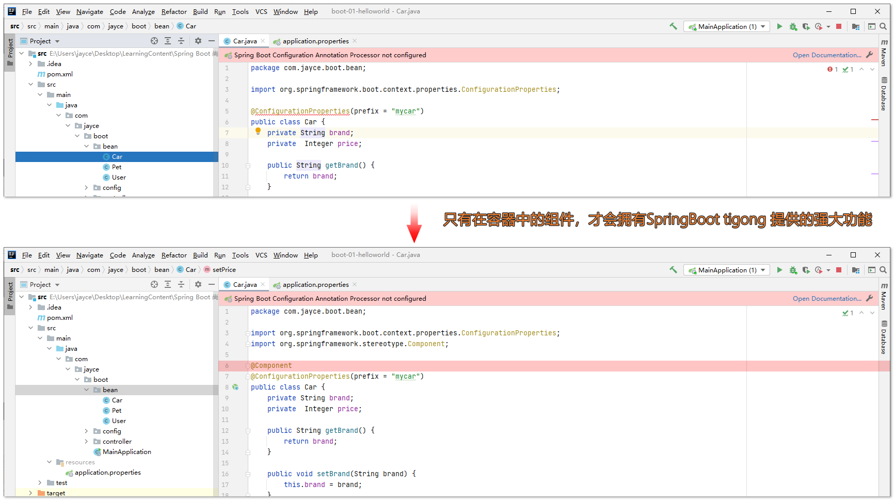

   > `@ConfigurationProperties(prefix = "mycar")` 使得 `Car` 这个组件，能供应用`application.properties` 中 `mycar` 作用域下的配置。

   

   除此外，必须配合使用`@Auowired` 注解——自动注入，才能使用`application.properties` 中的配置

   

2. `@EnableConfigurationProperties` + `@ConfigurationProperties`

   除了上述的方法，还有一种方法也可以应用`application.properties` 中的配置。

   在配置类中，开启配置属性功能：

   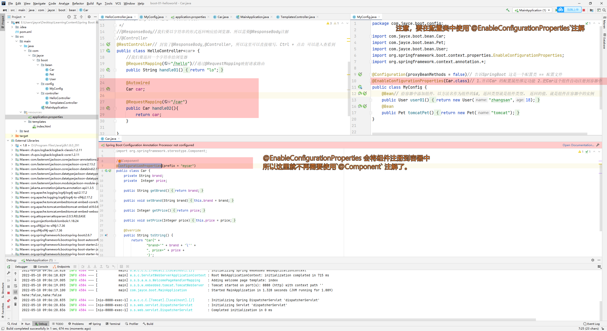

> 其实还有一种方法，可以读取`application.properties` 种的属性配置。
>
> **`@value`**
>
> 

### 3. 自动配置原理入门

> 这部分内容是比较有价值的，但是现阶段不是很有必要深入。以后需要深入的时候再看


### 4. 开发小技巧

#### 4.1 Lombok

简化JavaBean的开发

在之前开发JavaBean 的时候，就是这些


存在一些麻烦的地方，需要手动定义无参，有参构造函数。 需要重写`toString()` 方法， 需要定义get, set 方法。

使用 Lombok 能够简化着一些过程：

1. 首先引入依赖：

   ```xml
   <dependency>
       <groupId>org.projectlombok</groupId>
       <artifactId>lombok</artifactId>
   </dependency>
   ```

2. 安装插件：

   > lombok 插件帮我们扩展了一系列的三方注解，用以在编译的时候执行。
   >
   > ```java
   > @Getter and @Setter
   > @FieldNameConstants
   > @ToString，//生成toString 方法
   > @EqualsAndHashCode // 重新hashCode 方法
   > @AllArgsConstructor,// 全参构造器
   > @NoArgsConstructor,// 无参构造器
   > @RequiredArgsConstructor
   > @Log, @Log4j, @Log4j2, 
   > @Slf4j, // 注入日志类
   > @XSlf4j, @CommonsLog, @JBossLog, @Flogger, @CustomLog
   > @Data// 生成已有属性的 getter, setter方法
   > @Builder
   > @SuperBuilder
   > @Singular
   > @Delegate
   > @Value
   > @Accessors
   > @Wither
   > @With
   > @SneakyThrows
   > @val
   > @var
   > experimental @var
   > @UtilityClass
   > Lombok config system
   > ```

   

   

#### 4.2 Spring initailizr

用于快速创建项目

