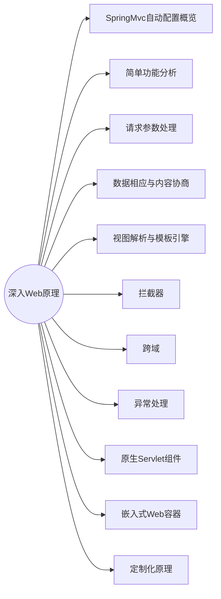

[TOC]



## 1. SpringMVC自动配置概览

**Spring Boot 在web场景下的开发基于 Spring MVC**

Spring Boot provides auto-configuration for Spring MVC that **works well with most applications.(大多场景我们都无需自定义配置)**

The auto-configuration adds the following features on top of Spring’s defaults:

- Inclusion of `ContentNegotiatingViewResolver` and `BeanNameViewResolver` beans.
  
  > 内容协商视图解析器和BeanName视图解析器
  
- Support for serving static resources, including support for WebJars (covered [later in this document](https://docs.spring.io/spring-boot/docs/current/reference/html/spring-boot-features.html#boot-features-spring-mvc-static-content))).

  > 静态资源（包括webjars）

- Automatic registration of `Converter`, `GenericConverter`, and `Formatter` beans.

  > 自动注册 `Converter，GenericConverter，Formatter `

- Support for `HttpMessageConverters` (covered [later in this document](https://docs.spring.io/spring-boot/docs/current/reference/html/spring-boot-features.html#boot-features-spring-mvc-message-converters)).

  > 支持 `HttpMessageConverters` （后来我们配合内容协商理解原理）

- Automatic registration of `MessageCodesResolver` (covered [later in this document](https://docs.spring.io/spring-boot/docs/current/reference/html/spring-boot-features.html#boot-features-spring-message-codes)).

  > 自动注册 `MessageCodesResolver` （国际化用）

- Static `index.html` support.

  > 静态index.html 页支持

- Custom `Favicon` support (covered [later in this document](https://docs.spring.io/spring-boot/docs/current/reference/html/spring-boot-features.html#boot-features-spring-mvc-favicon)).

  > 自定义 `Favicon`  

- Automatic use of a `ConfigurableWebBindingInitializer` bean (covered [later in this document](https://docs.spring.io/spring-boot/docs/current/reference/html/spring-boot-features.html#boot-features-spring-mvc-web-binding-initializer)).

  > 自动使用 `ConfigurableWebBindingInitializer` ，（DataBinder负责将请求数据绑定到JavaBean上）

If you want to keep those Spring Boot MVC customizations and make more [MVC customizations](https://docs.spring.io/spring/docs/5.2.9.RELEASE/spring-framework-reference/web.html#mvc) (interceptors, formatters, view controllers, and other features), you can add your own `@Configuration` class of type `WebMvcConfigurer` but **without** `@EnableWebMvc`.

**不用@EnableWebMvc注解。使用** `@Configuration` **+** `WebMvcConfigurer` **自定义规则**


If you want to provide custom instances of `RequestMappingHandlerMapping`, `RequestMappingHandlerAdapter`, or `ExceptionHandlerExceptionResolver`, and still keep the Spring Boot MVC customizations, you can declare a bean of type `WebMvcRegistrations` and use it to provide custom instances of those components.

**声明** `WebMvcRegistrations` **改变默认底层组件**


If you want to take complete control of Spring MVC, you can add your own `@Configuration` annotated with `@EnableWebMvc`, or alternatively add your own `@Configuration`-annotated `DelegatingWebMvcConfiguration` as described in the Javadoc of `@EnableWebMvc`.

**使用** `@EnableWebMvc+@Configuration+DelegatingWebMvcConfiguration 全面接管SpringMVC`


## 2. 简单功能分析

### 2.1 静态资源访问

> https://docs.spring.io/spring-boot/docs/current/reference/html/web.html#web.servlet.spring-mvc.static-content

1. 静态资源目录与访问

   默认的， Spring Boot 会 serve 根目录([src/main/resources]())下名为 static 或者 public 或者 resources 或者 META-INF/resources 的目录，并作为资源访问目录，这些目录统称为 **静态资源路径**

   >  "By default, Spring Boot serves static content from a directory called `/static` (or `/public` or `/resources` or `/META-INF/resources`)"

   例如 src/main/resources/public/xxx.jpg ,就可以直接通过 http://localhost:9999/xxx.jpg 访问到。
   
   **1.1 修改静态资源访问url前缀**
   
   当然，**还可以给静态资源的访问URL 加上前缀：**我们可以通过修改 `spring.mvc.static-path-pattern` 值去改动资源访问的URL
   
   ```yaml
   server:
     port: 9999
   spring:
     mvc:
       static-path-pattern: /abc/**
   ```
   
   此时就需要通过 http://localhost:9999/abc/xxx.jpg 才能访问到。
   
   > **如果有个静态资源名和路由一样会发生什么？**
   >
   > 例如: http://localhost:9999/a151.gif
   >
   > 请求进来， 会优先去找Controller，看能不能处理，如果不能处理，就交给静态资源处理器。 静态资源会去尝试匹配上述目录下是否有对应的文件，如果有则返回，否则404.
   >
   > 测试：
   >
   > 
   
   **1.2 修改serve目录**
   
   **我们也可以通过`spring.web.resources.static-locations` 这个配置来修改默认的serve目录：**
   
   ```yaml
   server:
     port: 9999
   spring:
     mvc:
       static-path-pattern: /res/**
   
     web:
       resources:
         static-locations: [classpath:/abc/]
   ```
   
   现在，仅 [src/main/resources/abc]() 下的资源， 能够通过 http://host:port/res/** 去访问。 
   
2. webjar

   webjar， 就是会将一些前端常用的js依赖，自动映射为 [/webjar/** ]() 从而，能够被上述访问机制去访问到静态资源。现在不怎么用这个技术。 你可以在[这里](https://docs.spring.io/spring-boot/docs/current/reference/html/web.html#web.servlet.spring-mvc.static-content)看到相关描述。
   在 https://www.webjars.org/ 可以找到常见的WebJars

   当你在pom中，引入依赖：

   ```xml
   <dependency>
       <groupId>org.webjars</groupId>
       <artifactId>jquery</artifactId>
       <version>3.5.1</version>
   </dependency>
   ```

   就可以通过 http://localhost:9999/res/webjars/jquery/3.5.1/jquery.min.js 访问到该资源。 注意，此时你也可以直接通过 http://localhost:9999/webjars/jquery/3.5.1/jquery.min.js 访问到。 

   

   

### 2.2 欢迎页支持

> [related docs](https://docs.spring.io/spring-boot/docs/current/reference/html/web.html#web.servlet.spring-mvc.welcome-page)

SpringBoot 支持两种方式的欢迎页，一种是静态html文件，另一种是模板文件。

**2.2.1 静态html文件**

**静态资源路径** 下的 index.html 文件，会被默认作为欢迎页。


**2.2.2 模板文件**

```xml
<dependency>
    <groupId>org.springframework.boot</groupId>
    <artifactId>spring-boot-starter-thymeleaf</artifactId>
</dependency>
```


### 2.3 favicon

欢迎页同时支持网站图标，只需要将名为`favicon.ico` 的文件，放在静态资源路径下即可。但是注意，`spring.mvc.static-path-pattern` 的配置也会导致 favicon 失效。


### 2.4 静态资源配置原理（略）

> 需要的时候在看


## 3. 请求参数处理

### 3.1 请求映射

1. REST 使用与原理

   > [about RESTFUL](https://restfulapi.net/http-methods/)
   >
   > 简言之，REST 是 API 的一种风格，它提倡CRUD (create, retrieve, update, delete) 操作，用对应的不同HTTP methods 去对应。 例如 GET\POST\PUT\DELETE\PATCH

   - 以前：
   
     ```
     /getUser  获取用户
     /deleteUser  删除用户
     /editUser  修改用户
     /saveUser  保存用户
     ```
   
   - 现在：
   
     ```
     /user    
     METHOD:
     	GET-获取用户    
     	DELETE-删除用户     
     	PUT-修改用户      
     	POST-保存用户
     ```
   
     **接口处理：**
   
     **`@GetMapping`，`@PostMapping`，`@PutMapping`，`@DeleteMapping`，`@PatchMapping`**
   
     
   
     > 在应用REST 风格，在处理**原生**表单请求的时候，有需要注意的问题，原生的表单`method` 属性，仅支持 `post` 或者 `get` 两种 Method [参考](https://developer.mozilla.org/en-US/docs/Web/HTML/Element/form#attr-method)。但是现在一般不会使用原生的表单。
     >
     > SpringBoot中，针对这种情况，增加了一个配置：
     >
     > ```yaml
     > spring:
     >   mvc:
     >     hiddenmethod:
     >       filter:
     >         enabled: true
     > ```
     >
     > 并且，前端页面也需要做特殊处理：
     >
     > ```html
     > <form action="/user" method="get">
     >     <label for="a">Get: </label>
     >     <input type="text" id="a">
     > 
     >     <input type="submit" value="Send Get">
     > </form>
     > <form action="/user" method="post">
     >     <label for="b">Post: </label>
     >     <input type="text" id="b">
     > 
     >     <input type="submit" value="Send Post">
     > </form>
     > <form action="/user" method="post">
     >     <label for="c">DELETE: </label>
     >     <input name="_method" type="hidden" value="DELETE">
     >     <input type="text" id="c">
     > 
     >     <input type="submit" value="Send Delete">
     > </form>
     > <form action="/user" method="post">
     >     <label for="d">PUT: </label>
     >     <input name="_method" type="hidden" value="PUT">
     >     <input type="text" id="d">
     > 
     >     <input type="submit" value="Send Put">
     > </form>
     > ```
     >
     > 1. form 的 method 必须是 `post`
     > 2. 须有一个input 元素，携带 _method:"DELETE/PUT/PATCH" 键值对， 且type 为 `hidden`
