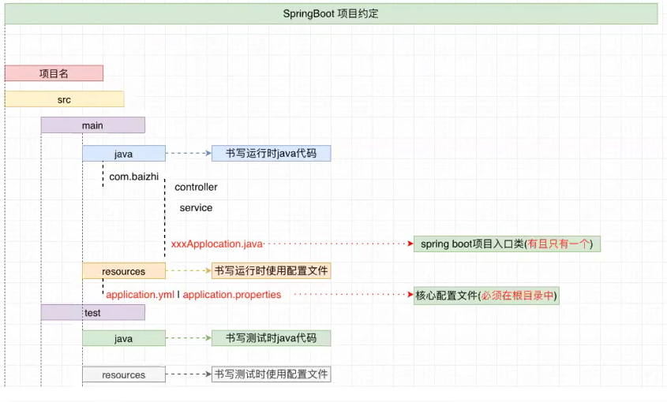

[toc]

## SpringBoot的引言

Spring Boot 是由 Pivotal 团队提供的全新框架，其目的是用来简化Spring 应用的初始搭建以及开发过程。该框架使用了特定的方式来进行配置，从而使开发人员不再需要定义样板化的配置。 通过这种方法，Spring Boot致力于在蓬勃发展的快速应用开发领域（rapid application development）成为领导者。


SpringBoot(微框架) = Spring mvc(控制器) + Spring core(项目管理)


## SpringBoot的优势

1. 创建完整的独立的Spring 应用程序
2. 嵌入的Tomcat,无需部署WAR文件
3. 简化的Maven配置，自动配置Spring, 没有 XML 配置


## SpringBoot的约定

 回顾传统开发：

```
项目构建工具：Maven
ssm:
	src/main/java		用来存放运行时java代码
		com.xxx
			.entity
			.dao
			.service
			...
	src/main/resource	用来存放运行时需要的配置文件
    	spring.xml
    	springmvc.xml
    	mybatis mapper
    	log5j,properties
    	....
	src/test/java		用来存放测试时java代码
    src/test/resource	用来存放测试时需要的配置信息
    	spring.xml
    	springmvc.xml
    	mybatis mapper
    	log4j.properties
    	....
```


springboot

		约定（要求）：
	    1. springboot约定springboot项目中有且只能存在一个入口类（Class）,其类名推荐为： xxx(项目名)Application.java
	    	a.入口类必须在所有子包之上
	    	b.入口类中必须存在一个启动项目main函数
	    2.	springboot的项目约定必须在项目根目录中存在一个名字为application.yml | application.properties 配置文件




```java
springboot:

        
        
    src/main/java		运行时java代码
        com.xxx.
        		.entity
        		.dao
        		.service
        		.controller
        		Application---------------------------> 入口类， 有且只能存在一个
    src/main/resource	运行时配置文件
        		application.yml | application.properties
    src/test/java		测试时java代码
    src/test/resource	测试时配置文件
```

