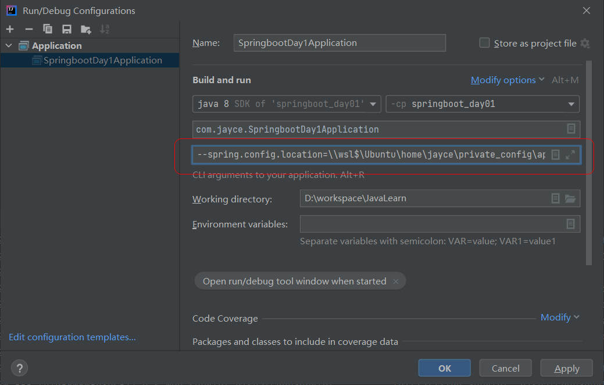

[toc]


## 1. 本地开发环境和生产环境

在开发一个SpringBoot应用的时候，在不同的开发阶段一般会有多个不同的配置环境，最少也有两种，分别是测试环境和生产环境。 都需要通过application.yml文件去进行相关配置。

SpringBoot支持将一个配置文件拆分为针对多个环境的配置。

配置文件一定要以`application-xxx.yml`的格式创建。例如`application-dev.yml`,`application-prod.yml`, 公共的配置则写在`application.yml` 中， 然后在不同的开发阶段启动时，去指定特定的配置文件。 

例如，现在我们希望实现以下环境的配置：

1. 不论是生产环境还是测试环境，端口都指定为公共的端口。 
2. 测试的时候，指定特定的项目名为springboot_day1
3. 生产的时候，指定特定的项目名为springboot


我们先创建两个配置文件，分别是：`application-dev.yml`, `application-prod.yml`。 创建完后的项目目录结构如下所示：

```bash
.
└── springboot_day01
    ├── pom.xml
    ├── springboot_day01.iml
    ├── src
    │   ├── main
    │   │   ├── java
    │   │   │   └── com
    │   │   │       └── jayce
    │   │   │           ├── SpringbootDay1Application.java
    │   │   │           ├── controller
    │   │   │           │   └── HelloController.java
    │   │   │           ├── dao
    │   │   │           ├── entity
    │   │   │           ├── service
    │   │   │           └── utils
    │   │   └── resources
    │   │       ├── application-dev.yml#新增的配置文件
    │   │       ├── application-prod.yml#新增的配置文件
    │   │       └── application.yml
    │   └── test
    │       ├── java
    │       └── resources
    └── target #自动生成的
        ├── classes
        │   ├── application.yml
        │   └── com
        │       └── jayce
        │           ├── SpringbootDay1Application.class
        │           └── controller
        │               └── HelloController.class
        └── generated-sources
            └── annotations
```

然后进行如下配置编辑：

```yml
#application.yml
server:
  port: 8081 # 修改内嵌服务器端口号

spring:
  profiles:
    active: dev #让dev环境生效,注意只需要写`-`后面的字符即可
```

```yml
#application-dev.yml
server:
  servlet:
    context-path: /springboot_day1 #测试项目名
```

```yml
#application-prod.yml
server:
  servlet:
    context-path: /springboot #生产项目名
```

然后重新启动项目：


此时，测试地址为：http://localhost:8081/springboot_day1/hello


尝试指定启动配置为生产环境，需要修改如下配置：

```yml
#application.yml
server:
  port: 8081 # 修改内嵌服务器端口号

spring:
  profiles:
    active: prod #让prod环境生效
```

此时重新启动项目后的测试访问地址为：http://localhost:8081/springboot/hello


> IDEA 中快速重新执行当前启动类快捷键为 <kbd>Ctrl</kbd> + <kbd>F5</kbd>


## 2. 引用外部配置

在真正的企业级开发应用中，配置文件项是多且复杂的，且通常生产服务器的环境可能不同于本地个人开发机器，再比如可能涉及**安全或者权限**相关，例如数据库的访问密码等。 所以一般不会使用本地配置，而是使用**宿主机上的配置**，相对我们的本地开发环境来讲，也就是所谓的**外部配置**。 那么怎么不让项目启动时去读取本地application.yml中的配置而引用外部配置呢？

### 示例：

假设我们现在私密服务器上，某个该项目的配置文件的<span style="color:red">**绝对路径**</span>为 : `\\wsl$\Ubuntu\home\jayce\private_config\application-local-prod.yml`

> 这个地址是通过windows资源管理器或者powershell去访问wsl 的路径，它是一个unc网络地址，这里我为了模拟外部配置文件，所以这样写的一个文件，也可以在本地任意路径进行模拟。如有疑问，详见这里[link](https://www.cnblogs.com/jaycethanks/p/15013198.html)

该路径下的该文件是我自己创建的文件， 注意是绝对路径，等下需要用到，该文件的内容如下：

```bash
# wsl bash
jayce@LAPTOP-0CA0HBLH:private_config$ pwd
/home/jayce/private_config
jayce@LAPTOP-0CA0HBLH:private_config$ cat application-local-prod.yml
server:
  port: 8080
  servlet:
    context-path: /spring-prod-server
```


然后通过IDEA配置程序启动参数：


填写配置参数：`--spring.config.location=` + `自定义私密服务器上的配置文件绝对路径`， 在这里即：

```bash
--spring.config.location=\\wsl$\Ubuntu\home\jayce\private_config\application-local-prod.yml
```



> :notebook: 这里的IDEA启动参数配置，背后，其实就是帮我们将项目打包成一个jar包，然后命令行里去执行以下命令效果是一样的：
>
> ```bash
> java -jar --spring.config.location=配置文件的绝对路径 xxx.jar
> ```

配置好了之后，点击应用然后ok， 再重新启动项目：


此时的测试地址为：http://localhost:8080/spring-prod-server/hello


