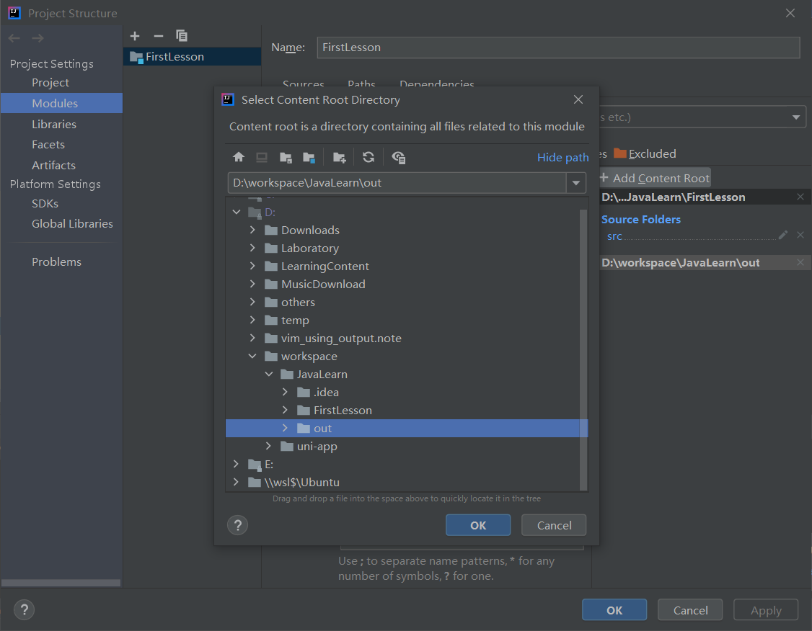

[toc]

## 类与对象的关系


- <span style="color:red">**类是一种抽象的数据类型，它是对某一类事物整体描述/定义，但是并不能代表某一个具体的事物。** </span>	
  - 动物、植物、手机、电脑..
  - Person 类、 Pet 类、 Car 类等， 这些类都是用来描述/定义某一类具体事物应该具备的特点和行为。 


- <span style="color:red">**对象是抽象概念的具体实例**</span>
  - 张三就是人的一个具体实例，张三家里的旺财就是狗的一个具体实例。
  - 能够体现出特点，展现出功能的是具体的实例，而不是一个抽象的概念。

  > 我们可以形容一脸车牌为京AAAAA的车，就是一个实际的物理世界的对象。  但是这个车是Audi A6这个品牌类别。 是小轿车车型的类别。 是黑色的车的类别。 
  >
  > 也就是说，对象通常是独立的个体，它有很多特征，可以被抽象成为很多个类别。 


## 创建与初始化<span style="color:red">对象</span>

- **使用<span style="color:red">new</span>关键字创建对象**

  - 在使用`new`关键字创建的时候，除了分配内存空间之外，还会给创建好的对象进行默认的初始化。  以及对类中构造器的调用。 
  - 类中的构造器也称为构造方法，是在进行创建对象的时候必须要调用的。 并且构造器有以下两个特点：
    - 必须和类的名字相同
    - 必须没有返回类型，也不能写void
    
    > 下面会详细说

  ```java
  //定义一个最简单的类
  //学生类
  public class Student {
      //属性：字段
      String name;//默认为null
      int age;//默认为0
      
      //方法
      public void study(){
          System.out.println(this.name + "在学习")；
      }
  }
  ```

  ```java
  //将定义的类实例化为一个对象
  public class Application(){
  	public static void main(String[] args){
          //类的实例化，通过new 关键字实例化会返回一个自己的对象
          //同一个类可以实例化为任意个对象
          Student xiaoming = new Student();
          Student zhangsan = new Student();
          
          xiaoming.name = "小明"；
          xiaoming.age = 3;
  		System.out.println(xiaoming.name);//小明
  		System.out.println(xiaoming.age);//3
          
      }
  }
  ```

  

- **<span style="color:red">构造器必须要掌握</span>**

**构造器的认识：**

1. <span style="color:red">实验：类有默认的构造器</span>

1. 将class 文件显示在idea中的配置：

   File - > Project Structure -> Modules -> "Add Content Root"  -> 将out 目录添加

   

   


2. 创建一个全新的demoConstructure包， 以及两个demo文件：

   

   ```java
   //com.jayce.demoConstructure.sourceFile.java
   package com.jayce.demoConstructure;
   
   public class sourceFile {
   }
   ```

   ```java
   //com.jayce.demoConstructure.demoFile.java
   package com.jayce.demoConstructure;
   
   public class demoFile {
   }
   ```

3. 查看 sourceFile.class文件（如果看不到将“FirstLesson rebuild 一下，然后out目录重载一下”）

   ```java
   //com.jayce.demoConstructure.sourceFile.class
   
   //
   // Source code recreated from a .class file by IntelliJ IDEA
   // (powered by FernFlower decompiler)
   //
   
   package com.jayce.demoConstructure;
   
   public class sourceFile {
       public sourceFile() {
       }
   }
   
   ```

   可以看到现在什么都没有

   

4. 在demoFile.Java 中通过new 关键字实例化对象sourceFile

   ```java
   package com.jayce.demoConstructure;
   
   public class demoFile {
       public static void main(String[] args) {
           sourceFile demoObj = new sourceFile();
       }
   }
   ```

   

5. 重载之后再次查看 sourceFile.class 文件

   ```java
   ////com.jayce.demoConstructure.sourceFile
   
   //
   // Source code recreated from a .class file by IntelliJ IDEA
   // (powered by FernFlower decompiler)
   //
   
   package com.jayce.demoConstructure;
   
   public class sourceFile {
       public sourceFile() {
       }
   }
   
   ```

   总结可以发现， 即便没有手动的在 sourceFile.java 中预定义 构造器（也叫做构造器函数） `public sourceFile()`  ，但是我们直接在 demoFile.java 中通过`new` 关键字去实例化一个 sourceFile 类的对象时。 但是在执行编译后， sourceFile.java 的编译文件 sourceFaile.class 中却依然产生了 构造器函数。  这就是默认的构造器函数。 

   


实验总结：

一个类，即使什么都不写，它也会存在一个构造方法。 

**构造器可以用于初始化实例， 这时候就需要以覆盖的形式，显式的初始化。**

注意：

- 必须和类的名字相同
- 必须没有返回类型，也不能写void

```java
//com.jayce.demoConstructure.sourceFile.java
package com.jayce.demoConstructure;

public class sourceFile {
    //显式的构造器函数
    String name;
    public sourceFile(){
        this.name = "jayce";
    }
}
```

```java
//com.jayce.demoConstructure.demoFile.java
package com.jayce.demoConstructure;

public class demoFile {
    public static void main(String[] args) {
        sourceFile demoObj = new sourceFile();
        System.out.println(demoObj.name);//jayce
    }
}

```


- 在使用`new` 关键字的时候，本质实在调用构造器

  为了便于说明该特点，以下示例是一个有参构造器

  ```java
  //sourceFile .java
  package com.jayce.demoConstructure;
  
  public class sourceFile {
      int age = 10;
      public sourceFile(int numb){
          this. = this.age + numb;
  
      }
  }
  ```

  ```java
  //demoFile.java
  package com.jayce.demoConstructure;
  
  public class demoFile {
      public static void main(String[] args) {
          sourceFile demoObj = new sourceFile(8);
          System.out.println(demoObj.age);//18
      }
  }
  ```

- ###### 构造器的作用，一般用于初始化实例对象。 

> 这一节能听明白这个老师讲的是什么， 但是讲课的节奏不好，这里点一下，哪里点一下，导致感觉有点乱。  这部分的笔记不好总结。 后期要是自己复习的时候，看到这里的备注，自己了解下情况。 
>
> 这节内容大概就讲了几个点：
>
> 1. 构造器就是通过 `new` 关键字去触发的类函数，它的特点是和类名一致，且无返回值。 
> 2. 

> 自动生成构造器 IDEA 快捷键 ：<kbd>Alt</kbd> + <kbd>Insert</kbd>


在定义构造器的时候，可以定义多个构造器，通过`new` 关键字在实例化类时，就可以根据传递参数的不同，使用不同的构造函数生成不同的实例对象。 即便是同一个类。 


老师的笔记：


构造方法是一种特殊的方法，具有以下特点。 
（1）构造方法的方法名必须与类名相同。 
（2）构造方法没有返回类型，也不能定义为void，在方法名前面不声明方法类型。 
（3）构造方法的主要作用是完成对象的初始化工作，它能够把定义对象时的参数传给对象的域。 
（4）构造方法不能由编程人员调用，而要系统调用。 
（5）一个类可以定义多个构造方法，如果在定义类时没有定义构造方法，则编译系统会自动插入一个无参数的默认构  造器，这个构造器不执行任何代码。 
（6）构造方法可以重载，以参数的个数，类型，或排列顺序区分。 
————————————————
版权声明：本文为CSDN博主「擎天荼荼」的原创文章，遵循CC 4.0 BY-SA版权协议，转载请附上原文出处链接及本声明。
原文链接：https://blog.csdn.net/ftx2540993425/article/details/51433421


## 创建对象内存分析


