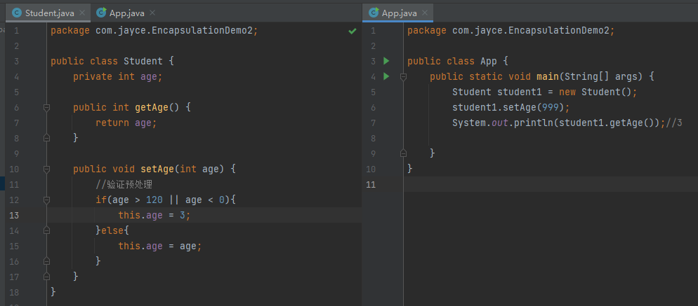

[toc]

## 封装

程序设计要追求“高内聚，低耦合”。 高内聚就是类的内部数据操作细节自己完成，不允许外部干涉；低耦合：仅暴露少量的方法给外部使用。 

封装：（数据的隐藏）

- 通常，应禁止直接访问一个对象中数据的实际表示，而应该通过操作接口来访问，这成为信息的隐藏。 

> 记住这句话就够了 ： 属性私有， get/set

不能通过`.` 去访问一个实例化类中的私有属性。 

可以提供一下可以操作这个属性的方法：

> IDEA 中，光标停留在类中任意位置，<kbd>Alt</kbd> + <kbd>Insert</kbd> 可以自动生成Get 和 Set 方法。 

可以对类中的私有属性做一些预处理或者验证操作，以维持合法性。 

> 小结: 封装的优点/意义：
>
> 1. 提高程序的安全性，保护数据 （例如示例中的验证预处理）
> 2. 隐藏代码的实现细节 （例如示例中，对于用户而言，只知道用get/set 去操作数据，但是并不知道我们验证预处理的逻辑。）
> 3. 统一接口， 所有的类私有属性的操作方法都是 get / set
> 4. 系统的可维护性增加了

