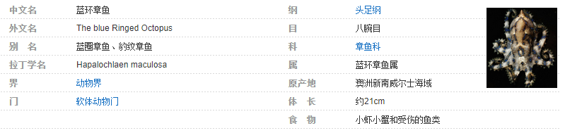
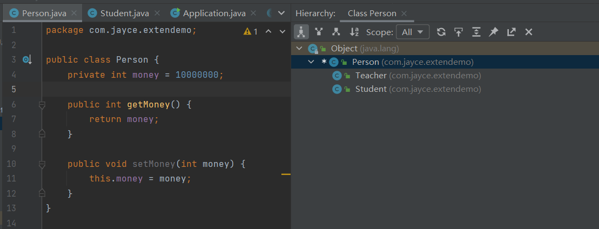
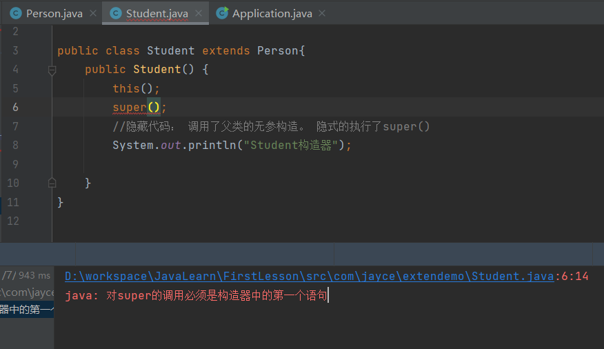

[toc]

## 继承

1. 继承的本质是对某一批类的抽象，从而实现对现实世界更好的建模。 

2. `extands` 的意思是 “扩展”。 子类是父类的扩展。 

3. <span style="color:red">Java 中的类只有单继承，没有多继承！</span>

4. 继承是类和类之间的一种关系。 除此之外，类和类之间的关系还有 依赖、组合、聚合 等。 

5. 继承关系的两个类， 一个为子类（也叫派生类）， 另一个叫做父类（也叫基类）。 子类继承父类，使用关键字 `extends` 来表示。

6. 子类和父类之间，从意义上讲， 应该具有  “is a ” 的关系。 

   

> **对继承的理解@jayce：**  继承易于理解，这里的继承和现实中的继承非常相似。 我们说 “儿子长得像爸爸”， 具体下来，可能是眉眼像，或者鼻子嘴巴像...   这就是继承， 儿子的鼻子长得和爸爸像， 是儿子继承了爸爸鼻子的特点。 
>
> 再比如， 自然界中的生物，分级别 ： 界、门、纲、目、科、属、种   ， 这种级别上的层层递进， 实际上都是从特征范围逐级扩大， 后面的一般具备前面等级的所有特征， 这即是继承。 仔细的说， 
>
> 
>
> ```mermaid
> graph RL
> 	A["蓝环章鱼（属）"] -.继承.-> B["章鱼（科）"] -.继承.-> C["八腕（目）"] -.继承.->D["头足（纲）"] -.继承.->E["软体动物（门）"] -.继承.->F["动物（界）"] 
> ```
>
> 而每一级又会有多个同级，例如同是蓝环章鱼属的 还有 ： 大蓝圈章鱼、小蓝环章鱼、兰纹章鱼

继承的示例：

```bash
#bash
jayce@LAPTOP-0CA0HBLH:extendemo$ pwd
/mnt/d/workspace/JavaLearn/FirstLesson/src/com/jayce/extendemo
jayce@LAPTOP-0CA0HBLH:extendemo$ tree
.
├── Application.java
├── Person.java
├── Student.java
└── Teacher.java

0 directories, 4 files
```


```java
// 基类
package com.jayce.extendemo;

public class Person {
    public void say(){
        System.out.println("说了一句话");
    }
}
```

```java
//子类1
package com.jayce.extendemo;

public class Student extends Person{
}
```

```java
//子类2
package com.jayce.extendemo;

public class Teacher extends Person{
}
```

```java
//调用
package com.jayce.extendemo;

public class Application {
    public static void main(String[] args) {
        Student student = new Student();
        student.say();
        Teacher teacher = new Teacher();
        teacher.say();
    }
}

//output
说了一句话
说了一句话
```


### **注意： 私有属性不能被继承**

```java
//基类
package com.jayce.extendemo;

public class Person {
    private int money = 10000000;

    public int getMoney() {
        return money;
    }

    public void setMoney(int money) {
        this.money = money;
    }
}
```

```java
//子类1
package com.jayce.extendemo;

public class Teacher extends Person{
}
```

```java
//调用
package com.jayce.extendemo;

public class Application {
    public static void main(String[] args) {
        Teacher teacher = new Teacher();
        System.out.println(teacher.money);//非法
        System.out.println(teacher.getMoney());//10000000
    }
}

    
```


**Idea 中查看继承的上下关系快捷键**

<kbd>Alt</kbd> +　<kbd>Ｈ</kbd>

> 这个功能的名字叫做 class Hierarchy， 在keymap 中可以搜到，在应用不同的编辑器keymap时，实际的快捷键会有所区别。 此外该快捷键在 光标停留的对象内部才会生效。




> 在Java 中，所有的类都继承自 Object类。


### **`this` 和 `super`**


#### 通过this 访问当前类中的属性，通过super 访问基类中的属性。 


```JAVA
//基类
package com.jayce.extendemo;

public class Person {
    protected String name = "这是基类中的name";
}
```

```java
//子类
package com.jayce.extendemo;

public class Student extends Person{
    private String name = "这是子类Student中的name";
    public void test(String name){
        System.out.println(name);
        System.out.println(this.name);
        System.out.println(super.name);
    }
}
```

```java
//调用
package com.jayce.extendemo;

public class Application {
    public static void main(String[] args) {
        Student student = new Student();
        student.test("这是调用Student中的方法时传递的参数");
    }
}
```

```java
//output 
这是调用Student中的方法时传递的参数
这是子类Student中的name
这是基类中的name
```


#### 通过this 访问当前类中的方法，通过super 访问基类中的方法；

```java
//基类
package com.jayce.extendemo;

public class Person {
    public void say(){//注意，可属性一样，私有方法属性不能被继承
        System.out.println("Person.say()");
    }
}
```

```java
//子类
package com.jayce.extendemo;

public class Student extends Person{
    public void say(){
        System.out.println("Student.say()");
    }
    public void test(){
        this.say();
        super.say();
    }
}
```

```java
//调用
package com.jayce.extendemo;

public class Application {
    public static void main(String[] args) {
        Student student = new Student();
        student.test();
    }
}
```


#### 构造函数在继承中的关系

```java
//基类
package com.jayce.extendemo;

public class Person {
    public Person() {
        System.out.println("Person构造器");
    }
}

```

```java
//子类
package com.jayce.extendemo;

public class Student extends Person{
    public Student() {
        System.out.println("Student构造器");
    }
}
```

```java
//子类实例化
package com.jayce.extendemo;

public class Application {
    public static void main(String[] args) {
        Student student = new Student();
    }   
}

```

```java
//output
Person构造器
Student构造器
```

> 当子类继承自父类时，子类被实例化时，父类构造函数先于子类构造函数执行。  


注意，该过程隐式的执行了父类的无参构造

```java
package com.jayce.extendemo;

public class Student extends Person{
    public Student() {
        //隐藏代码： 调用了父类的无参构造。 隐式的执行了super()
        System.out.println("Student构造器");
		//super();//如果显示的指定该行将会报错，super()必须置顶执行。
    }
}
```

> 实际上，即便时调用某个类自己的构造器，`this()` 也必须置为首行。这时 `super() ` 和 `this()` 只能够执行一个，不能同时显示指定；
>
> 
>
> 


小结：

super 注意点：

1. super 调用父类的构造方法，必须在构造方法的第一个；
2. super必须只能出现在子类的方法或者构造方法中！
3. super 和 this 不能同时调用构造方法！

Vs this:

1. 代表的对象不同：
   - this : 本身调用者这个对象
   - super: 代表父类对象的引用
2. 使用条件不同：
   - this : 没有继承也可以使用
   - super : 只能在继承条件下才可以使用
3. 构造方法：
   - this (): 本类的构造
   - super () : 父类的构造
