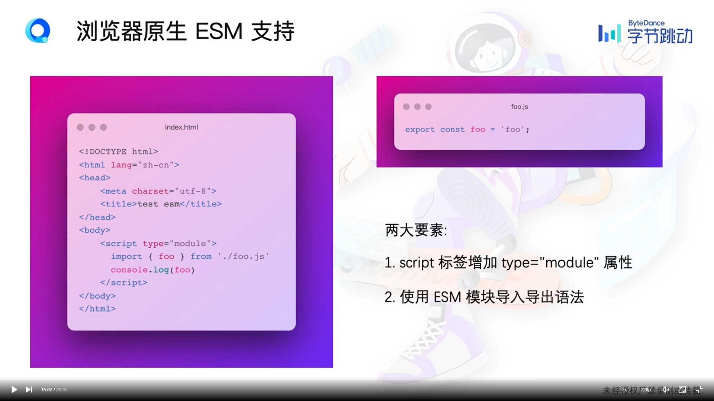
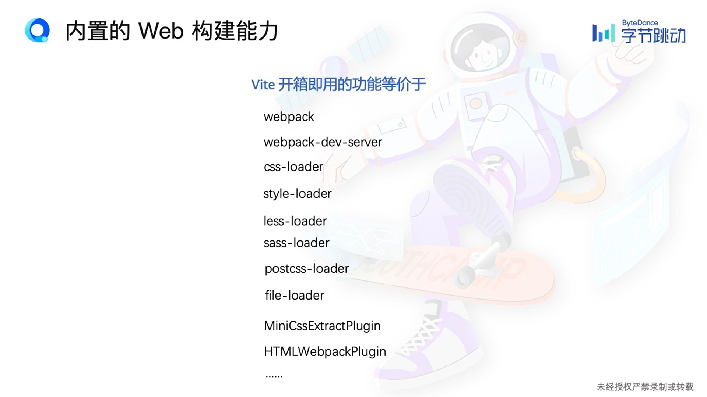

## Overview

1. 浅谈构建工具
2. Vite概要介绍
3. Vite上手实战
4. Vite整体架构
5. Vite进阶路线

### Intro

#### 为什么需要构建工具 ？

模块化方案：

1. 提供模块加载方案
2. 兼容不同模块规范

语法转译

1. 高级语法转译，如Sass, Ts
2. 高级资源加载， 图片，字体， worker

产物质量

1. 产物压缩，无用代码删除， 语法降级

开发小路

1. 热更新

## 什么是 Vite?

定位： 新一代前端构建工具

两大组成部分：

1. No-bundle 开发服务，源文件无需要打包
2. 生产环境基于 Rollup 的 Bundler

核心特征：

1. 高性能， dev启动速度和热更新速度非常快！
2. 简单易用， 开发者体验好

## 当下其他的构建工具存在什么问题，Vite解决了什么问题？

- 缓慢的启动：项目编译等待成本高
- 缓慢的热更新 ： 修改代码后不能实时更新

**瓶颈在哪里？**

- bundle 带来的性能开销
- js语言的性能瓶颈

## 两大行业优势

1. 全球浏览器对原生 ESM 的普遍支持
2. 基于esbuid 的构建
   - 基于原生语言（Go, Rust） 编写的前端编译工具链
   - 如Go语言编写的 Esbuild, Rust 编写的 SWC

